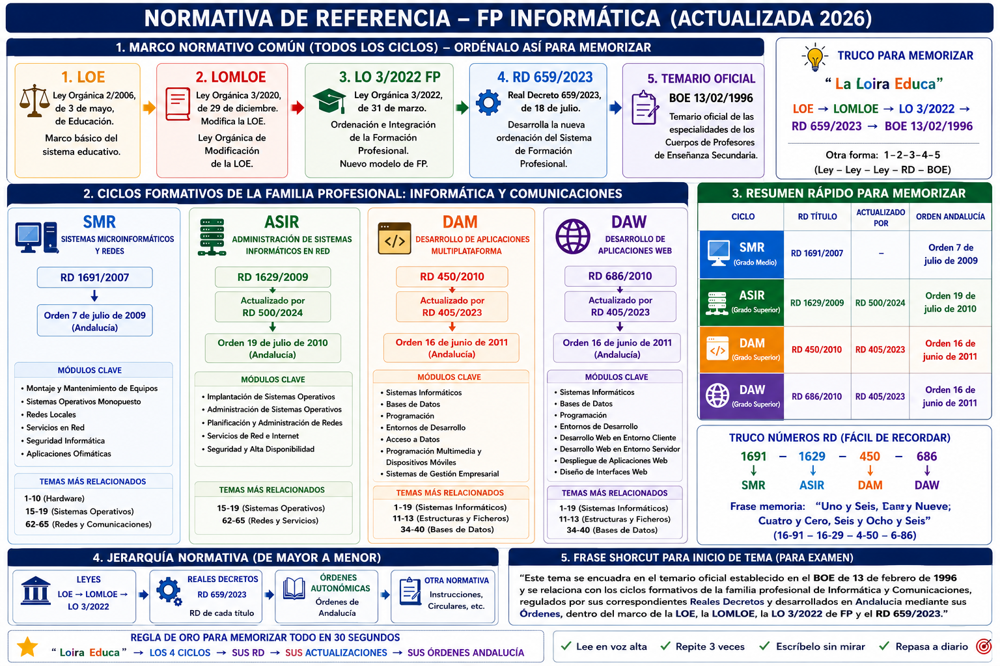

# Material Oposiciones Informática Secundaria

## PES Informática

## BLOQUE 01 - HARDWARE
- 01 Representación y comunicación de la información.
- [02 Elementos funcionales de un ordenador digital.](tema2.md)
- 03 Componentes, estructura y funcionamiento de la Unidad Central de Proceso.
- [04 Memoria interna. Tipos. Direccionamiento. Características y funciones.](tema4.md)
- 05 Microprocesadores. Estructura. Tipos. Comunicación con el exterior.
- [06 Sistemas de almacenamiento externo. Tipos. Características y funcionamiento.](tema6.md)
- [07 Dispositivos periféricos de entrada salida. Características y funcionamiento.](tema7.md)
- [08 Hardware comercial de un ordenador. Placa base. Tarjetas controladoras de dispositivos y de entrada-salida.](tema8.md)
- 09 Lógica de circuitos. Circuitos combinacionales y secuenciales.

## BLOQUE 02 – REPRESENTACIÓN Y ORGANIZACIÓN DE DATOS
- 10 Representación interna de los datos.
- [11 Organización Lógica de los Datos. Estructuras estáticas](tema11.md)
- [12 Organización Lógica de los Datos. Estructuras dinámicas](tema12.md)
- [13 Ficheros. Tipos. Características. Organizaciones](tema13.md)
- [14 Utilización de ficheros según su organización](tema14.md)

## BLOQUE 03 – GESTIÓN DE SISTEMAS
- [15 Sistemas operativos. Componentes. Estructura. Funciones. Tipos.](tema15.md)
- 16 Sistemas operativos Gestión de procesos.
- 17 Sistemas operativos Gestión de memoria.
- 18 Sistemas operativos Gestión de entrada-salida.
- 19 Sistemas operativos Gestión de archivos y dispositivos.
- 20 Explotación y administración de sistemas operativos monousuario y multiusuario.

## BLOQUE 04 – SISTEMAS INFORMÁTICOS
- 21 Sistemas informáticos. Estructura física y funcional.

## BLOQUE 05 – ALGORITMOS Y PROGRAMACIÓN
-  23 Diseño de algoritmos. Técnicas descriptivas.
-  [24 Lenguajes de programación. Tipos. Características](tema24.md)
-  [25 Programación estructurada. Estructuras básicas. Funciones y procedimientos.](tema25.md)
-  [26 Programación modular. Diseño de funciones. Recursividad. Librerías.](tema26.md)
-  [27 Programación Orientada a Objetos. Clases. Herencia. Polimorfismo. Lenguajes.](tema27.md)
-  28 Programación en tiempo real. Interrupciones. Sincronización y comunicación entre tareas. Lenguajes.
-  29 Utilidades para el desarrollo y prueba de programas. Compiladores. Interpretes. Depuradores.
-  30 Prueba y documentación de programas. Técnicas.
-  33 Programación en lenguaje ensamblador. Instrucciones básicas. Formatos. Direccionamientos.

## BLOQUE 06 – BASES DE DATOS
-  [34 Sistemas gestores de bases de datos. Funciones. Componentes](tema34.md)
-  [35 La definición de datos. Niveles de descripción. Lenguajes. Diccionario de datos.](tema35.md)
-  36 La manipulación de datos. Operaciones. Lenguajes. Optimización de consultas.
-  37 Modelo de datos jerárquico y en red. Estructuras. Operaciones.
-  [38 Modelo de datos relacional. Estructuras. Operaciones. Álgebra relacional.](tema38.md)
-  [39 Lenguajes para Definición y Manipulación de Datos en Bases de Datos Relacionales.](tema39.md)
-  [40 Diseño de bases de datos relacionales.](tema40.md)
-  41 Utilidades de los sistemas gestores de base de datos para el desarrollo de aplicaciones. Tipos. Características.(tema40.md)
-  42 Sistemas de bases de datos distribuidos.
-  [43 Administración de sistemas de bases de datos.](Tema43.md)
-  [44 Técnicas y procedimientos para la seguridad de los datos](tema44.md)

## BLOQUE 07 – SISTEMAS DE INFORMACIÓN
-  45 Sistemas de información. Tipos. Características. Sistemas de información en la empresa.
-  [46: Aplicaciones informáticas de propósito general y para la gestión empresarial](tema46.md)
-  [47 Instalación y explotación de aplicaciones informáticas. Compartición de datos](tema47.md)

## BLOQUE 08 – INGENIERÍA DEL SOFTWARE, ANÁLISIS Y DISEÑO
-  50 Análisis de sistemas modelización conceptual de datos. Técnicas descriptivas. Documentación.
-  55 Diseño físico de datos y funciones. Criterios de diseño. Documentación.
-  56 Análisis y diseño orientado a objetos.
-  57 Calidad del software. Factores y métricas. Estrategias de prueba.
-  58 Ayudas automatizadas para el desarrollo de software.

## BLOQUE 09 – REDES Y COMUNICACIONES
-  61 Redes y servicios de comunicaciones.
-  62 Arquitecturas de sistemas de comunicaciones. Arquitecturas basadas en niveles. Estándares.
- [63 Funciones y servicios del nivel físico](tema63.md)
-  64 Funciones y servicios del nivel de enlace. Técnicas. Protocolos.
-  65 Funciones y servicios del nivel de red y del nivel de transporte. Técnicas. Protocolos.
-  [66 Funciones y servicios en niveles sesión, presentación y aplicación. Protocolos. Estándares.](tema66.md)
-  [67 Redes de área local. Componentes. Topologías. Estándares. Protocolos.](tema67.md)
-  [68 Software de sistemas en red. Componentes. Funciones. Estructura.](tema68.md)
-  [69 Integración de sistemas. Medios de interconexión. Estándares. Protocolos de acceso a redes de área extensa.](tema69.md)
-  70 Diseño de sistemas en red local. Parámetros de diseño. Instalación y configuración de sistemas en red local.
-  71 Explotación y administración de sistemas en red local. Facilidades de gestión.
-  72 La seguridad en sistemas en red. Servicios de seguridad. Técnicas y sistemas de protección. Estándares.
-  73 Evaluación y Mejora de Prestaciones en un Sistema en Red. Técnicas y Procedimientos de Medida.
-  74 Sistemas Multimedia.
  

[Temario Global Mapa Visual](/oposdocs/mapasweb/temasmap.html).

