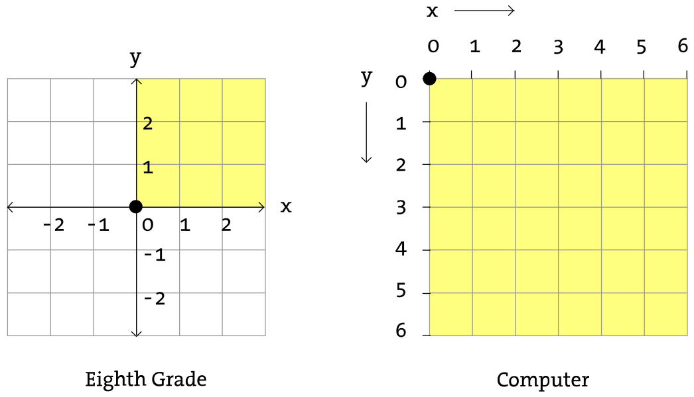

# 3. Conceptos Básicos de Processing

## ¿Qué es un Sketch?
Un **sketch** en Processing es el término que se utiliza para describir un programa o proyecto. Cada sketch es un conjunto de instrucciones que el entorno de Processing ejecuta para producir gráficos, animaciones o interacciones. En Processing, los sketches son la base para crear arte visual y explorar la programación de una manera sencilla y accesible.

### Ejemplo de un Sketch
```java
void setup() {
  size(400, 400);
  background(255);
}

void draw() {
  ellipse(200, 200, 100, 100);
}
```
Este sketch crea una ventana de 400 x 400 píxeles y dibuja un círculo en el centro.

## Sistema de Coordenadas
Processing utiliza un sistema de coordenadas basado en píxeles para posicionar y dibujar elementos en la pantalla. El origen de las coordenadas (0, 0) está en la esquina superior izquierda de la ventana, donde el valor de **x** aumenta hacia la derecha y el valor de **y** aumenta hacia abajo.




### Ejemplo de Coordenadas
```java
void setup() {
  size(400, 400);
  background(255);
}

void draw() {
  point(50, 50);    // Dibuja un punto en (50, 50)
  line(50, 50, 200, 200); // Dibuja una línea desde (50, 50) hasta (200, 200)
}
```

## Formas Básicas
Processing permite dibujar formas geométricas básicas como círculos, rectángulos y líneas utilizando funciones específicas. Estas formas son los bloques de construcción fundamentales para crear gráficos y arte.

### Ejemplo de Formas Básicas
```java
void setup() {
  size(400, 400);
  background(255);
}

void draw() {
  rect(100, 100, 150, 75); // Dibuja un rectángulo
  ellipse(300, 300, 50, 50); // Dibuja un círculo
  line(50, 50, 350, 350); // Dibuja una línea diagonal
}
```

## Interactividad
Uno de los puntos fuertes de Processing es la capacidad de crear gráficos interactivos. Puedes responder a las acciones del usuario, como mover el ratón o hacer clic en la ventana, para cambiar lo que se muestra en la pantalla.

### Ejemplo de Interactividad
```java
void setup() {
  size(400, 400);
  background(255);
}

void draw() {
  ellipse(mouseX, mouseY, 50, 50); // Dibuja un círculo que sigue al ratón
}

void mousePressed() {
  background(255); // Limpia la pantalla cuando se hace clic
}
```

## Colores
Processing utiliza el modelo de color RGB (Rojo, Verde, Azul) para definir colores. Puedes establecer colores para el fondo, las formas y las líneas usando funciones como `background()`, `fill()` y `stroke()`.

### Ejemplo de Colores
```java
void setup() {
  size(400, 400);
  background(255);
}

void draw() {
  fill(255, 0, 0); // Rellena con color rojo
  stroke(0, 0, 255); // Línea de borde en azul
  rect(150, 150, 100, 50); // Dibuja un rectángulo
}
```
En este ejemplo, el rectángulo se dibuja con un relleno rojo y un borde azul.
