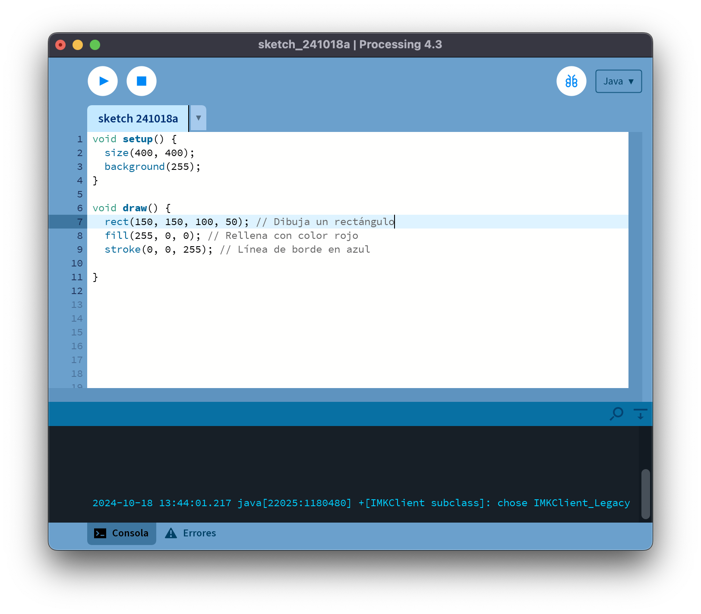
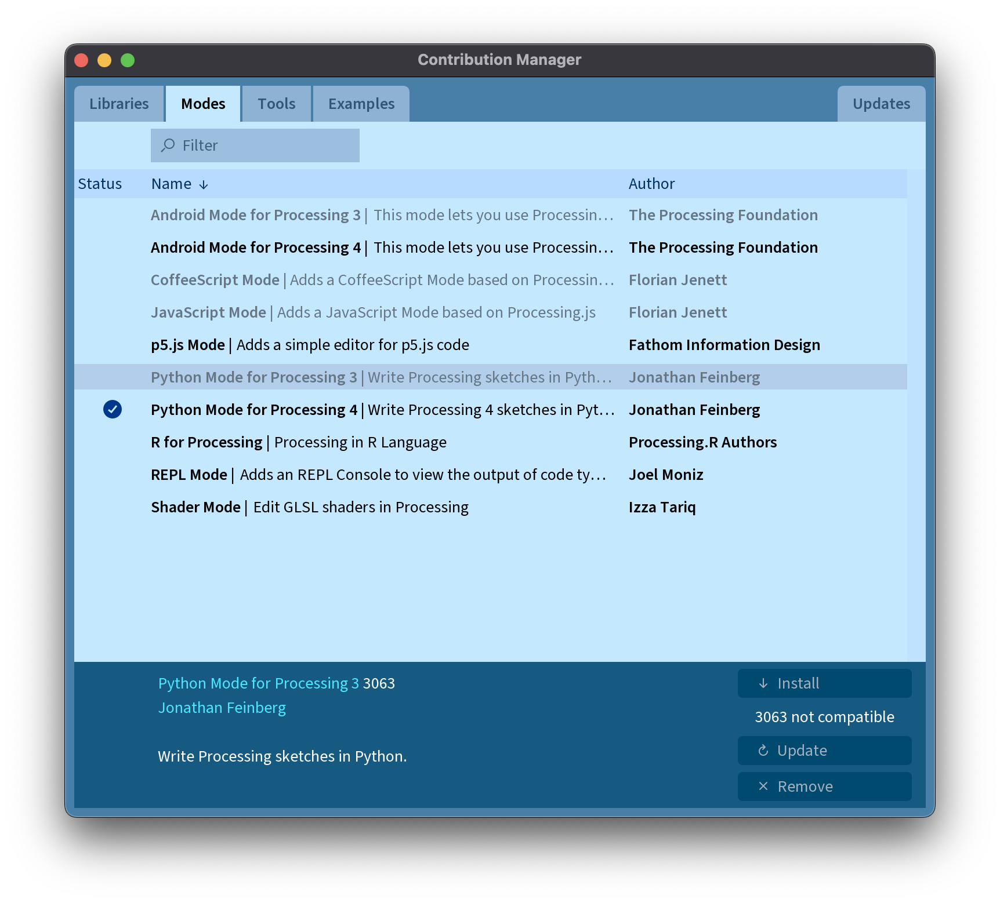

# Instalación de Processing

Processing es un software flexible y potente para aprender a programar en el contexto de las artes visuales. Este manual te guiará a través del proceso de instalación en diferentes plataformas.

## Índice
1. [Windows](#windows)
2. [macOS](#macos)
3. [Linux](#linux)

## Windows

1. Ve al sitio web oficial de Processing: https://processing.org/download/
2. Descarga la versión más reciente para Windows.
3. Una vez descargado, descomprime el archivo ZIP en la ubicación deseada.
4. Abre la carpeta descomprimida y haz doble clic en el archivo `processing.exe` para iniciar el programa.

## macOS

1. Visita la página de descargas de Processing: https://processing.org/download/
2. Descarga la versión más reciente para macOS.
3. Una vez descargado, abre el archivo .dmg.
4. Arrastra el icono de Processing a la carpeta de Aplicaciones.
5. Abre Processing desde la carpeta de Aplicaciones o usando Spotlight.

## Linux

### Ubuntu y otras distribuciones basadas en Debian

1. Abre una terminal.
2. Actualiza la lista de paquetes:
   ```
   sudo apt-get update
   ```
3. Instala las dependencias necesarias:
   ```
   sudo apt-get install default-jdk
   ```
4. Descarga Processing desde https://processing.org/download/
5. Descomprime el archivo descargado:
   ```
   tar -xvzf processing-xxx-linux64.tgz
   ```
6. Mueve la carpeta descomprimida a una ubicación permanente:
   ```
   sudo mv processing-xxx /opt/
   ```
7. Crea un enlace simbólico para ejecutar Processing desde cualquier lugar:
   ```
   sudo ln -s /opt/processing-xxx/processing /usr/local/bin/processing
   ```
8. Ahora puedes iniciar Processing escribiendo `processing` en la terminal.

### Arch Linux

1. Processing está disponible en el AUR. Instálalo usando tu helper de AUR preferido, por ejemplo:
   ```
   yay -S processing
   ```
2. Una vez instalado, puedes iniciar Processing desde el menú de aplicaciones o escribiendo `processing` en la terminal.

Recuerda que, independientemente de la plataforma, es importante mantener Processing actualizado para disfrutar de las últimas características y correcciones de errores.

El aspecto del IDE de `Processing` es el siguiente:




Una vez que lo has descargado e instalado en tu máquina, deberás ver una ventana similar a esta. En la parte superior derecha vemos que aparece el texto `Java`, esto quiere decir que por defecto el entorno de desarrollo de Processing está preparado para trabajar con sketches escritos en el lenguaje de programación Java. Para trabajar con el lenguaje de programación `Python`, hay que descargar el software necesario para poder trabajar en modo **Python**

Para ello hacemos click en el desplegable y accedemos a Gestionar Modos, desde ahi podemos instalar los interpretes necesarios, como `Python` o `Javascrip`

