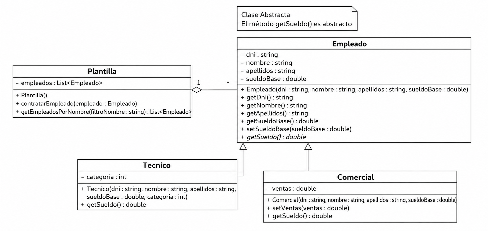
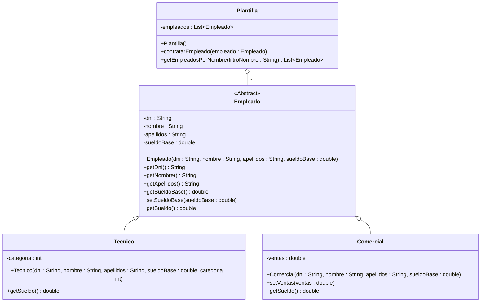

# OPOSICIONES INFORMÁTICA ANDALUCÍA. Programación en Java

## Ejercicio 2023



En el diagrama se describe la estructura para representar la plantilla de empleados de una empresa. 
Los empleados se dividen en técnicos y comerciales. 
El sueldo de los técnicos dependerá de su categoría (número entero) y el de los comerciales, de las ventas realizadas. 

Se pide: 

Desarrolle en lenguaje Java la estructura representada en el diagrama. Para ello, tenga en cuenta las siguientes consideraciones: 
- Debe desarrollar todas las clases completas. 
- En la clase Técnico, el sueldo se calculará como el sueldo base más la categoría multiplicada por 100. 
- En la clase Comercial, el sueldo se calculará como el sueldo base más un 10% de las ventas realizadas. 
- En la clase Plantilla, el método contratarEmpleado() añadirá el empleado dado a la plantilla. 
- El método getEmpleadosPorNombre() devolverá una lista con todos los empleados que contengan en el nombre, o en los apellidos, el texto pasado como parámetro.



## Clase Abstracta Empleado

```java
public abstract class Empleado {

    private String dni;
    private String nombre;
    private String apellidos;
    private double sueldoBase;

    public Empleado(String dni, String nombre, String apellidos, double sueldoBase) {
        this.dni = dni;
        this.nombre = nombre;
        this.apellidos = apellidos;
        this.sueldoBase = sueldoBase;
    }

    public String getDni() {
        return dni;
    }

    public String getNombre() {
        return nombre;
    }

    public String getApellidos() {
        return apellidos;
    }

    public double getSueldoBase() {
        return sueldoBase;
    }

    public void setSueldoBase(double sueldoBase) {
        this.sueldoBase = sueldoBase;
    }

    public abstract double getSueldo();
}
```

## Clase Técnico

```java
public class Tecnico extends Empleado {

    private int categoria;

    public Tecnico(String dni, String nombre, String apellidos,
                   double sueldoBase, int categoria) {
        super(dni, nombre, apellidos, sueldoBase);
        this.categoria = categoria;
    }

    @Override
    public double getSueldo() {
        return getSueldoBase() + categoria * 100;
    }
}
```

## Clase Comercial

```java
public class Comercial extends Empleado {

    private double ventas;

    public Comercial(String dni, String nombre, String apellidos,
                     double sueldoBase) {
        super(dni, nombre, apellidos, sueldoBase);
        this.ventas = 0;
    }

    public void setVentas(double ventas) {
        this.ventas = ventas;
    }

    @Override
    public double getSueldo() {
        return getSueldoBase() + ventas * 0.10;
    }
}
```

## Clase Plantilla

```java
import java.util.ArrayList;
import java.util.List;

public class Plantilla {

    private List<Empleado> empleados;

    public Plantilla() {
        empleados = new ArrayList<>();
    }

    public void contratarEmpleado(Empleado empleado) {
        empleados.add(empleado);
    }

    public List<Empleado> getEmpleadosPorNombre(String filtroNombre) {

        List<Empleado> resultado = new ArrayList<>();

        for (Empleado empleado : empleados) {

            if (empleado.getNombre().toLowerCase().contains(filtroNombre.toLowerCase())
                    || empleado.getApellidos().toLowerCase().contains(filtroNombre.toLowerCase())) {

                resultado.add(empleado);
            }
        }

        return resultado;
    }
}
```

## Programa de Prueba 

```java
import java.util.List;

public class Main {

    public static void main(String[] args) {

        Plantilla plantilla = new Plantilla();

        Tecnico t1 = new Tecnico(
                "11111111A",
                "Juan",
                "Pérez García",
                1500,
                3);

        Comercial c1 = new Comercial(
                "22222222B",
                "María",
                "López Sánchez",
                1400);

        c1.setVentas(10000);

        plantilla.contratarEmpleado(t1);
        plantilla.contratarEmpleado(c1);

        System.out.println("Sueldo técnico: " + t1.getSueldo());
        System.out.println("Sueldo comercial: " + c1.getSueldo());

        List<Empleado> encontrados =
                plantilla.getEmpleadosPorNombre("pez");

        System.out.println("\nEmpleados encontrados:");

        for (Empleado e : encontrados) {
            System.out.println(e.getNombre() + " " + e.getApellidos());
        }
    }
}
````

### Salida esperada

```bash
Sueldo técnico: 1800.0
Sueldo comercial: 2400.0

Empleados encontrados:
Juan Pérez García
```

> Esta solución utiliza herencia, polimorfismo, clases abstractas y colecciones (`ArrayList` y `List`), tal como refleja el diagrama UML.
