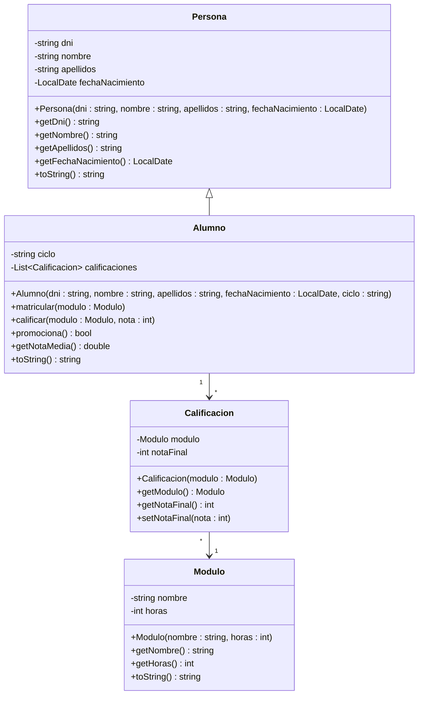

## OPOSICIONES INFORMÁTICA ANDALUCÍA 2025


Desarrollar en lenguaje Java la estructura representada en el siguiente Diagrama de Clases. En dicho diagrama se describe la estructura para representar los alumnos de un Ciclo Formativo con sus módulos y calificaciones.



Se deben desarrollar las clases Alumno y Calificacion. Suponemos el resto de clases ya desarrolladas previamente. A continuación se describe la funcionalidad de los métodos más importantes.  


- En la clase Alumno, el método `matricular()` añadirá un módulo y su calificación al alumno. La calificación inicial será 0, indicando que aún está sin calificar. El método `calificar()` servirá para asignarle una calificación numérica (1- 10) al alumno en el módulo especificado. Si el alumno ya estaba matriculado de ese módulo, el método no hará nada.   

- Los métodos que toman un módulo como argumento, si tienen que buscar dicho módulo entre las calificaciones, usarán el nombre del módulo para determinar la coincidencia.   

- El método `promociona()` devolverá true si el alumno está en condiciones de promocionar, es decir, si la suma de las horas de los módulos aprobados es mayor o igual al 50% del total de horas de los módulos matriculados.
- El método `toString()` de Alumno, devolverá lo mismo que el de Persona (datos personales), añadiendo detrás, `"Nota Media = XX.XX"`, donde XX.XX será la nota media del alumno, con dos cifras decimales como máximo.

A continuación se muestra un ejemplo de uso de las clases descritas junto con la salida generada:

## Ejemplo de Uso:

```java
Alumno alumno1 = new Alumno ("11111111H", "Alejandro", "Fernández", LocalDate.of (2000, 3, 15) ,"DAW") ;
Alumno alumno2 = new Alumno ("22222222M", "Daniel", "Travieso", LocalDate.of (1992, 7, 5), "DAW") ; .

Modulo progr = new Modulo ("Programacion", 8) ;
Modulo bd = new Modulo ("Bases de Datos", 7);
Modulo sis = new Modulo ("Sistemas", 4) ;
Modulo endes = new Modulo ("Entornos de Desarrollo", 3) ;

alumno1.matricular (progr); 
alumno1.matricular (bd); 
alumno1.matricular (sis); 
alumno1.matricular (endes) ;

alumno2.matricular (progr) : 
alumno2.matricular (bd) ; 
alumno2.matricular (sis) ; 
alumno2.matricular (endes) ;

alumno1.calificar (progr,8); 
alumno1.calificar (bd,6) ;
alumno1.calificar (sis,6); 
alumno1.calificar (endes,10) ;
alumno2.calificar (progi,4) ; 
alumno2.calificar (ba,4) ; 
alumno2.calificar (sis,6); 
alumno2.calificar (endes,10) ;

System.out.println(alumnol + ", promociona: " + (alumno1.promociona()?"Si": "No") ) ;
System.out.println(alumno2 + ", promociona: " + (alumno2.promociona()?"Si": "No") ) ;
```

### Resultado

```bash
Alejandro Fernández Nota Media = 7.5, promociona: Sí
Daniel Travieso Nota Media = 6.0, promociona: No
```

### Observaciones:

- Se valorarán positivamente la limpieza y claridad en el código, asi como la simplicidad (hacer el código lo más sencillo posible).
- También se valorará el uso de comentarios allá donde sea conveniente alguna aclaración.
- Se escribirá sólo el código de las clases. No es necesario especificar los "imports" ni los paquetes.
- Se separarán con claridad las distintas clases (con un espaciado amplio o una línea horizontal), para facilitar su lectura.
- Se respetarán los nombres que aparecen en el diagrama.
- No se debe añadir ninguna funcionalidad no