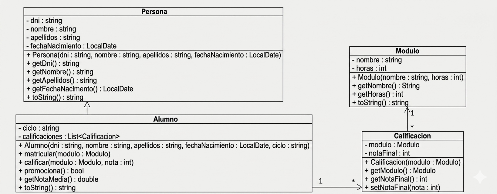
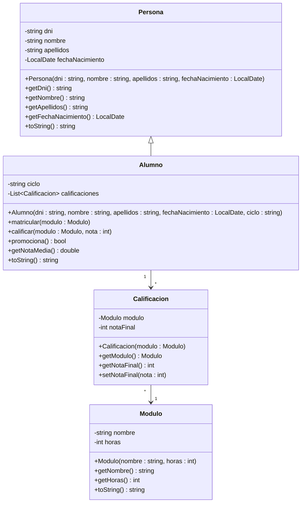

# OPOSICIONES INFORMÁTICA ANDALUCÍA. Programación en Java

## Ejercicio 2025

Desarrollar en lenguaje Java la estructura representada en el siguiente Diagrama de Clases. En dicho diagrama se describe la estructura para representar los alumnos de un Ciclo Formativo con sus módulos y calificaciones.

Se deben desarrollar las clases Alumno y Calificación. Suponemos el resto de clases ya desarrolladas previamente. A continuación se describe la funcionalidad de los métodos más importantes.  



- En la clase Alumno, el método `matricular()` añadirá un módulo y su calificación al alumno. La calificación inicial será 0, indicando que aún está sin calificar. El método `calificar()` servirá para asignarle una calificación numérica (1- 10) al alumno en el módulo especificado. Si el alumno ya estaba matriculado de ese módulo, el método no hará nada.   

- Los métodos que toman un módulo como argumento, si tienen que buscar dicho módulo entre las calificaciones, usarán el nombre del módulo para determinar la coincidencia.   

- El método `promociona()` devolverá true si el alumno está en condiciones de promocionar, es decir, si la suma de las horas de los módulos aprobados es mayor o igual al 50% del total de horas de los módulos matriculados.
- El método `toString()` de Alumno, devolverá lo mismo que el de Persona (datos personales), añadiendo detrás, `"Nota Media = XX.XX"`, donde XX.XX será la nota media del alumno, con dos cifras decimales como máximo.




A continuación se muestra un ejemplo de uso de las clases descritas junto con la salida generada:

### Ejemplo de Uso:

```java
Alumno alumno1 = new Alumno ("11111111H", "Alejandro", "Fernández", LocalDate.of (2000, 3, 15) ,"DAW") ;
Alumno alumno2 = new Alumno ("22222222M", "Daniel", "Travieso", LocalDate.of (1992, 7, 5), "DAW") ; .

Modulo progr = new Modulo ("Programacion",8) ;
Modulo bd = new Modulo ("Bases de Datos",7);
Modulo sis = new Modulo ("Sistemas",4) ;
Modulo endes = new Modulo ("Entornos de Desarrollo",3) ;

alumno1.matricular (progr); 
alumno1.matricular (bd); 
alumno1.matricular (sis); 
alumno1.matricular (endes);

alumno2.matricular (progr);
alumno2.matricular (bd); 
alumno2.matricular (sis); 
alumno2.matricular (endes);

alumno1.calificar (progr,8); 
alumno1.calificar (bd,6);
alumno1.calificar (sis,6); 
alumno1.calificar (endes,10);

alumno2.calificar (progr,4); 
alumno2.calificar (bd,4); 
alumno2.calificar (sis,6); 
alumno2.calificar (endes,10);

System.out.println(alumnol + ", promociona: " + (alumno1.promociona()?"Si": "No") ) ;
System.out.println(alumno2 + ", promociona: " + (alumno2.promociona()?"Si": "No") ) ;
```

### Resultado

```bash
Alejandro Fernández Nota Media = 7.5, promociona: Sí
Daniel Travieso Nota Media = 6.0, promociona: No
```

### Observaciones:

- Se valorarán positivamente la limpieza y claridad en el código, asi como la simplicidad (hacer el código lo más sencillo posible).
- También se valorará el uso de comentarios allá donde sea conveniente alguna aclaración.
- Se escribirá sólo el código de las clases. No es necesario especificar los "imports" ni los paquetes.
- Se separarán con claridad las distintas clases (con un espaciado amplio o una línea horizontal), para facilitar su lectura.
- Se respetarán los nombres que aparecen en el diagrama.
- No se debe añadir ninguna funcionalidad no solicitada.

## Clase Calificacion

```java
public class Calificacion {
    private Modulo modulo;
    private int notaFinal;

    public Calificacion(Modulo modulo) {
        this.modulo = modulo;
        this.notaFinal = 0;
    }

    public Modulo getModulo() {
        return modulo;
    }

    public int getNotaFinal() {
        return notaFinal;
    }

    public void setNotaFinal(int nota) {
        this.notaFinal = nota;
    }
}
```


## Clase Alumno

```java
import java.time.LocalDate;
import java.util.ArrayList;
import java.util.List;

public class Alumno extends Persona {
    private String ciclo;
    private List<Calificacion> calificaciones;

    public Alumno(String dni, String nombre, String apellidos, LocalDate fechaNacimiento, String ciclo) {
        super(dni, nombre, apellidos, fechaNacimiento);
        this.ciclo = ciclo;
        this.calificaciones = new ArrayList<>();
    }

    public void matricular(Modulo modulo) {
        for (Calificacion c : calificaciones) {
            if (c.getModulo().getNombre().equals(modulo.getNombre())) {
                return;
            }
        }
        calificaciones.add(new Calificacion(modulo));
    }

    public void calificar(Modulo modulo, int nota) {
        for (Calificacion c : calificaciones) {
            if (c.getModulo().getNombre().equals(modulo.getNombre())) {
                c.setNotaFinal(nota);
                return;
            }
        }
    }

    public boolean promociona() {
        int horasAprobadas = 0;
        int horasTotales = 0;

        for (Calificacion c : calificaciones) {
            horasTotales += c.getModulo().getHoras();
            if (c.getNotaFinal() >= 5) {
                horasAprobadas += c.getModulo().getHoras();
            }
        }

        return horasAprobadas * 2 >= horasTotales;
    }

    public double getNotaMedia() {
        if (calificaciones.isEmpty()) {
            return 0.0;
        }
        int suma = 0;
        for (Calificacion c : calificaciones) {
            suma += c.getNotaFinal();
        }
        return (double) suma / calificaciones.size();
    }

    public String toString() {
        return super.toString() + " Nota Media = " + String.format("%.1f", getNotaMedia());
    }
}
```


## Otras clases, no necesarias para el ejercicio:

### Persona

```java
import java.time.LocalDate;

public class Persona {
    private String dni;
    private String nombre;
    private String apellidos;
    private LocalDate fechaNacimiento;

    public Persona(String dni, String nombre, String apellidos, LocalDate fechaNacimiento) {
        this.dni = dni;
        this.nombre = nombre;
        this.apellidos = apellidos;
        this.fechaNacimiento = fechaNacimiento;
    }

    public String getDni() {
        return dni;
    }

    public String getNombre() {
        return nombre;
    }

    public String getApellidos() {
        return apellidos;
    }

    public String toString() {
        return nombre + " " + apellidos;
    }
}
```


### Modulo
```java
public class Modulo {
    private String nombre;
    private int horas;

    public Modulo(String nombre, int horas) {
        this.nombre = nombre;
        this.horas = horas;
    }

    public String getNombre() {
        return nombre;
    }

    public int getHoras() {
        return horas;
    }
}
```

### Main

```java
import java.time.LocalDate;
import java.util.ArrayList;
import java.util.List;

public class Main {
    public static void main(String[] args) {
        Alumno alumno1 = new Alumno ("11111111H", "Alejandro", "Fernández", LocalDate.of(2000, 3, 15), "DAW");
        Alumno alumno2 = new Alumno ("22222222M", "Daniel", "Travieso", LocalDate.of(1992, 7, 5), "DAW");

        Modulo progr = new Modulo("Programacion", 8);
        Modulo bd = new Modulo("Bases de Datos", 7);
        Modulo sis = new Modulo("Sistemas", 4);
        Modulo endes = new Modulo("Entornos de Desarrollo", 3);

        alumno1.matricular(progr);
        alumno1.matricular(bd);
        alumno1.matricular(sis);
        alumno1.matricular(endes);

        alumno2.matricular(progr);
        alumno2.matricular(bd);
        alumno2.matricular(sis);
        alumno2.matricular(endes);

        alumno1.calificar(progr, 8);
        alumno1.calificar(bd, 6);
        alumno1.calificar(sis, 6);
        alumno1.calificar(endes, 10);

        Modulo progi = new Modulo("Programacion", 8);
        Modulo ba = new Modulo("Bases de Datos", 7);
        alumno2.calificar(progi, 4);
        alumno2.calificar(ba, 4);
        alumno2.calificar(sis, 6);
        alumno2.calificar(endes, 10);

        System.out.println(alumno1 + ", promociona: " + (alumno1.promociona()?"Si":"No"));
        System.out.println(alumno2 + ", promociona: " + (alumno2.promociona()?"Si":"No"));
    }
}
```

Comprobamos que compila correctamente:
```bash

 ~/java/opos2025/ java Main
Alejandro Fernández Nota Media = 7,5, promociona: Si
Daniel Travieso Nota Media = 6,0, promociona: No

```
Perfecto...


