# Manual de Python
## Fundamentos de programación para bachillerato

Este manual recorre los fundamentos de la programación usando **Python** como lenguaje. Cada sección explica un concepto, lo ilustra con ejemplos ejecutables y termina con ejercicios para comprobar lo aprendido.

## Cómo usar este manual

- Lee la sección completa antes de hacer los ejercicios.
- Escribe el código en un archivo `.py` y ejecútalo con Python.
- Los bloques que empiezan por `Salida` muestran lo que verás en pantalla.
- Al final hay una [biblioteca de ejercicios](#ejercicios-de-repaso) para practicar de forma ordenada.

## Convenciones

| Símbolo | Significado |
|---|---|
| `>` | Entrada de datos del usuario |
| Salida | Texto que aparece en pantalla |
| `mensaje` | Texto literal entre comillas |
| `PI`, `MAX_INT` | Constante (se escribe siempre en mayúsculas) |
| `edad`, `total` | Variable (se escribe en minúsculas) |
| `*¿...?*` | Valor que debe teclear el usuario |

## Índice

1. [1.1 Por qué aprender a programar](#11-por-qué-aprender-a-programar)
2. [1.2 Instrucción y secuenciación](#12-instrucción-y-secuenciación)
3. [1.3 Algoritmos y diagramas de flujo](#13-algoritmos-y-diagramas-de-flujo)
4. [1.4 Código](#14-código)
5. [1.5 Tipos de datos](#15-tipos-de-datos)
6. [1.6 Constantes y variables](#16-constantes-y-variables)
7. [1.7 Operadores y expresiones](#17-operadores-y-expresiones)
8. [1.8 Comentarios](#18-comentarios)
9. [1.9 Interacción con el usuario](#19-interacción-con-el-usuario)
10. [1.10 Estructuras de control](#110-estructuras-de-control)
11. [1.11 Estructuras de datos](#111-estructuras-de-datos)
12. [1.12 Funciones y módulos](#112-funciones-y-módulos)

---

## 1.1 Por qué aprender a programar

### Qué es programar

Programar es **escribir instrucciones que un ordenador ejecuta de forma automática**. No le decimos a la máquina *qué resultado queremos*: le decimos *cómo obtenerlo*, paso a paso.

Piensa en una receta de cocina. Si le dices a alguien «cena para cuatro personas», cada persona interpretará los pasos de forma distinta. Un ordenador necesita que cada paso sea exacto, sin ambigüedades.

### Por qué es una habilidad útil

- **Automatiza tareas repetitivas.** Calcular mil notas, renombrar cien archivos o generar informes no debería ocupar una tarde entera.
- **Resuelve problemas.** Enseñar a un ordenador a resolver un problema te obliga a entenderlo tú mismo mejor.
- **Es la base de casi todo.** Las apps, las páginas web, el análisis de datos, la inteligencia artificial y la automatización de servidores empiezan aquí.
- **Desarrolla pensamiento lógico.** Descomponer un problema grande en pasos pequeños es una habilidad transferible a cualquier asignatura.
- **Es una habilidad con salidas laborales.** Python es de los lenguajes más demandados en el mercado actual.

### El ciclo de resolución de problemas

Programar no es escribir código directamente. Es un proceso con fases:

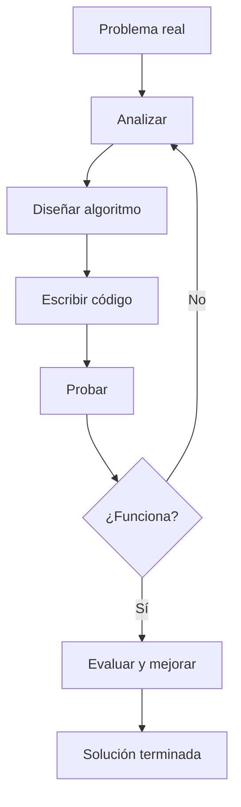

Un error en el programa no es un desastre: es información que te dice que el algoritmo debe ajustarse. Por eso se habla de **depurar** (`debug`) y no solo de "programar".

### Ejemplo del ciclo completo

Problema: *una tienda aplica un 21 % de IVA a sus precios*.

1. **Analizar:** el usuario introduce un precio sin impuestos y el programa muestra el precio final.
2. **Diseñar algoritmo:** calcular `precio * 1.21` y mostrarlo.
3. **Programar:** escribir esas dos instrucciones en Python.
4. **Probar:** ¿funciona con 100 €? ¿Con 0 €? ¿Con un número con decimales?

```python
precio = 100
print(precio * 1.21)
```

**Salida**

```text
121.0
```

---

## 1.2 Instrucción y secuenciación

### Qué es una instrucción

Una **instrucción** es una orden que el ordenador entiende y ejecuta. En Python, cada instrucción se escribe en una línea (salvo los bloques como `if` o `for`, que necesitan varias líneas y usan dos puntos).

```python
nombre = "Ana"                    # instrucción 1: crear una variable
edad = 17                         # instrucción 2
print("Hola", nombre)             # instrucción 3: mostrar
print("Tienes", edad, "años")     # instrucción 4
```

**Salida**

```text
Hola Ana
Tienes 17 años
```

### El orden importa: secuenciación

Las instrucciones se ejecutan **una detrás de otra, de arriba abajo**. A ese orden se le llama **secuenciación**, y es la primera estructura de control que usas, aunque no se escriba con ninguna palabra clave.

```python
a = 10
b = 5
print("Suma:", a + b)
a = 100          # esta línea se ejecuta DESPUÉS de la anterior
print("Ahora a vale:", a)
```

**Salida**

```text
Suma: 15
Ahora a vale: 100
```

El error clásico es suponer que el ordenador «entiende» la intención. No lo hace: si escribes

```python
print("El resultado es:", total)
total = 5 + 5
```

**Salida**

```text
El resultado es:
Traceback (most recent call last):
  File "ejemplo.py", line 1, in <module>
    print("El resultado es:", total)
NameError: name 'total' is not defined
```

Python ejecuta de arriba abajo: cuando llega a `print`, la variable `total` todavía no existe. **Declara cada variable antes de usarla.**

### Un programa con tres fases

Un programa real casi siempre sigue la misma secuencia: **entrada → proceso → salida**.

```python
# ENTRADA: obtener los datos
nombre = input("Nombre: ")
edad = int(input("Edad: "))

# PROCESO: calcular
mayor_de_edad = edad >= 18

# SALIDA: mostrar el resultado
print(nombre, "es mayor de edad:", mayor_de_edad)
```

Cada fase tiene una responsabilidad. Cuando un programa se complica, separar las fases es lo que lo mantiene ordenado.

### Ejercicios

1. Escribe un programa con tres instrucciones que muestre tu nombre, tu curso y tu ciudad.
2. Escribe un programa con cuatro instrucciones que declare tres variables y muestre su suma.
3. Explica por qué este programa falla y cómo lo corregirías:

```python
print("Hola", nombre)
nombre = "Ana"
```

4. Escribe un programa que declare una variable `x` con el valor `5` y la muestre, y después vuelva a declarar `x` con el valor `10` y la vuelva a mostrar.

---

## 1.3 Algoritmos y diagramas de flujo

### Qué es un algoritmo

Un **algoritmo** es una secuencia finita y no ambigua de pasos que resuelve un problema. Tres características:

- **Finito:** tiene principio y fin; termina.
- **Preciso:** cada paso indica exactamente qué hacer, sin ambigüedades.
- **General:** sirve para cualquier caso del mismo tipo, no solo para uno concreto.

Un algoritmo para calcular el área de un rectángulo:

1. Pedir la base.
2. Pedir la altura.
3. Multiplicar base por altura.
4. Mostrar el resultado.

Fíjate en que **no dice «calcula el área»**: eso no es un paso preciso, es el objetivo. El algoritmo son los pasos.

### Calidad de un algoritmo

Un buen algoritmo debe ser **eficiente** (no hacer trabajo innecesario) y **legible** (que otra persona pueda entenderlo). Se evalúa en dos aspectos:

| Aspecto | Pregunta | Cómo se mejora |
|---|---|---|
| Corrección | ¿Produce el resultado correcto? | Revisar la lógica |
| Eficiencia | ¿Tarda lo necesario? | Evitar repetir cálculos y bucles innecesarios |

Comparación de dos algoritmos para sumar los números del 1 al `n`:

```python
# Algoritmo A: repetimos la suma n veces
n = 1000
suma = 0
for i in range(1, n + 1):
    suma = suma + i
print(suma)

# Algoritmo B: usamos la fórmula de Gauss, una sola operación
print(n * (n + 1) / 2)
```

**Salida**

```text
500500
500500.0
```

Los dos dan el mismo resultado, pero el B es mucho más eficiente. Saber elegir el algoritmo correcto es tan importante como saber escribirlo.

### Símbolos de un diagrama de flujo

Un **diagrama de flujo** representa el algoritmo con figuras geométricas:

| Figura | Significado |
|---|---|
| Óvalo | Inicio o fin del programa |
| Rectángulo | Proceso (una instrucción) |
| Rombo | Decisión (¿se cumple la condición?) |
| Paralelogramo | Entrada o salida de datos |
| Conector | Une dos zonas del diagrama |

### Símbolos en Mermaid

Este sitio usa [Mermaid](https://mermaid.js.org) para dibujar los diagramas. La estructura básica es:

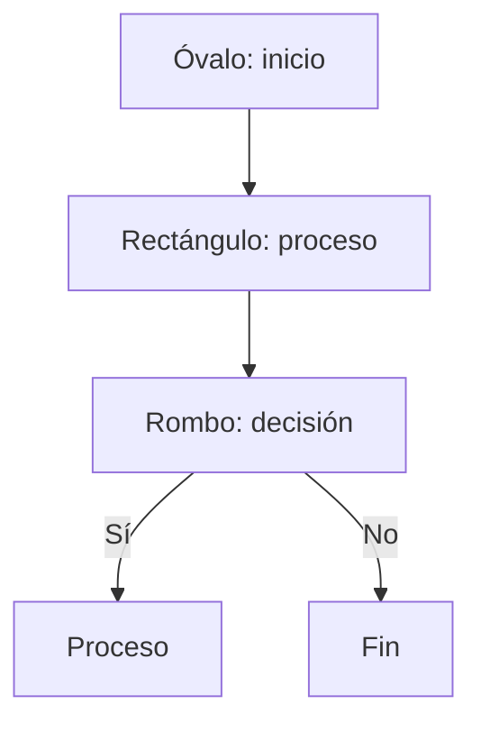

```text
      (Inicio)
          |
          v
      [Proceso]
          |
          v
     <¿Decisión?> --Sí--> [Proceso A]
          |
          No
          v
     [Proceso B]
          |
          v
        (Fin)
```

### Ejemplo completo: ¿es mayor de edad?

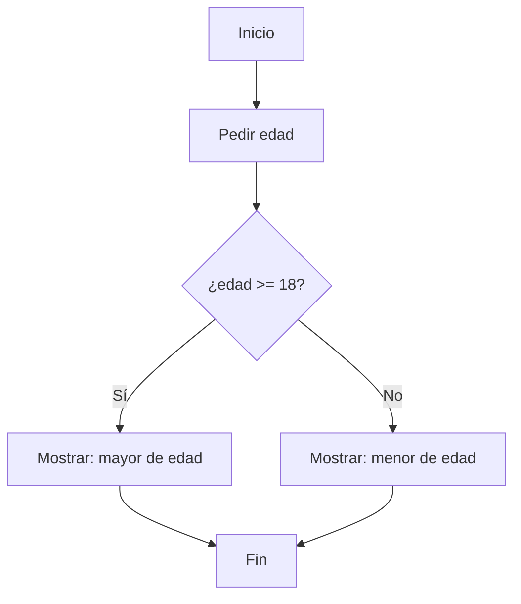

El mismo algoritmo en Python:

```python
edad = int(input("Introduce tu edad: "))

if edad >= 18:
    print("Eres mayor de edad")
else:
    print("Eres menor de edad")
```

### Ejemplo: algoritmo con dos decisiones

Buscar el número mayor entre tres:

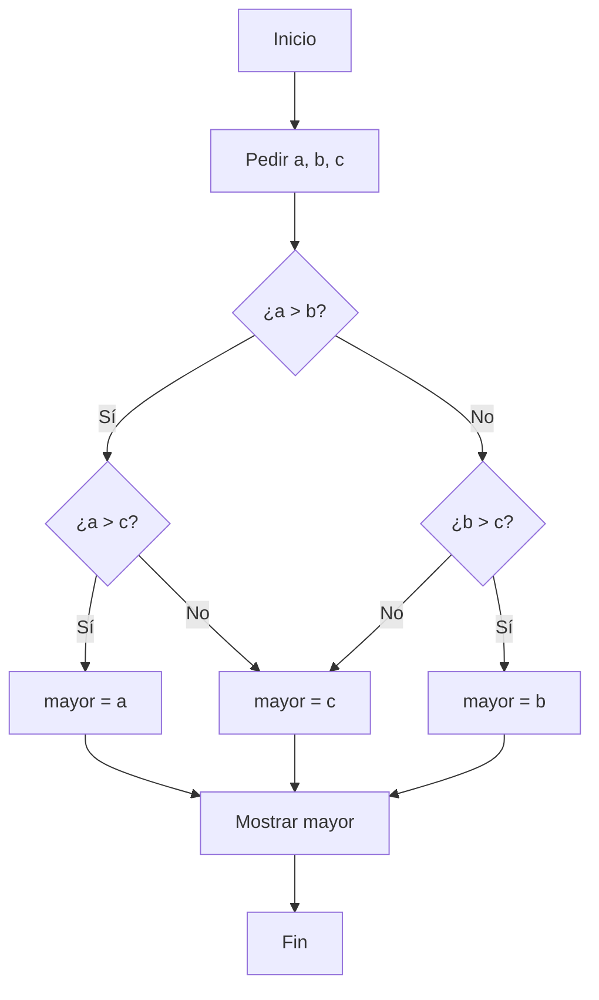

```python
a = int(input("a: "))
b = int(input("b: "))
c = int(input("c: "))

if a > b:
    if a > c:
        mayor = a
    else:
        mayor = c
else:
    if b > c:
        mayor = b
    else:
        mayor = c

print("El mayor es", mayor)
```

### Ejercicios

1. Escribe el algoritmo (en pasos) para determinar si un número es positivo, negativo o cero.
2. Dibuja el diagrama de flujo de un programa que pida un número y muestre si es par o impar.
3. Escribe el algoritmo para calcular el perímetro de un rectángulo y su diagrama de flujo.
4. Explica la diferencia entre un algoritmo correcto y un algoritmo eficiente. Pon un ejemplo de cada uno.

---

## 1.4 Código

### Del algoritmo al código

Un **algoritmo** es la idea, independiente del lenguaje. El **código** es esa idea escrita en un lenguaje concreto para que una máquina la ejecute. El algoritmo de «pedir edad y decir si es mayor de edad» es el mismo en Python, en Java o en pseudocódigo; el código cambia.

**Pseudocódigo** es una forma de escribir el algoritmo con casi lenguaje natural:

```text
INICIO
    LEER edad
    SI edad >= 18 ENTONCES
        ESCRIBIR "Mayor de edad"
    SINO
        ESCRIBIR "Menor de edad"
    FIN_SI
FIN
```

**Python** del mismo algoritmo:

```python
edad = int(input("Edad: "))

if edad >= 18:
    print("Mayor de edad")
else:
    print("Menor de edad")
```

### Cómo se escribe código: sangría e indentación

En Python los bloques de código se delimitan por **sangría** (los espacios al principio de la línea), no por llaves como en otros lenguajes. Es la regla más importante del lenguaje y la causa número uno de errores al empezar.

La regla: **todo lo que forma parte de un bloque lleva 4 espacios de sangría**. El bloque empieza en la línea de los dos puntos (`:`) y termina cuando la sangría vuelve al nivel anterior.

```python
edad = 20

if edad >= 18:              # nivel 0
    print("Mayor de edad")  # nivel 1 (4 espacios)
    print("Puedes voter")   # nivel 1
else:                       # nivel 0
    print("Menor de edad")  # nivel 1
```

Si el bloque tiene varios niveles, la sangría se acumula:

```python
notas = [7, 3, 9, 10]

if notas[0] > 5:                    # nivel 0
    if notas[1] > 5:                # nivel 1
        print("Ambas aprobadas")   # nivel 2
    else:                           # nivel 1
        print("Segunda suspensa")   # nivel 2
```

::: tip Recomendación
Configura tu editor para que al pulsar <kbd>Intro</kbd> dentro de un bloque añada automáticamente 4 espacios. En Visual Studio Code: **Ajustes → Preferencias → Configuración → Editor: Tab Size = 4** y activa *Convert Tabs To Spaces*.
:::

### Archivos y extensión

Un programa se guarda en un archivo de texto plano con extensión **`.py`**. Por ejemplo `mayor_edad.py`.

```text
# archivo: mayor_edad.py
edad = int(input("Edad: "))
if edad >= 18:
    print("Mayor de edad")
else:
    print("Menor de edad")
```

Para ejecutarlo:

```bash
python mayor_edad.py
```

Un archivo `.py` puede contener muchas líneas y ejecutarse tantas veces como quieras. El orden de ejecución siempre es de arriba abajo.

### Errores frecuentes al escribir código

| Error | Ejemplo | Consecuencia |
|---|---|---|
| Olvidar los dos puntos | `if edad >= 18` | `SyntaxError` |
| Sangría incorrecta | Falta un espacio en un `print` | `IndentationError` |
| Usar un nombre no definido | `print(total)` sin declararlo | `NameError` |
| Paréntesis sin cerrar | `print("hola"` | `SyntaxError` |
| Mezclar comillas | `print('hola")` | `SyntaxError` |
| Confundir `=` y `==` | `if edad = 18:` | `SyntaxError` |

### Cómo leer mensajes de error

Cuando Python se detiene, muestra siempre el mismo tipo de información:

```text
Traceback (most recent call last):
  File "mayor_edad.py", line 2, in <module>
    print(edad)
NameError: name 'edad' is not defined
```

1. `File "mayor_edad.py", line 2` → **en qué archivo y en qué línea** está el fallo.
2. `print(edad)` → la línea exacta de código.
3. `NameError: ...` → el **tipo** de error y su descripción.

Localiza la línea indicada, lee el mensaje y corrige. No hace falta entender el 100 % del mensaje: la última línea siempre te dice qué falla.

### Ejercicios

1. Escribe este pseudocódigo en Python y ejecútalo:

```text
INICIO
    LEER lado
    LEER altura
    ESCRIBIR "Área:" (lado * altura)
FIN
```

2. Corrige este programa e indica qué estaba mal:

```python
edad = 17
if edad >= 18:
    print("Mayor de edad")
print("Fin del programa")
```

3. Explica la diferencia entre escribir en una línea `if edad >= 18: print("Sí")` y escribirlo en tres líneas. ¿Cuándo conviene cada opción?
4. Ejecuta deliberadamente un programa con un error y localiza la línea exacta que señala el mensaje de error.

---

## 1.5 Tipos de datos

### Qué es un tipo de dato

Un **tipo de dato** define qué clase de valores puede contener una variable y qué operaciones se pueden hacer con ellos. El número `3`, el texto `"3"` y el valor `3.0` no son lo mismo: cada uno tiene un tipo distinto y se comporta de forma distinta.

Python es de **tipado dinámico**: no declaras el tipo al crear la variable, pero el tipo siempre existe y se puede consultar.

### Los tipos básicos

| Tipo | Nombre | Ejemplo | Descripción |
|---|---|---|---|
| `int` | Entero | `42`, `-7`, `0` | Números sin decimales |
| `float` | Real | `3.14`, `-0.5` | Números con decimales |
| `str` | Cadena | `"Hola"`, `'Python'` | Texto entre comillas |
| `bool` | Booleano | `True`, `False` | Verdad o falsedad |
| `NoneType` | Nulo | `None` | Ausencia de valor |

### Enteros (`int`)

```python
edad = 17
ano = 2026
negativo = -3
cero = 0

print(type(edad))     # <class 'int'>
```

Los enteros no tienen límite de tamaño en Python 3 (a diferencia de otros lenguajes, donde un entero está limitado a 32 o 64 bits).

### Reales (`float`)

```python
altura = 1.72
precio = 19.99
division = 10 / 4     # 2.5 (la división siempre produce float)

print(type(precio))   # <class 'float'>
```

Un detalle importante: los `float` no representan exactamente todos los decimales, porque internamente se guardan en base 2. Esto produce efectos curiosos:

```python
print(0.1 + 0.2)
```

**Salida**

```text
0.30000000000000004
```

No es un error de Python: es una limitación de la representación binaria de los decimales. Cuando necesites precisión exacta (cálculo monetario, por ejemplo), usa el módulo `decimal` o guarda los valores como enteros en céntimos.

### Cadenas de texto (`str`)

Las cadenas van entre comillas. Puedes usar comillas simples `'...'` o dobles `"..."`; lo importante es que sean del mismo tipo y que no se mezclen con la propia comilla sin escaparla.

```python
nombre = "Ana"
apellido = 'García'
ciudad = "Málaga"
frase = "Ella dijo: 'hola'"

print(type(nombre))   # <class 'str'>
```

Para escribir una comilla dentro de una cadena de texto, se puede usar la barra invertida `\` delante:

```python
frase = "Ella dijo: \"hola\""
```

O usar comillas triples, útiles para textos de varias líneas:

```python
carta = """Querida abuela:

Hoy he aprobado Programación.
Un abrazo."""
```

Las cadenas son **inmutables**: una vez creada, no se puede cambiar su contenido. Si intentas modificarla, obtienes un error. Para «cambiar» una cadena hay que crear una nueva:

```python
saludo = "hola"
saludo = saludo + " mundo"    # se crea una cadena nueva
print(saludo)                 # hola mundo
```

### Booleanos (`bool`)

Solo hay dos valores: `True` y `False`. Se escriben con mayúscula inicial. Son el resultado de las comparaciones:

```python
print(5 > 3)        # True
print(5 < 3)        # False
print(5 == 5)       # True
print(5 != 3)       # True
```

En una condición, todo valor puede actuar como verdadero o falso según estas reglas, que conviene conocer:

| Valor | ¿Verdadero? |
|---|---|
| `0`, `0.0` | Falso |
| `""` (cadena vacía) | Falso |
| `[]` (lista vacía) | Falso |
| `None` | Falso |
| Cualquier otro valor | Verdadero |

```python
print(bool(0))       # False
print(bool(""))      # False
print(bool(-1))      # True  (¡ojo! cualquier número distinto de 0)
```

### El valor `None`

`None` representa la **ausencia de valor**. Es lo que devuelve una función que no tiene `return`, y se usa para indicar que una variable todavía no tiene nada.

```python
resultado = None
print(resultado)         # None
print(type(resultado))   # <class 'NoneType'>
```

### Consultar y convertir tipos

La función `type()` devuelve el tipo de un valor:

```python
print(type(42))          # <class 'int'>
print(type(3.14))        # <class 'float'>
print(type("hola"))      # <class 'str'>
print(type(True))        # <class 'bool'>
```

Para pasar de un tipo a otro se usa una función homónima del tipo destino. Esto se llama **casting** o **conversión de tipos**:

```python
print(int("25") + 5)         # 30    (texto a entero, y luego suma)
print(float("3.5") * 2)      # 7.0   (texto a real)
print(str(100) + "€")        # 100€  (entero a texto)
print(bool(1))               # True
```

### El problema clásico: `input()` siempre devuelve texto

Este es el error más frecuente al empezar. **`input()` devuelve siempre una `str`**, aunque el usuario escriba un número. Si no conviertes el resultado, cualquier operación matemática fallará:

```python
# ❌ ERROR
edad = input("Edad: ")
print(edad + 1)

# TypeError: can only concatenate str (not "int") to str
```

La solución es envolver `input()` con `int()` o `float()`:

```python
# ✅ Correcto
edad = int(input("Edad: "))
print(edad + 1)
```

Recuerda: `int()` convierte a entero (borra la parte decimal), `float()` conserva los decimales.

```python
print(int(3.99))      # 3
print(float(3))        # 3.0
```

Y si el usuario escribe letras en lugar de un número, el programa se detiene con un `ValueError`. Lo veremos con detalle en el manual de Python avanzado.

### Estructuras de datos como tipos

Python incluye además tipos que guardan **varios valores**: listas (`list`), tuplas (`tuple`), diccionarios (`dict`) y conjuntos (`set`). Los veremos en detalle en el [apartado 1.11](#111-estructuras-de-datos).

```python
print(type([1, 2, 3]))        # <class 'list'>
print(type((1, 2, 3)))        # <class 'tuple'>
print(type({"a": 1}))         # <class 'dict'>
print(type({1, 2, 3}))        # <class 'set'>
```

### Tabla resumen de conversiones

| Función | Convierte a | Ejemplo | Resultado |
|---|---|---|---|
| `int(x)` | Entero | `int("42")` | `42` |
| `float(x)` | Real | `float("3.5")` | `3.5` |
| `str(x)` | Texto | `str(42)` | `"42"` |
| `bool(x)` | Booleano | `bool(0)` | `False` |
| `type(x)` | Tipo | `type(42)` | `int` |

### Ejercicios

1. Declara una variable de cada tipo básico y muestra su `type()`.
2. Explica con tus palabras qué diferencia hay entre `5`, `"5"` y `5.0`. Escribe un programa que demuestre que no son intercambiables.
3. Corrige este programa:

```python
altura = input("Altura en metros: ")
doble = altura * 2
print("El doble de tu altura es", doble)
```

4. ¿Qué salida produce este código? Razona el resultado antes de ejecutarlo:

```python
print(int("3") + int("4"))
print(str(3) + str(4))
print("3" + "4")
```

5. Escribe un programa que pida la edad al usuario y muestre su edad dentro de 10 años, teniendo en cuenta el tipo de dato correcto.

---

## 1.6 Constantes y variables

### Variables

Una **variable** es una caja con un nombre donde guardas un valor para usarlo más tarde. En Python:

- **No se declara** con una palabra clave: se crea al asignarle un valor por primera vez.
- El signo `=` se llama **operador de asignación**: significa «guarda este valor en esta caja», no «son iguales».
- Puede cambiar de valor a lo largo del programa.

```python
puntos = 0                 # se crea con el valor 0
print(puntos)              # 0
puntos = puntos + 10       # ahora vale 10
print(puntos)              # 10
puntos = 0                 # se reinicia
print(puntos)              # 0
```

Un mismo nombre puede cambiar de tipo entre asignaciones, aunque conviene evitarlo porque dificulta entender el programa:

```python
dato = 5
print(type(dato))     # <class 'int'>
dato = "cinco"
print(type(dato))     # <class 'str'>
```

### Constantes

Una **constante** es un valor que **no debe cambiar** durante la ejecución del programa. En Python no hay una palabra clave para declararlas: la convención universal es escribirlas **en mayúsculas**.

```python
PI = 3.14159
MAX_INTENTOS = 5
SALUDO = "Bienvenido al aula"
TASA_IVA = 0.21

print("El área es:", 3 * 4 * PI)
print(SALUDO)
```

Python **no impide** reasignar una constante, solo indica por convención que no deberías hacerlo. Además, los avisos de muchos editores y analizadores aparecen al reasignar una variable escrita en mayúsculas, precisamente para avisarte del error.

### Convenciones de nombres

En Python existe una convención estándar (PEP 8) que conviene seguir:

| Tipo | Convención | Ejemplo |
|---|---|---|
| Variables | `snake_case` (minúsculas con guiones bajos) | `edad`, `total_puntos` |
| Constantes | `MAYÚSCULAS_CON_GUION_BAJO` | `PI`, `MAX_INTENTOS` |
| Funciones | `snake_case` | `calcular_area()` |
| Clases | `PascalCase` | `Alumno`, `CocheElectrico` |

Reglas para los nombres:

- Empiezan por letra o guion bajo. **No pueden empezar por número.**
- Solo llevan letras, dígitos y guiones bajos. **No pueden contener espacios ni guiones.**
- No pueden ser palabras reservadas del lenguaje: `if`, `else`, `while`, `for`, `class`, `import`, `return`...
- No Uses mayúsculas y minúsculas de forma intercambiable: `edad` y `Edad` son **variables distintas**.

```python
# ❌ Nombres incorrectos
2edad = 10          # empieza por número
mi edad = 10        # espacio
mi-edad = 10        # guion
class = 2           # palabra reservada
Edad = 10
edad = 20           # ¿cuál vale? Son dos variables diferentes

# ✅ Nombres correctos
edad = 10
edad_2026 = 10
_altura = 1.72
```

### Ámbito de una variable

Una variable existe **solo desde la línea donde se crea** y hasta que el programa termina. Si intentas usarla antes de crearla, obtaines un `NameError`.

```python
print(saludo)       # ❌ NameError
saludo = "Hola"     # la variable se crea aquí
print(saludo)       # ✅ Hola
```

### Intercambio de valores

Para intercambiar dos variables sin una variable auxiliar, Python permite hacerlo en una sola línea:

```python
a = 1
b = 2
print(a, b)     # 1 2
a, b = b, a
print(a, b)     # 2 1
```

También se puede hacer lo mismo con tres variables:

```python
a, b, c = 1, 2, 3
print(a, b, c)        # 1 2 3
a, b, c = c, a, b
print(a, b, c)        # 3 1 2
```

### Ejercicios

1. Declara tres constantes: el valor de PI, el precio del combustible y un mensaje de bienvenida, y úsalas en un programa que muestre el área de un círculo y el precio final con IVA.
2. Escribe un programa que declare tres variables, intercambie sus valores y los muestre.
3. Explica por qué estos dos nombres son problema:

```python
PESO = 70
peso = 70
```

4. Renombra correctamente estas variables según las convenciones de Python: `MiNombre`, `TOTAL-VENTA`, `2Intentos`, `edad del alumno`.
5. ¿Qué error produce este código? Corrígelo:

```python
print("Hola", nombre)
nombre = "Ana"
```

---

## 1.7 Operadores y expresiones

Un **operador** es un símbolo que indica una operación. Una **expresión** es una combinación de valores, variables y operadores que produce un resultado. En `total = precio * 2`, `precio * 2` es la expresión y `=` es el asignador.

### Operadores aritméticos

| Operador | Nombre | Ejemplo | Resultado |
|---|---|---|---|
| `+` | Suma | `5 + 3` | `8` |
| `-` | Resta | `5 - 3` | `2` |
| `*` | Multiplicación | `5 * 3` | `15` |
| `/` | División real | `7 / 2` | `3.5` |
| `//` | División entera | `7 // 2` | `3` |
| `%` | Módulo (resto) | `7 % 2` | `1` |
| `**` | Potencia | `2 ** 10` | `1024` |

La diferencia entre `/` y `//` es fundamental: `/` siempre devuelve un `float`, `//` devuelve solo la parte entera.

```python
print(7 / 2)      # 3.5
print(7 // 2)     # 3
print(7.0 // 2)   # 3.0
```

El operador `%` devuelve el **resto** de la división. Es la forma más fácil de comprobar si un número es par:

```python
print(7 % 2)      # 1  -> impar
print(8 % 2)      # 0  -> par
```

**Salida del programa**

```text
7 % 2 = 1
8 % 2 = 0
```

### División por cero

Si el divisor es cero, Python detiene el programa con un `ZeroDivisionError`. Compruébalo antes de dividir:

```python
print(10 / 0)
```

**Salida**

```text
ZeroDivisionError: division by zero
```

### Operadores de comparación

Comparan dos valores y devuelven `True` o `False`:

| Operador | Significado | Ejemplo | Resultado |
|---|---|---|---|
| `==` | Igual | `5 == 5` | `True` |
| `!=` | Distinto | `5 != 3` | `True` |
| `>` | Mayor | `5 > 3` | `True` |
| `<` | Menor | `5 < 3` | `False` |
| `>=` | Mayor o igual | `5 >= 5` | `True` |
| `<=` | Menor o igual | `3 <= 5` | `True` |

::: warning El error más común
`=` asigna, `==` compara.

```python
edad = 18      # asigna el valor 18 a la variable edad
if edad == 18: # pregunta si edad vale 18
    print("Mayoría de edad")

if edad = 18:  # ❌ SyntaxError
    print("Nunca llega aquí")
```
:::

### Operadores lógicos

Combinan condiciones. Tabla de verdad:

| `a` | `b` | `and` | `or` | `not a` |
|---|---|---|---|---|
| `True` | `True` | `True` | `True` | `False` |
| `True` | `False` | `False` | `True` | `False` |
| `False` | `True` | `False` | `True` | `True` |
| `False` | `False` | `False` | `False` | `True` |

| Operador | Significado | Ejemplo | Resultado |
|---|---|---|---|
| `and` | Ambas condiciones son ciertas | `edad >= 18 and tiene_carnet` | `True` |
| `or` | Al menos una es cierta | `dia == "sábado" or dia == "domingo"` | `True` |
| `not` | Niega el valor | `not aprobado` | `False` |

```python
edad = 20
tiene_carnet = True

print(edad >= 18 and tiene_carnet)     # True
print(edad < 18 or tiene_carnet)       # True
print(not tiene_carnet)                # False
```

En Python se pueden agrupar condiciones con paréntesis para que la lógica sea más evidente:

```python
print((5 + 3) * 2)
print(5 + 3 * 2)
```

**Salida**

```text
16
11
```

### Operadores de pertenencia e identidad

| Operador | Qué comprueba | Ejemplo | Resultado |
|---|---|---|---|
| `in` | Si un valor está en una colección | `3 in [1, 2, 3]` | `True` |
| `not in` | Si **no** está en la colección | `5 not in [1, 2, 3]` | `True` |
| `is` | Si **es el mismo objeto** | `a is b` | `False` |
| `is not` | Si **no** es el mismo objeto | `a is not b` | `True` |

```python
notas = [7, 5, 9]
print(5 in notas)          # True
print(8 in notas)          # False

print("a" in "hola")       # True (las cadenas también son colecciones)
```

Como regla práctica, **usa `==` para comparar valores**. `is` se reserva para comprobar si una variable está vacía:

```python
texto = ""
if texto is None:         # ✅ forma correcta de detectar ausencia de valor
    print("No hay texto")
```

Si escribes `if texto == None:` funciona, pero la forma recomendada es `is None`.

### Concatenación y repetición de cadenas

El operador `+` también une cadenas, y `*` repite una cadena:

```python
print("Hola" + " " + "mundo")    # Hola mundo
print("-" * 30)                  # ------------------------------
print("AB" * 3)                  # ABABAB
```

```text
Hola mundo
------------------------------
ABABAB
```

Los números **no** se pueden concatenar con `+`. Hay que convertirlos con `str()`:

```python
# ❌ TypeError
print("Tengo " + 17 + " años")

# ✅ Correcto
print("Tengo " + str(17) + " años")
```

La forma más cómoda de evitar esto son las **cadenas formateadas** o *f-strings*, con la letra `f` delante:

```python
nombre = "Ana"
edad = 17
altura = 1.72

print(f"Hola, me llamo {nombre} y tengo {edad} años.")
print(f"Mido {altura} metros y dentro de 10 años seguiré midiendo {altura}.")
```

**Salida**

```text
Hola, me llamo Ana y tengo 17 años.
Mido 1.72 metros y dentro de 10 años seguiré midiendo 1.72.
```

Dentro de las llaves `{}` puedes escribir expresiones completas:

```python
print(f"El doble de 7 es {7 * 2}")
print(f"El área es {3 * 4} unidades cuadradas")
```

Las f-strings son la forma preferida de construir texto en Python moderno. Úsalas siempre que puedas.

### Operadores de asignación

| Operador | Equivale a |
|---|---|
| `x += 1` | `x = x + 1` |
| `x -= 1` | `x = x - 1` |
| `x *= 2` | `x = x * 2` |
| `x /= 2` | `x = x / 2` |
| `x //= 2` | `x = x // 2` |
| `x %= 2` | `x = x % 2` |
| `x **= 2` | `x = x ** 2` |

```python
total = 10
total += 5
print(total)        # 15
total *= 2
print(total)        # 30
```

### Prioridad de operadores

Como en matemáticas, los operadores tienen un orden de ejecución. De mayor a menor prioridad:

| Nivel | Operadores | Asociación |
|---|---|---|
| 1 | `**` | Derecha |
| 2 | `*` `/` `//` `%` | Izquierda |
| 3 | `+` `-` | Izquierda |
| 4 | `<` `<=` `>` `>=` `in` `not in` `is` `is not` | Izquierda |
| 5 | `not` | Derecha |
| 6 | `and` | Izquierda |
| 7 | `or` | Izquierda |
| 8 | `=` (asignación) | Derecha |

```python
print(2 + 3 * 4)        # 14  (primero la multiplicación)
print((2 + 3) * 4)      # 20  (los paréntesis mandan)
print(2 ** 3 ** 2)      # 512 (asociación a la derecha: 2 ** (3 ** 2))
```

::: tip Consejo
Cuando tengas dudas sobre el orden, **usa paréntesis**. Aunque no sean necesarios, hacen el código más fácil de leer.
:::

### Errores frecuentes

| Expresión | Error | Solución |
|---|---|---|
| `print("5" * 2)` | Imprime `55`, no 10 | Convierte: `int("5") * 2` |
| `print(3 / 0)` | `ZeroDivisionError` | Comprueba que el divisor no sea 0 |
| `if x = 3:` | `SyntaxError` | Usa `==` para comparar |
| `print("Total: " + 10)` | `TypeError` | Usa f-strings: `print(f"Total: {10}")` |
| `print("Ana" - "Beto")` | `TypeError` | `+` une, no resta |

### Ejercicios

1. Resuelve usando operadores: dado un número de dos cifras, muestra su suma, resta, producto y división entre ambos dígitos.
2. Explica qué salida da cada expresión (sin ejecutarlas primero):

```python
print(10 / 3)
print(10 // 3)
print(10 % 3)
print(2 ** 8)
print("3" * 3)
```

3. Escribe un programa que pida un número y muestre si es múltiplo de 3, de 5 o de ambos.
4. Corrige este programa usando f-strings:

```python
nombre = "Luis"
nota = 7
print("El alumno " + nombre + " ha sacado un " + nota)
```

5. Escribe un programa que pida el año de nacimiento y calcule la edad,Respeta los paréntesis y el orden de operadores.
6. Explica la diferencia entre `and` y `or` con un ejemplo donde el resultado sea distinto.

---

## 1.8 Comentarios

### Qué es un comentario

Un **comentario** es texto que Python ignora al ejecutarse. Sirve para explicar el código a otras personas (y a ti mismo dentro de seis meses).

En Python, un comentario empieza con dos almohadillas `#`. Todo lo que va detrás en esa línea se ignora.

```python
# Esto es un comentario de una línea
edad = 17   # Esto también, al final de una instrucción
```

### Comentarios de una línea

Se usa `#`. No se pueden extender a la línea siguiente.

```python
# Calculamos el precio final con un 21% de IVA
precio = 100
iva = precio * 0.21
total = precio + iva
```

### Comentarios de varias líneas

Se pueden escribir varios `#` seguidos, o usar tres comillas. La forma recomendada por la convención de Python es la primera.

```python
# ==== Programa de cálculo de nota media ====
# Autor: Diego J. González
# El programa pide cinco notas por teclado
# y muestra la media aritmética.
# ============================================

notas = [7, 8, 6, 9, 5]
media = sum(notas) / len(notas)
print(f"Media: {media}")
```

Con tres comillas se puede escribir un bloque largo sin poner `#` en cada línea. El texto entre `"""` o `'''` no se ejecuta, así que puede contener comillas sueltas:

```python
"""
Este programa:
  1. Pide una edad
  2. Indica si es mayor de edad
Autores: el grupo 3ºB
"""

edad = int(input("Edad: "))
if edad >= 18:
    print("Mayor de edad")
```

### Cuándo comentar

Comenta el **por qué**, no el qué. Comentar `total = precio + iva` con `# suma el precio y el iva` es redundante: el código ya lo dice.

```python
# ❌ Comentario inútil
edad = 17   # asigna 17 a edad

# ✅ Comentario útil
# Los productos con descuento deben comprobarse antes de aplicar el IVA,
# porque el margen ya viene calculado sin impuestos.
total = calcular_total(producto, descuento)
```

Criterios prácticos:

- **Cabecera del programa:** autor, fecha y qué hace.
- **Frases en mayúsculas o al final de la línea:** para explicaciones breves o encabezados de sección.
- **Explica el porqué**, no lo obvio.
- **Actualiza los comentarios** cuando cambies el código; un comentario obsoleto es peor que no tener ninguno.

### Ejercicios

1. Escribe un programa que calcule el área de un triángulo y añade al menos tres comentarios: uno de cabecera, uno encima de cada bloque y uno al final de una instrucción.
2. Explica la diferencia entre estos dos comentarios: `# Calcula el total` y `# El total incluye el IVA; sin él, la contabilidad no cuadra`.
3. ¿Se puede escribir un código en Python sin un solo comentario? ¿Por qué conviene ponerlos?

---

## 1.9 Interacción con el usuario

Un programa que no se comunica con quien lo ejecuta es poco útil. Python ofrece dos funciones básicas: `print()` para **mostrar** datos e `input()` para **recibir** datos.

### 1.9.1 Mostrar datos en pantalla

#### La función `print()`

`print()` escribe texto en la pantalla (en realidad, envía el texto a la salida estándar, que normalmente es la consola).

```python
print("Hola, mundo")
```

**Salida**

```text
Hola, mundo
```

#### Qué puede contener un `print()`

Puedes pasar **cualquier valor**: texto con comillas, variables, números, resultados de operaciones o incluso listas y diccionarios.

```python
nombre = "Ana"
edad = 17
altura = 1.72

print(nombre)                    # Ana
print("La edad de", nombre, "es", edad)
print(2 + 3)                     # 5
print(edad + 1)                  # 18
print([1, 2, 3])                 # [1, 2, 3]
```

#### Cómo separa los argumentos

Por defecto, `print()` coloca un **espacio** entre los argumentos:

```python
print("A", "B", "C")     # A B C
```

Puedes cambiar el separador con el parámetro `sep`:

```python
print("A", "B", "C", sep="-")     # A-B-C
print("A", "B", "C", sep="")      # ABC
print("uno", "dos", sep=" | ")    # uno | dos
```

#### Salto de línea

Por defecto, `print()` añade un salto de línea al final. El parámetro `end` controla qué se escribe después de cada llamada:

```python
print("Hola", end="")
print("mundo")               # Hola mundo  (todo en la misma línea)
```

```text
Hola mundo
```

También puedes insertar saltos de línea dentro del texto con `\n`:

```python
print("Primera línea\nSegunda línea\nTercera línea")
```

**Salida**

```text
Primera línea
Segunda línea
Tercera línea
```

Se pueden combinar `sep` y `end`:

```python
print("1", "2", "3", sep=" | ", end="\n")
print("4", "5", "6", sep=" | ", end="!")
```

**Salida**

```text
1 | 2 | 3
4 | 5 | 6!
```

#### Ejemplos de impresión con f-strings

Las f-strings son la forma más cómoda de mezclar texto y variables:

```python
producto = "Laptop"
precio = 899.99
iva = precio * 0.21

print(f"Producto: {producto}")
print(f"Precio: {precio} €")
print(f"Precio con IVA: {precio + iva:.2f} €")
print("=" * 30)
print(f"{'PRODUCTO':<15}{'PRECIO':>10}")
print("=" * 30)
print(f"{producto:<15}{precio:>10.2f} €")
```

**Salida**

```text
Producto: Laptop
Precio: 899.99 €
Precio con IVA: 1088.99 €
==============================
PRODUCTO             PRECIO
==============================
Laptop             899.99 €
```

Fíjate en los especificadores de formato dentro de las llaves:

| Formato | Significado | Resultado |
|---|---|---|
| `{valor}` | Convierte a texto | `899.99` |
| `{valor:.2f}` | Dos decimales | `900.00` |
| `{valor:>10}` | Alineado a la derecha en 10 columnas | `     123.45` |
| `{valor:<15}` | Alineado a la izquierda | `Laptop        ` |
| `{valor:^10}` | Centrado | `   Laptop  ` |

#### Ejercicios

1. Imprime tu nombre, tu edad y tu ciudad usando un solo `print()` y usando tres `print()` distintos. Compara ambas formas.
2. Escribe un programa que imprima un rótulo de un negocio usando `sep` y `end` para combinar texto y variables.
3. Imprime una tabla de precios de tres productos alineada con f-strings.
4. Muestra el siguiente triángulo usando `print()` y un bucle:

```text
*
* *
* * *
* * * *
```

### 1.9.2 Obtener datos de teclado

#### La función `input()`

`input()` **detiene el programa** y espera a que el usuario escriba algo y pulse <kbd>Intro</kbd>. Lo que se teclea **siempre se devuelve como texto**.

```python
nombre = input("¿Cómo te llamas? ")
print("Hola,", nombre)
```

**Salida**

```text
¿Cómo te llamas? Ana
Hola, Ana
```

El texto que se pasa a `input()` es el **mensaje de invitación** que ve el usuario antes de escribir.

#### Convertir el dato al tipo correcto

Como ya vimos, `input()` devuelve `str`. Para pedir números hay que convertir el resultado:

```python
edad = int(input("Introduce tu edad: "))          # entero
altura = float(input("Introduce tu altura: "))     # decimal
```

Si no conviertes, el programa fallará al hacer operaciones matemáticas.

#### Ejemplo completo: pedir y mostrar datos

```python
# ENTRADA
nombre = input("Nombre: ")
edad = int(input("Edad: "))
altura = float(input("Altura en metros: "))
peso = float(input("Peso en kg: "))

# PROCESO
mayor = edad >= 18
imc = round(peso / (altura * altura), 1)

# SALIDA
print("=" * 30)
print(f"Nombre:  {nombre}")
print(f"Edad:    {edad}")
print(f"Altura:  {altura} m")
print(f"Peso:    {peso} kg")
print(f"IMC:     {imc}")
print(f"Mayor de edad: {mayor}")
print("=" * 30)
```

**Salida**

```text
==============================
Nombre:  Ana
Edad:    17
Altura:  1.65 m
Peso:    55.0 kg
IMC:     20.2
Mayor de edad: False
==============================
```

#### Varias líneas de entrada

Para pedir un solo dato por vez se encadenan varios `input()`. Cada pregunta se muestra en su propia línea.

```python
print("DATOS DEL ALUMNO")
print("-" * 20)
nombre = input("Nombre: ")
apellidos = input("Apellidos: ")
curso = input("Curso: ")
nota = float(input("Nota media: "))
```

#### Combinar con f-strings

Las f-strings también sirven para construir el mensaje de `input()`:

```python
producto = input("¿Qué producto quieres? ")
cantidad = int(input(f"¿Cuántas unidades de {producto} quieres? "))
precio = 2.5
total = cantidad * precio
print(f"Total a pagar: {total:.2f} €")
```

#### Comprobar la entrada

Si el usuario escribe letras donde se esperaba un número, el programa se detiene:

```python
edad = int(input("Edad: "))
```

Si escribe `abc`, aparece:

```text
ValueError: invalid literal for int() with base 10: 'abc'
```

Una solución sencilla para bachillerato es comprobar el texto antes de convertirlo. `str.isdigit()` devuelve `True` si una cadena contiene solo dígitos.

```python
texto = input("Introduce un número entero: ")

if texto.isdigit():
    numero = int(texto)
    print(f"El doble es {numero * 2}")
else:
    print("Entrada no válida: escribe solo números")
```

**Salida**

```text
Introduce un número entero: 25
El doble es 50
```

Para admitir también decimales y signos, se puede usar un bloque `try`, que capturará el error:

```python
try:
    numero = float(input("Introduce un número: "))
    print(f"El doble es {numero * 2}")
except ValueError:
    print("No has escrito un número válido")
```

#### Ejercicios

1. Escribe un programa que pida el nombre, los apellidos y el curso, y muestre un carnet de alumno con el texto bien alineado.
2. Escribe un programa que pida un número y muestre su cuadrado, su cubo y su mitad, usando f-strings.
3. ¿Por qué este código falla y cómo lo corriges?

```python
print("Introduce dos números")
a = input("Primer número: ")
b = input("Segundo número: ")
print("La suma es", a + b)
```

4. Escribe un programa que pida un número y compruebe con `isdigit()` si es válido, mostrando un mensaje distinto en cada caso.
5. Escribe un programa que pida la cantidad y el precio de un producto, y muestre el total con dos decimales usando f-strings y `sep`/`end`.

---

## 1.10 Estructuras de control

Hasta ahora los programas ejecutan todas sus instrucciones una detrás de otra. Las **estructuras de control** permiten decidir **qué** se ejecuta y **cuántas veces** se repite.

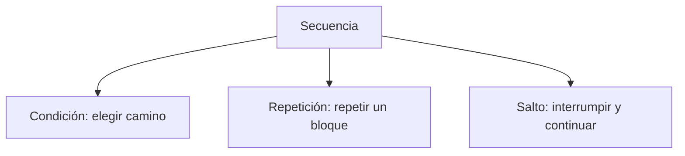

## 1.10.1 Estructuras condicionales

### El `if`

Una condicional permite ejecutar un bloque **solo si se cumple una condición**. Su estructura tiene tres partes obligatorias: la palabra `if`, una **condición** y dos puntos `:`.

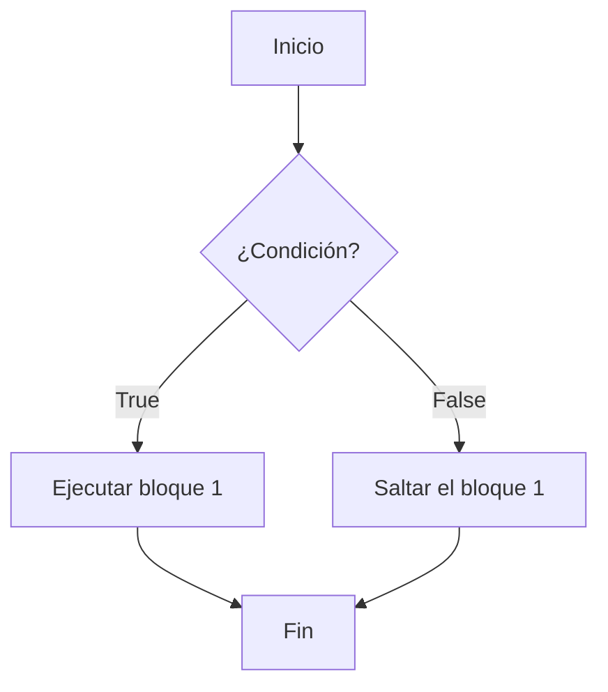

```python
edad = 20

if edad >= 18:
    print("Eres mayor de edad")
```

Si la condición es `False`, el bloque se salta entero y el programa sigue con la línea siguiente.

### El `if ... else`

El `else` añade un camino alternativo que se ejecuta cuando la condición es falsa. **Siempre va alineado con su `if`** y su bloque lleva sangría.


```python
edad = 15

if edad >= 18:
    print("Eres mayor de edad")
else:
    print("Eres menor de edad")
```

### El `if ... elif ... else`

`elif` significa «si no, pero además...». Permite encadenar varias condiciones. Solo se ejecuta el primer bloque cuya condición sea cierta.

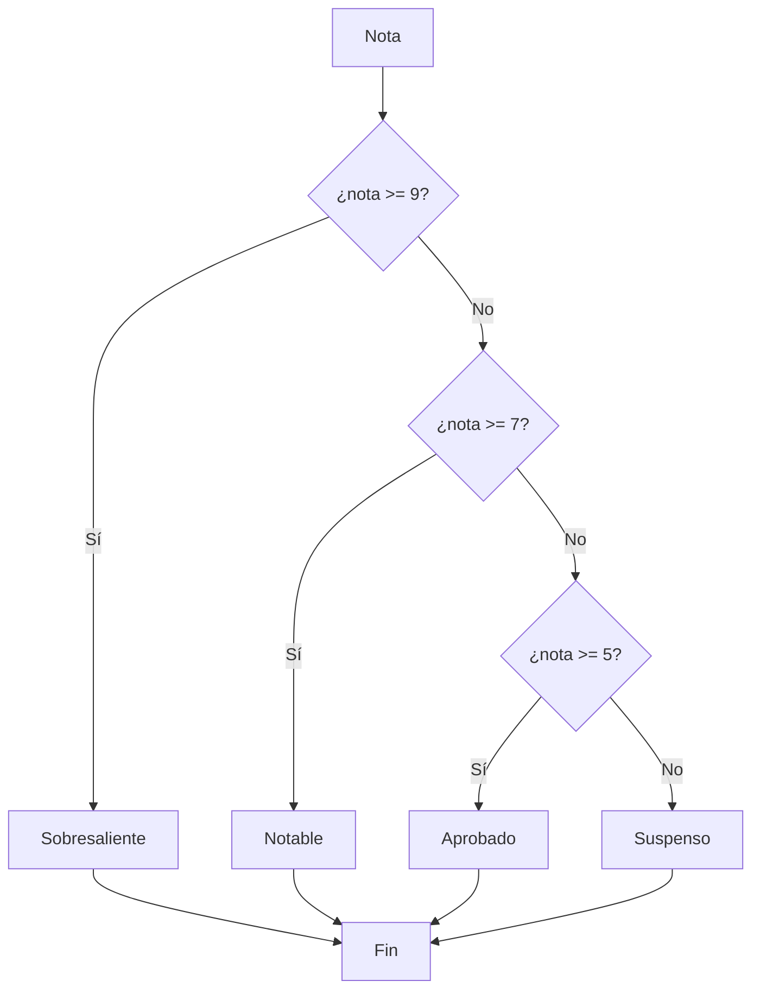

```python
nota = float(input("Nota: "))

if nota >= 9:
    print("Sobresaliente")
elif nota >= 7:
    print("Notable")
elif nota >= 5:
    print("Aprobado")
else:
    print("Suspenso")
```

La clave de este patrón es el **orden de las condiciones**: se empieza por la más restrictiva. Si escribieras `if nota >= 5` antes que `if nota >= 9`, una nota de 10 entraría en el primer caso y mostraría «Aprobado» en lugar de «Sobresaliente».

### Condiciones múltiples

`and` y `or` permiten escribir una sola línea con varias condiciones:

```python
edad = 20
carnet = True
estudiante = True

# Ambas deben cumplirse
if edad >= 18 and carnet and estudiante:
    print("Puedes entrar con descuento")

# Al menos una debe cumplirse
dia = "sábado"
if dia == "sábado" or dia == "domingo":
    print("Es fin de semana")
```

Para combinar ambas cosas se usan paréntesis, que se evalúan primero:

```python
if (edad >= 18 or edad < 10) and not estudiante:
    print("No puedes entrar")
```

### El operador `in`

Para comprobar si un valor pertenece a un conjunto de valores, `in` es más limpio que encadenar `or`:

```python
dia = "martes"

if dia in ["lunes", "martes", "miércoles", "jueves", "viernes"]:
    print("Es día lectivo")
else:
    print("No es día lectivo")
```

```python
letra = "a"
if letra in "aeiou":
    print("Es una vocal")
```

### Condicionales anidados

Puedes anidar condicionales colocando un `if` dentro del bloque de otro:

```python
nota = float(input("Nota: "))
asistencias = int(input("Asistencias: "))

if nota >= 5:
    if asistencias >= 20:
        print("Aprobado con asistencia perfecta")
    else:
        print("Aprobado, pero le faltan horas de asistencia")
else:
    print("Suspenso por la nota")
```

Cuando hay muchos niveles, se puede **refactorizar** usando `elif` o una condición compuesta, lo que mejora la legibilidad:

```python
if nota < 5:
    print("Suspenso por la nota")
elif asistencias < 20:
    print("Aprobado, pero le faltan horas de asistencia")
else:
    print("Aprobado con asistencia perfecta")
```

### El `match` (alternativa moderna)

A partir de Python 3.10 existe la estructura `match`, que compara un valor con varios patrones. Es muy cómoda para menús y clasificaciones:

```python
opcion = input("Elige una opción (1-3): ")

match opcion:
    case "1":
        print("Has elegido: Nueva partida")
    case "2":
        print("Has elegido: Cargar partida")
    case "3":
        print("Has elegido: Salir")
    case _:
        print("Opción no válida")
```

El símbolo `_` es el patrón **comodín**: se usa cuando ningún otro caso coincide.

### Errores frecuentes

| Error | Consecuencia |
|---|---|
| Olvidar los `:` tras `if` | `SyntaxError` |
| Poner sangría en el `else` | `IndentationError` |
| Poner `else` antes de `if` | `SyntaxError` |
| Confundir `=` con `==` | `SyntaxError` |
| Terminar el bloque con `else` vacío | `SyntaxError` |

### Ejercicios

1. Escribe un programa que pida un número y muestre si es positivo, negativo o cero.
2. Escribe un programa que pida un número y muestre si es par o impar, usando el operador `%`.
3. Escribe un programa que pida un año y muestre si es bisiesto o no. Un año es bisiesto si es múltiplo de 4, salvo los múltiplos de 100, que solo lo son si también son múltiplos de 400.
4. Escribe un programa que pida un número del 1 al 10 y muestre su nombre en español (uno, dos, tres...) con `match`.
5. Escribe un programa que pida el precio de un producto y aplique un descuento: del 0 al 100 € un 10 %, de 100 a 500 € un 20 %, más de 500 € un 30 %.
6. Escribe un programa que pida dos números y muestre el mayor, o «son iguales» si lo son.
7. Convierte un condicional anidido en una versión con `elif` que sea más legible.

## 1.10.2 Estructuras repetitivas

Las estructuras repetitivas (**bucles**) ejecutan un bloque de código **varias veces** sin tener que duplicar las instrucciones.

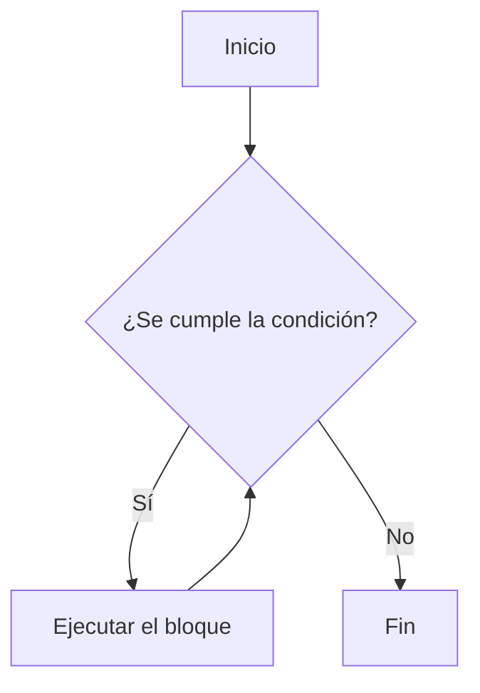

### El bucle `while`

`while` repite un bloque **mientras una condición sea verdadera**. Antes de cada vuelta comprueba la condición.

```python
contador = 1

while contador <= 5:
    print("Hola, soy la vuelta", contador)
    contador = contador + 1

print("Fin del programa")
```

**Salida**

```text
Hola, soy la vuelta 1
Hola, soy la vuelta 2
Hola, soy la vuelta 3
Hola, soy la vuelta 4
Hola, soy la vuelta 5
Fin del programa
```

**El `contador = contador + 1` es imprescindible.** Si lo olvidas, la condición nunca se va a hacer falsa y el programa se queda en un bucle infinito (puedes detenerlo con <kbd>Ctrl</kbd> + <kbd>C</kbd>).

Los operadores `+=`, `-=`, `++` de otros lenguajes no existen en Python. Se usa:

```python
contador += 1       # forma recomendada
contador = contador + 1   # equivalente
```

### Bucle `while` con `input()`

```python
edad = int(input("Introduce tu edad (0 para salir): "))

while edad != 0:
    if edad >= 18:
        print("Eres mayor de edad")
    else:
        print("Eres menor de edad")
    edad = int(input("Introduce tu edad (0 para salir): "))

print("Programa terminado")
```

### El bucle `for` y `range()`

Cuando **sabes cuántas veces** hay que repetir, `for` es más adecuado que `while`. Se usa junto con `range()`, que genera una secuencia de números.

```python
for i in range(5):
    print("Vuelta", i)

print("---")

for i in range(1, 6):
    print("Vuelta", i)

print("---")

for i in range(10, 0, -1):
    print("Cuenta atrás:", i)
```

**Salida**

```text
Vuelta 0
Vuelta 1
Vuelta 2
Vuelta 3
Vuelta 4
---
Vuelta 1
Vuelta 2
Vuelta 3
Vuelta 4
Vuelta 5
---
Cuenta atrás: 10
Cuenta atrás: 9
...
Cuenta atrás: 1
```

Las tres formas de usar `range()`:

| Forma | Valores generados |
|---|---|
| `range(fin)` | De `0` hasta `fin - 1` |
| `range(inicio, fin)` | De `inicio` hasta `fin - 1` |
| `range(inicio, fin, paso)` | De `inicio` hasta `fin - 1`, avanzando de `paso` en `paso` |

`range(fin)` **no incluye** el valor de `fin`. Esto desconcierta al principio, pero es una decisión de diseño que evita errores típicos del `for (int i = 0; i <= n; i++)` de otros lenguajes.

### Sumar una serie de números

```python
suma = 0

for numero in range(1, 11):
    suma = suma + numero

print("La suma del 1 al 10 es", suma)
```

**Salida**

```text
La suma del 1 al 10 es 55
```

Usando el atajo `+=` queda más corto:

```python
suma = 0
for numero in range(1, 11):
    suma += numero
print(suma)      # 55
```

### Recorrer textos

`for` no solo sirve con `range()`: cualquier cadena o lista es una secuencia y se puede recorrer directamente.

```python
palabra = "Python"

for letra in palabra:
    print(letra)
```

**Salida**

```text
P
y
t
h
o
n
```

Así se cuentan las vocales de una palabra:

```python
palabra = input("Escribe una palabra: ").lower()
vocales = 0

for letra in palabra:
    if letra in "aeiou":
        vocales += 1

print(f"'{palabra}' tiene {vocales} vocal(es)")
```

### Tablas de multiplicar

```python
numero = int(input("¿Qué tabla quieres? "))

for i in range(1, 11):
    print(f"{numero} x {i} = {numero * i}")
```

**Salida**

```text
7 x 1 = 7
7 x 2 = 14
7 x 3 = 21
...
7 x 10 = 70
```

### Cuándo usar `while` y cuándo `for`

| Situación | Bucle adecuado |
|---|---|
| Sabes cuántas iteraciones hay | `for` |
| No sabes cuántas iteraciones hacen falta | `while` |
| Recorrer una lista o un texto | `for` |
| Esperar a que el usuario cumpla una condición | `while` |
| Validar datos hasta que sean correctos | `while` |

::: warning Precaución
Un `while` cuya condición nunca se hace falsa produce un **bucle infinito** que congela el programa. Comprueba siempre que dentro del bucle se modifica alguna variable que aparece en la condición.
:::

### Ejercicios

1. Escribe un programa con `for` que muestre los números del 1 al 20, uno por línea.
2. Escribe un programa con `while` que muestre los números del 20 al 1, uno por línea.
3. Escribe un programa que pida un número y muestre su tabla de multiplicar del 1 al 10.
4. Escribe un programa que pida números al usuario y vaya sumando hasta que el usuario introduzca un `0`.
5. Escribe un programa que calcule la suma de todos los números pares del 1 al 100.
6. Escribe un programa que pida un número y muestre si es primo. Un número es primo si solo es divisible por 1 y por sí mismo.
7. Escribe un programa que pida un número entero y muestre su factorial (`5! = 1 x 2 x 3 x 4 x 5`).
8. Escribe un programa que pida una contraseña y repita la solicitud mientras no sea `1234`.

## 1.10.3 Estructuras de salto

Las **estructuras de salto** interrumpen el flujo normal del programa: cambian la secuencia de ejecución o cortan un bucle antes de tiempo.

### `break`: salir del bucle

`break` termina el bucle en el que se encuentra y el programa continúa con la línea **siguiente** al bucle.

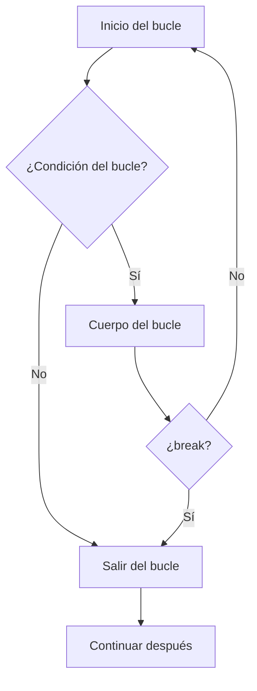

```python
print("Buscando el 7 en la lista...")

for numero in [1, 3, 5, 7, 9, 11]:
    if numero == 7:
        print("¡Encontrado en la posición", numero, "!")
        break
    print("Revisando el", numero)

print("El programa sigue funcionando")
```

**Salida**

```text
Revisando el 1
Revisando el 3
Revisando el 5
¡Encontrado en la posición 7 !
El programa sigue funcionando
```

Se usa sobre todo para **optimizar**: si ya sabes que no puede haber más resultados, no tiene sentido seguir calculando.

```python
# Sin break: 100000 divisiones
for n in range(2, 100000):
    if 999983 % n == 0:
        print("Divisor encontrado:", n)
        break

# Con break: se detiene en cuanto encuentra uno
for n in range(2, 100000):
    if 999983 % n == 0:
        print("Divisor encontrado:", n)
        break
```

### `continue`: pasar a la siguiente vuelta

`continue` salta el resto del cuerpo del bucle y vuelve al principio. El bucle **no** termina.

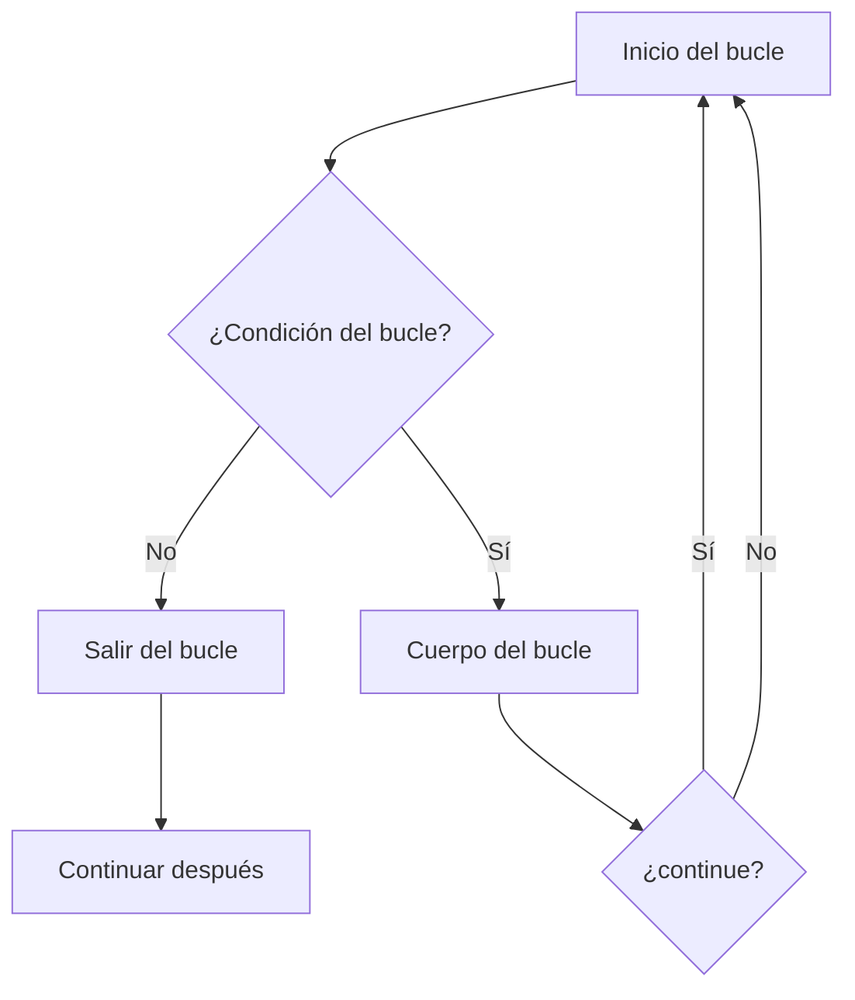

```python
# Mostrar solo los números pares del 1 al 10
for numero in range(1, 11):
    if numero % 2 != 0:
        continue
    print(numero, "es par")
```

**Salida**

```text
2 es par
4 es par
6 es par
8 es par
10 es par
```

Otro uso habitual es **ignorar valores no válidos** en medio de una lista:

```python
notas = [8, -1, 7, None, 5, 999, 3]
validas = 0

for nota in notas:
    if nota is None or nota < 0 or nota > 10:
        continue          # este valor no cuenta
    validas += 1

print("Notas válidas:", validas)     # 4
```

### Diferencia entre `break` y `continue`

| Instrucción | Efecto | Continúa el bucle |
|---|---|---|
| `break` | Sale del bucle | No |
| `continue` | Salta a la siguiente vuelta | Sí |

Piensa en un examen: `continue` es «esta pregunta la dejo en blanco, paso a la siguiente» y `break` es «dejo el examen y entrego».

### El bucle `while ... else`

Python permite añadir un bloque `else` a los bucles `for` y `while`. Se ejecuta **solo si el bucle terminó sin `break`**. Es la forma idiomática de detectar que no se encontró lo buscado.

```python
numero = int(input("Busca un número entre 1 y 10: "))

for i in range(1, 11):
    if i == numero:
        print("¡Encontrado en", i, "!")
        break
else:
    print("No está en la lista")
```

### `return`: salir de una función

`return` termina la ejecución de una función y devuelve un valor. Lo vemos en detalle en el [apartado 1.12](#112-funciones-y-módulos), pero conviene mencionarlo aquí porque también funciona como una estructura de salto.

```python
def buscar(lista, valor):
    for i in range(len(lista)):
        if lista[i] == valor:
            return i          # sale de la función en cuanto lo encuentra
    return -1                 # no se encontró
```

### `pass`: dejar un bloque vacío

`pass` no hace nada. Sirve para marcar un bloque que todavía no está escrito, y permite que el programa sea válido mientras tanto. También se usa en clases que aún no tienen contenido.

```python
edad = 20

if edad >= 18:
    # TODO: implementar la funcionalidad de verificación
    pass
else:
    print("Menor de edad")
```

### `raise`: lanzar un error

`raise` interrumpe el programa lanzando una excepción. Es útil para avisar de que un dato no es válido.

```python
edad = int(input("Edad: "))

if edad < 0 or edad > 150:
    raise ValueError("La edad debe estar entre 0 y 150")

print("Edad válida:", edad)
```

### Ejercicios

1. Escribe un programa con `for` que se detenga en cuanto encuentre un número negativo en una lista, indicando cuál era.
2. Escribe un programa que muestre los números del 1 al 10, saltando los múltiplos de 3 con `continue`.
3. Escribe un programa que pida números al usuario y los vaya sumando, pero que solo sume los pares (usa `continue` para ignorar los impares).
4. Escribe un programa que pida un número del 1 al 5 y use `while ... else` para indicar si la entrada era válida.
5. Explica con tus palabras la diferencia entre `break`, `continue`, `return` y `pass`. ¿En qué casos se usa cada uno?
6. Escribe un programa con `for` que no use `break` y demuestre la diferencia de tiempo con una versión que sí lo usa al buscar un número primo grande.

---

## 1.11 Estructuras de datos

Hasta ahora hemos guardado un solo valor en cada variable. Las **estructuras de datos** permiten guardar **varios valores relacionados** en una misma variable.

| Estructura | Sintaxis | ¿Modificable? | ¿Ordenada? | ¿Permite duplicados? |
|---|---|---|---|---|
| Lista | `[1, 2, 3]` | Sí | Sí | Sí |
| Tupla | `(1, 2, 3)` | No | Sí | Sí |
| Diccionario | `{"a": 1}` | Sí | Por clave | No (claves únicas) |
| Conjunto | `{1, 2, 3}` | Sí | No | No |

## 1.11.1 Listas

### Qué es una lista

Una **lista** es una colección **ordenada y modificable** de valores. Puede contener números, textos, listas u otras combinaciones.

```python
notas = [7, 8, 5, 9, 3]
```

### Acceder a los elementos

Cada elemento tiene una **posición** (índice) que empieza en **0**. El primer elemento es el índice 0, el segundo el 1, y así sucesivamente.

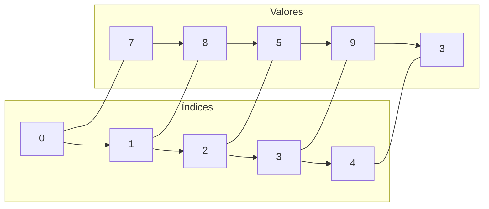

```python
notas = [7, 8, 5, 9, 3]

print(notas[0])     # 7  (el primero)
print(notas[2])     # 5  (el tercero)
print(notas[4])     # 3  (el último)
print(notas[-1])    # 3  (el último, con índice negativo)
print(notas[-2])    # 9  (el penúltimo)
```

La función `len()` devuelve cuántos elementos tiene la lista:

```python
print(len(notas))   # 5
```

Si pides un índice que no existe, el programa se detiene con un `IndexError`:

```python
print(notas[10])
```

**Salida**

```text
IndexError: list index out of range
```

### Recorrer una lista

```python
notas = [7, 8, 5, 9, 3]

for nota in notas:
    print(nota)
```

O, si necesitas también la posición, con `enumerate()`:

```python
for posicion, nota in enumerate(notas):
    print(f"Posición {posicion}: nota {nota}")
```

**Salida**

```text
Posición 0: nota 7
Posición 1: nota 8
Posición 2: nota 5
Posición 3: nota 9
Posición 4: nota 3
```

Con `enumerate(notas, 1)` el contador empieza en 1, que resulta más legible al mostrar.

### Modificar una lista

Los elementos se pueden cambiar asignando a su posición:

```python
notas = [7, 8, 5, 9, 3]
notas[1] = 10
print(notas)        # [7, 10, 5, 9, 3]
```

### Añadir elementos

| Método | Qué hace | Ejemplo |
|---|---|---|
| `append(x)` | Añade al final | `lista.append(4)` |
| `insert(i, x)` | Inserta en la posición `i` | `lista.insert(0, 4)` |
| `extend(otra)` | Añade todos los elementos de otra lista | `lista.extend([4, 5])` |

```python
notas = [7, 8, 5]

notas.append(9)          # [7, 8, 5, 9]
notas.insert(0, 10)      # [10, 7, 8, 5, 9]
notas.extend([3, 4])     # [10, 7, 8, 5, 9, 3, 4]

print(notas)
```

**Salida**

```text
[10, 7, 8, 5, 9, 3, 4]
```

### Eliminar elementos

| Método | Qué hace |
|---|---|
| `remove(x)` | Borra la **primera** aparición del valor `x` |
| `pop(i)` | Borra el elemento de la posición `i` **y lo devuelve** |
| `pop()` | Borra el último elemento y lo devuelve |
| `clear()` | Vacía la lista entera |

```python
notas = [7, 8, 5, 8, 9]

notas.remove(8)      # borra solo el primero -> [7, 5, 8, 9]
print(notas)

ultimo = notas.pop() # extrae el último
print(ultimo)        # 9
print(notas)         # [7, 5, 8]

notas.clear()
print(notas)         # []
```

Si `remove()` no encuentra el valor, aparece un `ValueError`. Si `pop()` recibe un índice inválido, un `IndexError`.

### Otras operaciones útiles

| Operación | Qué hace | Ejemplo |
|---|---|---|
| `len(lista)` | Número de elementos | `len([1, 2, 3])` → `3` |
| `sum(lista)` | Suma de los números | `sum([1, 2, 3])` → `6` |
| `max(lista)` | Valor máximo | `max([1, 5, 3])` → `5` |
| `min(lista)` | Valor mínimo | `min([1, 5, 3])` → `1` |
| `sorted(lista)` | Devuelve una copia ordenada | `sorted([3, 1, 2])` → `[1, 2, 3]` |
| `lista.count(x)` | Cuántas veces aparece `x` | `[1, 2, 1].count(1)` → `2` |
| `lista.index(x)` | Posición de la primera aparición | `[1, 2, 3].index(2)` → `1` |
| `lista.reverse()` | Invierte el orden (modifica la lista) | |
| `lista.sort()` | Ordena la lista (modifica la lista) | |

```python
notas = [7, 3, 9, 5, 3]

print(len(notas))           # 5
print(sum(notas))           # 27
print(max(notas))           # 9
print(min(notas))           # 3
print(sorted(notas))        # [3, 3, 5, 7, 9]
print(notas.count(3))       # 2
print(notas.index(9))       # 2
print(f"Media: {sum(notas) / len(notas):.2f}")   # Media: 5.40
```

::: warning La diferencia entre `sort()` y `sorted()`
- `lista.sort()` **modifica** la lista y devuelve `None`. No puedes asignar su resultado.
- `sorted(lista)` **no modifica** nada: devuelve una lista nueva.

```python
# ❌ Error: sort() no devuelve nada
notas = notas.sort()

# ✅ Correcto
notas.sort()
# o, si quieres una copia ordenada
ordenadas = sorted(notas)
```
:::

### Rebanadas (slicing)

Las rebanadas permiten obtener una parte de la lista con la sintaxis `lista[inicio:fin:paso]`.

```python
letras = ["a", "b", "c", "d", "e"]

print(letras[1:3])     # ['b', 'c']   (desde el 1 hasta antes del 3)
print(letras[:3])      # ['a', 'b', 'c']
print(letras[2:])      # ['c', 'd', 'e']
print(letras[:])       # ['a', 'b', 'c', 'd', 'e'] (copia completa)
print(letras[::2])     # ['a', 'c', 'e'] (de dos en dos)
print(letras[::-1])    # ['e', 'd', 'c', 'b', 'a'] (invertida)
```

Como en `range()`, el final **no se incluye**. Y cuidado: asignar a una rebanada **modifica la lista original**.

```python
notas = [7, 8, 5, 9, 3]
notas[1:3] = [10, 10]
print(notas)        # [7, 10, 10, 9, 3]
```

### Comprobar si una lista está vacía

```python
lista = []

if not lista:
    print("La lista está vacía")
```

### Listas y bucles: se acumulan

El patrón más habitual al trabajar con listas es **recorrer una lista y añadir a otra** lo que cumple una condición.

```python
numeros = [4, 9, 12, 7, 20, 15]
pares = []

for numero in numeros:
    if numero % 2 == 0:
        pares.append(numero)

print(pares)     # [4, 12, 20]
```

### Comprobar si un elemento está en la lista

```python
notas = [7, 8, 5]

if 8 in notas:
    print("Hay un 8 en la lista")
```

### Ejercicios

1. Crea una lista con los nombres de cinco compañeros y muestra el primero y el último.
2. Escribe un programa que pida cinco notas por teclado, las guarde en una lista y muestre la media, el máximo y el mínimo.
3. Crea una lista de números del 1 al 10 y muestra solo los pares con `for` y `if`.
4. Escribe un programa que pida números al usuario y los añada a una lista hasta que introduzca `-1`.
5. Escribe un programa que pida una lista de notas y muestra cuántas hay aprobadas y cuántas suspensas.
6. Crea una lista de nombres y muestra cuántos hay, cuál es el más largo (usando `len()`) y el orden alfabético (`sorted()`).
7. Escribe un programa que pida una lista de números y la muestre invertida, sin usar `reverse()` ni rebanadas.
8. Explica la diferencia entre `lista.sort()` y `sorted(lista)` con un ejemplo donde la diferencia se vea claramente.
9. Escribe un programa que pida una palabra y devuelva sus letras en una lista, usando `list()`.

## 1.11.2 Diccionarios

### Qué es un diccionario

Un **diccionario** es una colección que guarda información en forma de **clave: valor**. En lugar de acceder a un elemento por su posición, se accede por su **clave**.

```python
persona = {
    "nombre": "Ana",
    "edad": 17,
    "altura": 1.72
}
```

Se parece a una ficha: no importa el orden, importa que cada dato tenga su etiqueta.

### Acceder a los valores

Se usan los **corchetes** con la clave:

```python
persona = {"nombre": "Ana", "edad": 17, "altura": 1.72}

print(persona["nombre"])     # Ana
print(persona["edad"])       # 17
print(persona["altura"])      # 1.72
```

Si la clave no existe, aparece un `KeyError`:

```python
print(persona["apellido"])
```

**Salida**

```text
KeyError: 'apellido'
```

Para evitarlo, usa `get()`, que devuelve un valor por defecto si la clave no existe:

```python
print(persona.get("apellido"))                  # None
print(persona.get("apellido", "No indicado"))   # No indicado
print(persona.get("nombre"))                    # Ana
```

### Comprobar si una clave existe

```python
if "edad" in persona:
    print("La edad es", persona["edad"])
```

### Añadir y modificar valores

Asignar a una clave que no existe **la crea**; si ya existe, **la modifica**.

```python
persona = {"nombre": "Ana", "edad": 17}

persona["edad"] = 18                 # modifica
persona["ciudad"] = "Málaga"         # crea una clave nueva
print(persona)

# Salida: {'nombre': 'Ana', 'edad': 18, 'ciudad': 'Málaga'}
```

### Métodos de los diccionarios

| Método | Qué hace |
|---|---|
| `diccionario.keys()` | Devuelve todas las **claves** |
| `diccionario.values()` | Devuelve todos los **valores** |
| `diccionario.items()` | Devuelve pares clave-valor |
| `diccionario.get(clave, def)` | Valor de la clave o el valor por defecto |
| `clave in diccionario` | Comprueba si la clave existe |
| `diccionario.pop(clave)` | Elimina la clave y devuelve su valor |
| `diccionario.update(otro)` | Fusiona dos diccionarios |
| `diccionario.clear()` | Vacía el diccionario |

### Recorrer un diccionario

Con `.keys()` solo las claves, con `.values()` solo los valores y con `.items()` ambos. Lo habitual es usar `.items()`:

```python
notas = {"Matemáticas": 7, "Lengua": 8, "Física": 5}

print("--- Notas ---")
for asignatura, nota in notas.items():
    print(f"{asignatura}: {nota}")
print("--- Fin ---")
```

**Salida**

```text
--- Notas ---
Matemáticas: 7
Lengua: 8
Física: 5
--- Fin ---
```

Si solo necesitas las claves:

```python
for asignatura in notas.keys():
    print(asignatura)
```

Y si solo los valores:

```python
media = sum(notas.values()) / len(notas)
print(f"Media: {media:.2f}")     # Media: 6.67
```


### Claves que no son texto

Las claves de un diccionario no tienen que ser cadenas. Pueden ser números, tuplas u otros valores inmutables (nunca listas):

```python
notas = {(1, 2): 7, (1, 3): 5, (2, 3): 8}
print(notas[(1, 2)])      # 7
```

Esto es muy útil para matrices, tablas y problemas de grafos.

### Diccionarios y bucles

El patrón típico es recorrer un diccionario y filtrar o transformar sus valores.

```python
notas = {"Ana": 7, "Luis": 4, "Marta": 9, "Pau": 5}

aprobados = {}
for nombre, nota in notas.items():
    if nota >= 5:
        aprobados[nombre] = nota

print("Aprobados:", aprobados)
```

**Salida**

```text
Aprobados: {'Ana': 7, 'Marta': 9, 'Pau': 5}
```

### Longitud y vaciado

```python
notas = {"Ana": 7, "Luis": 4}
print(len(notas))     # 2

if not notas:
    print("El diccionario está vacío")
```

### Listas dentro de diccionarios y al revés

Como los valores pueden ser cualquier cosa, se pueden anidar estructuras. Un diccionario puede contener listas:

```python
curso = {
    "1ºA": ["Ana", "Luis", "Marta"],
    "1ºB": ["Pau", "Nuria"]
}

print(curso["1ºA"][0])      # Ana
print(len(curso["1ºB"]))    # 2
```

Y una lista puede contener diccionarios. Esta combinación es la base de casi cualquier formato de datos real (JSON, bases de datos, APIs):

```python
alumnos = [
    {"nombre": "Ana", "edad": 17, "nota": 7},
    {"nombre": "Luis", "edad": 18, "nota": 4},
    {"nombre": "Marta", "edad": 17, "nota": 9}
]

for alumno in alumnos:
    print(f"{alumno['nombre']}: {alumno['nota']}")
```

**Salida**

```text
Ana: 7
Luis: 4
Marta: 9
```

### Eliminar claves

```python
persona = {"nombre": "Ana", "edad": 17, "ciudad": "Málaga"}

print(persona.pop("ciudad"))    # Málaga (lo devuelve)
print(persona)                  # {'nombre': 'Ana', 'edad': 17}
```

### Ejercicios

1. Crea un diccionario con tu nombre, edad y ciudad, y muestra cada dato con un `print` y con un bucle.
2. Escribe un programa que pida el nombre y la nota de cinco alumnos y los guarde en un diccionario. Luego muestra quién ha aprobado.
3. Crea un diccionario con diez divisores de 100 y muestra cuántas parejas hay cuyo producto sea 100.
4. Escribe un programa que pida datos de contacto (nombre, teléfono, correo) de tres personas y los muestre al final.
5. Dado un diccionario de precios, escribe un programa que calcule el precio total de una lista de productos pasada por el usuario.
6. Crea un diccionario donde las claves sean los números del 1 al 10 y los valores sean sus cuadrados. Muéstralos con `items()`.
7. Escribe un programa con un diccionario de traducciones que traduzca una palabra inglesa al español, y avise si la palabra no está en el diccionario.
8. Explica con un ejemplo por qué un diccionario es más adecuado que una lista para guardar los datos de un alumno. ¿Cuándo sería mejor una lista?

---

## 1.12 Funciones y módulos

### El problema que resuelven

Si necesitas calcular el área de un círculo en cinco sitios distintos del programa, tienes dos opciones: copiar y pegar el mismo cálculo cinco veces, o escribirlo **una vez** y reutilizarlo. Esa pieza reutilizable se llama **función**.

```python
# Sin función: código repetido
print(3 * 3.14159 * 2 ** 2)
print(3 * 3.14159 * 5 ** 2)
print(3 * 3.14159 * 10 ** 2)

# Con función: el cálculo se escribe una sola vez
def area_circulo(radio):
    return 3.14159 * radio * radio

print(area_circulo(2))
print(area_circulo(5))
print(area_circulo(10))
```

Ventajas de usar funciones:

- **Evitas la repetición:** el código se escribe una vez.
- **El programa es más legible:** ves la intención (`area_circulo(5)`) y no la mecánica.
- **Puedes corregir en un solo sitio:** si el cálculo cambia, cambias una línea.
- **Puedes reutilizarlas en otros programas:** librerías como `math` son conjuntos de funciones ya escritas.

### Definir una función

Se usa la palabra reservada `def`, seguida del nombre, paréntesis y dos puntos. El cuerpo va con sangría.

```python
def saludar():
    print("¡Hola, mundo!")

saludar()
saludar()
```

**Salida**

```text
¡Hola, mundo!
¡Hola, mundo!
```

Fíjate en la diferencia:

- `def saludar():` **define** la función (no ejecuta nada, solo guarda el código).
- `saludar()` **llama** a la función (ejecuta el código).

Si solo escribes `def saludar():` sin llamarla, no se muestra nada.

### Parámetros y argumentos

Los **parámetros** son las variables que se declaran en la definición. Los **argumentos** son los valores que se pasan al llamar a la función.

```python
def saludar(nombre):          # 'nombre' es el parámetro
    print("Hola,", nombre)

saludar("Ana")                 # 'Ana' es el argumento
saludar("Luis")
```

**Salida**

```text
Hola, Ana
Hola, Luis
```

Una función puede tener varios parámetros, separados por comas:

```python
def sumar(a, b):
    resultado = a + b
    print("La suma es", resultado)

sumar(3, 5)          # La suma es 8
sumar(10, 20)        # La suma es 30
```

### El `return`: devolver un valor

`print()` **muestra** un valor; `return` lo **devuelve** para que puedas seguir usándolo. Esta diferencia es la más importante de esta sección.

```python
def sumar(a, b):
    return a + b          # devuelve el resultado

resultado = sumar(3, 5)    # el valor devuelto se guarda
print(resultado)           # 8
print(sumar(3, 5) * 2)     # 16
```

Compara las dos versiones:

```python
# Con return: el valor se puede seguir usando
def sumar(a, b):
    return a + b

# Sin return: solo muestra, no se puede reutilizar
def sumar_mal(a, b):
    print(a + b)

sumar_mal(3, 5) + sumar_mal(3, 5)   # ❌ TypeError
```

**Salida**

```text
8
8
Traceback (most recent call last):
  File "ejemplo.py", line 11, in <module>
TypeError: unsupported operand type(s) for +: 'NoneType' and 'NoneType'
```

Una función **sin `return` devuelve `None`**. Por eso el error dice `NoneType`.

Cuando pones un `return` dentro de un bloque `if`, la función se termina ahí:

```python
def clasificar(nota):
    if nota >= 9:
        return "Sobresaliente"
    elif nota >= 7:
        return "Notable"
    elif nota >= 5:
        return "Aprobado"
    else:
        return "Suspenso"

nota = float(input("Nota: "))
print(clasificar(nota))
```

### Funciones con parámetros por defecto

Se puede dar un valor por defecto a un parámetro. Si el llamador no lo especifica, se usa ese valor.

```python
def saludar(nombre, saludo="Hola"):
    print(f"{saludo}, {nombre}!")

saludar("Ana")                  # Hola, Ana!
saludar("Luis", "Buenos días")  # Buenos días, Luis!
```

Los parámetros con valor por defecto deben ir **siempre al final**, después de los obligatorios. Si no, Python lanza un `SyntaxError`.

### Ámbito: variables locales y globales

Una **variable local** se crea dentro de una función y **solo existe allí**. Una **variable global** se declara fuera de cualquier función y existe en todo el programa.

```python
contador = 10          # variable global

def mostrar():
    print(contador)    # puede leer la global

def fallo():
    contador = 5       # esta es OTRA variable, local
    print(contador)    # 5

mostrar()      # 10
fallo()        # 5
print(contador)  # 10 (la global no cambió)
```

**Regla recomendada: pasa los datos como parámetros y devuelve los resultados.** Evita problemas y hace el código más fácil de entender.

```python
# ❌ No recomendable
total = 0

def sumar_dinero(cantidad):
    global total        # hay que declarar global
    total += cantidad

# ✅ Recomendable
def sumar_dinero(total, cantidad):
    return total + cantidad
```

### Funciones recursivas

Una función es **recursiva** cuando se llama a sí misma. Es la forma más natural de resolver problemas que se dividen en partes más pequeñas del mismo problema.

```python
def factorial(n):
    if n <= 1:
        return 1
    return n * factorial(n - 1)

print(factorial(5))      # 120
```

La estructura tiene siempre dos partes:

- **Caso base:** la condición que detiene la recursión (`n <= 1`).
- **Llamada recursiva:** la llamada a la función con un valor **más pequeño** (`factorial(n - 1)`).

::: warning Precaución
Si olvidas el caso base, la función se llamará a sí misma indefinidamente hasta agotar la memoria y el programa se detendrá con un error `RecursionError`. Comprueba siempre que el parámetro se aproxime al caso base.
:::

Otro ejemplo clásico:

```python
def fibonacci(n):
    if n <= 1:
        return n
    return fibonacci(n - 1) + fibonacci(n - 2)

for i in range(10):
    print(fibonacci(i), end=" ")
```

**Salida**

```text
0 1 1 2 3 5 8 13 21 34
```

### Documentación de funciones

Un **docstring** es una cadena de texto al principio de una función que explica qué hace. Se escribe entre tres comillas dobles.

```python
def calcular_area(base, altura):
    """Calcula el área de un rectángulo.

    Parámetros:
        base (float): la base del rectángulo
        altura (float): la altura del rectángulo

    Returns:
        float: el área del rectángulo
    """
    return base * altura

area = calcular_area(5, 3)
print(area)              # 15.0
print(calcular_area.__doc__)
```

Un buen docstring indica qué hace la función, qué parámetros acepta y qué devuelve. Ayuda mucho a quien lea tu código, includedo tú mismo.

### Módulos

Un **módulo** es un archivo `.py` que contiene funciones, variables o clases listas para usar. Sirve para organizar el código y no escribirlo todo en un solo archivo gigante.

#### Módulos de la biblioteca estándar

Python trae muchos módulos listos para usar. Los más útiles en bachillerato son:

| Módulo | Qué ofrece | Ejemplo |
|---|---|---|
| `math` | Operaciones matemáticas | `math.sqrt(16)` → `4.0` |
| `random` | Números aleatorios | `random.randint(1, 6)` |
| `datetime` | Fechas y horas | `datetime.date.today()` |
| `os` | Interacción con el sistema | `os.getcwd()` |
| `sys` | Información del intérprete | `sys.version` |

Para usarlos se usa la palabra `import`:

```python
import math

print(math.sqrt(16))          # 4.0
print(math.pi)                # 3.141592653589793
print(math.pow(2, 10))        # 1024.0
print(math.floor(3.7))        # 3
print(math.ceil(3.2))         # 4
print(abs(-5))                # 5  (abs no necesita math)
```

Funciones de `random`:

```python
import random

print(random.randint(1, 6))       # número entero aleatorio entre 1 y 6
print(random.uniform(0, 100))     # real aleatorio entre 0 y 100
print(random.choice(["a", "b", "c"]))   # un elemento aleatorio
print(random.random())            # real entre 0 y 1
lista = [1, 2, 3, 4, 5]
random.shuffle(lista)             # mezcla la lista
print(lista)
```

#### Importar solo lo necesario

Se puede importar un elemento concreto para que el código quede más corto:

```python
from math import sqrt, pi

print(sqrt(25))      # 5.0
print(pi)            # 3.14159...
```

Con `import math` → `math.sqrt(25)`. Con `from math import sqrt` → `sqrt(25)`. La primera forma es más clara si el módulo tiene muchas funciones; la segunda, más cómoda.

Para evitar colisiones de nombres, se puede renombrar el módulo:

```python
import math as m

print(m.sqrt(9))     # 3.0
```

#### Crear tus propios módulos

Crea un archivo `matematicas.py`:

```python
# archivo: matematicas.py

PI = 3.14159

def area_circulo(radio):
    return PI * radio ** 2

def es_primo(n):
    if n < 2:
        return False
    for i in range(2, int(n ** 0.5) + 1):
        if n % i == 0:
            return False
    return True
```

Y otro archivo `principal.py` que lo use:

```python
# archivo: principal.py
import matematicas

print(matematicas.area_circulo(3))     # 28.27431
print(matematicas.es_primo(7))         # True
print(matematicas.es_primo(8))         # False
print(matematicas.PI)                  # 3.14159
```

Ambos archivos deben estar en la misma carpeta. Ejecuta **siempre** `principal.py`, que es el que tiene la lógica del programa.

#### La convención `if __name__ == "__main__"`

Cuando un archivo importa otro, se ejecuta **todo** lo que contiene, incluidas las instrucciones sueltas. Para evitarlo, se envuelven en este bloque:

```python
# archivo: matematicas.py

def area_circulo(radio):
    return 3.14159 * radio ** 2


if __name__ == "__main__":
    # Solo se ejecuta si ejecutamos este archivo directamente
    print(area_circulo(3))
    print("Pruebas completadas")
```

```python
# archivo: principal.py
import matematicas

print(matematicas.area_circulo(5))
```

Si ejecutas `principal.py`, solo verás el resultado del `print` de `principal`. Las pruebas de `matematicas.py` no se ejecutan. Esta es una convención estándar que conviene usar siempre en tus propios módulos.

### Ejercicios

1. Escribe una función `es_par(n)` que devuelva `True` si `n` es par y `False` si es impar. Compruébala con varios valores.
2. Escribe una función `mayor_de_tres(a, b, c)` que devuelva el mayor de tres números **sin usar** `max()`.
3. Escribe una función `area_rectangulo(base, altura)` que devuelva el área, y otra `perimetro_rectangulo(base, altura)` que devuelva el perímetro.
4. Escribe una función `es_bisiesto(anio)` que devuelva `True` si el año es bisiesto. Úsala en un programa que pida años y los clasifique.
5. Escribe una función que reciba una lista de notas y devuelva la media, el máximo y el mínimo en un diccionario.
6. Escribe una función recursiva que calcule la suma de los números del 1 al `n` (sin bucles).
7. Crea un módulo `aleatorio.py` con una función que tire un dado de 6 caras y otra que elija un elemento de una lista al azar. Impórtalo desde otro archivo.
8. Escribe un programa que pida palabras al usuario y, usando funciones, devuelva: la más larga, la cantidad de palabras y cuántas empiezan por vocal.
9. Escribe un programa que genere una contraseña aleatoria de 8 caracteres usando `random` y el módulo `string`.
10. Crea un módulo `figuras.py` con funciones `area_circulo(r)`, `area_cuadrado(l)` y `area_rectangulo(b, h)`, y un programa que pida la figura y la medida y muestre el área.

---

## Ejercicios de repaso

Estos ejercicios mezclan todos los apartados del manual. Intenta resolverlos sin mirar la teoría y después revisa.

### Nivel 1 — Fundamentos

1. **Ficha de alumno.** Escribe un programa que pida nombre, apellidos, curso, edad y nota media, y muestre una ficha con f-strings y `sep`/`end`.
2. **Área y perímetro.** Pide la base y la altura de un rectángulo y muestra el área y el perímetro con dos decimales.
3. **Conversor de temperaturas.** Pida una temperatura en grados Celsius y muéstrela en Fahrenheit (`F = C * 9 / 5 + 32`) y en Kelvin (`K = C + 273.15`).
4. **Par o impar.** Pida un número y diga si es par o impar, usando `%`.
5. **Mayor de tres.** Pida tres números y muestre el mayor, el menor y el orden de la lista.

### Nivel 2 — Control

6. **Año bisiesto.** Pida un año y determine si es bisiesto.
7. **Calculadora.** Pida dos números y una operación (`+`, `-`, `*`, `/`) y muestre el resultado. Valida la operación con `match`.
8. **Tabla de multiplicar.** Pida un número del 1 al 10 y muestre su tabla. Si está fuera de rango, muestra un error y vuelve a pedirlo con `while`.
9. **Cuentas atrás.** Pida un número y muestre la cuenta atrás hasta 0, parándose en 0 con `break`.
10. **Adivina el número.** Genera un número aleatorio entre 1 y 100 con `random` y pide números al usuario hasta acertar, indicando si es mayor o menor.

### Nivel 3 — Datos

11. **Lista de notas.** Pida seis notas, guárdalas en una lista y muestra la media, cuántas aprobadas hay y la nota más alta.
12. **Diccionario de países.** Crea un diccionario con cinco países y sus capitales. Pida un país y muestre su capital, o avisa si no está.
13. **Agenda.** Pida tres contactos (nombre y teléfono) y guárdalos en un diccionario. Muestra todos y pide buscar uno por nombre.
14. **Lista de la compra.** Pida productos con su precio hasta escribir «fin», y muestra el total y el producto más caro.
15. **Búsqueda.** Pida una lista de palabras y una palabra a buscar, y usa `break` para indicar la posición o que no existe.

### Nivel 4 — Funciones y módulos

16. **Calculadora con funciones.** Escribe funciones `sumar`, `restar`, `multiplicar` y `dividir` y un menú que pida la operación.
17. **Validación.** Escribe una función `pedir_numero(mensaje, minimo, maximo)` que repita la solicitud hasta que el valor esté en el rango, usando `while`.
18. **Cifrado César.** Escribe una función que desplace cada letra de una palabra un número de posiciones en el alfabeto.
19. **Estadísticas.** Escribe una función que reciba una lista y devuelva un diccionario con el tamaño, la media, el máximo y el mínimo.
20. **Lanzamiento de dados.** Simula el lanzamiento de dos dados 1000 veces con `random` y muestra cuántas veces ha salido cada combinación.

---

## Autoevaluación

Comprueba si has asimilado la materia. Intenta responder sin consultar el manual.

| Apartado | Pregunta de comprobación |
|---|---|
| 1.1 | ¿Por qué un ordenador necesita algoritmos en lugar de objetivos? |
| 1.2 | ¿Qué significa secuenciación? ¿Por qué importa el orden de las instrucciones? |
| 1.3 | ¿Qué características debe tener un algoritmo? ¿Qué figuras usa un diagrama de flujo? |
| 1.4 | ¿Qué es la indentación en Python? ¿Qué pasa si la escribes mal? |
| 1.5 | ¿Cuál es la diferencia entre `int`, `float` y `str`? ¿Por qué `input()` necesita conversión? |
| 1.6 | ¿Cómo se declara una variable? ¿Y una constante? ¿Qué convención se usa? |
| 1.7 | ¿Cuál es la diferencia entre `=` y `==`? ¿Entre `/` y `//`? ¿Para qué sirve `%`? |
| 1.8 | ¿Cómo se escribe un comentario? ¿Qué conviene comentar? |
| 1.9 | ¿Qué hace `print()`? ¿Qué devuelve `input()`? ¿Cómo se cambia el separador? |
| 1.10.1 | ¿Cuál es la diferencia entre `if` y `if/else`? ¿Cuándo se usa `elif`? |
| 1.10.2 | ¿Cuándo se usa `while` y cuándo `for`? ¿Por qué `range(5)` no llega al 5? |
| 1.10.3 | ¿Qué hace `break`? ¿Y `continue`? ¿Cuál es la diferencia? |
| 1.11.1 | ¿Qué es una lista? ¿Cómo se accede a un elemento? ¿Para qué sirve `append()`? |
| 1.11.2 | ¿Qué es un diccionario? ¿En qué se diferencia de una lista? |
| 1.12 | ¿Qué diferencia hay entre `print` y `return`? ¿Para qué sirve un módulo? |

---

## Errores frecuentes

Una lista de los errores más habituales, su causa y su solución.

| Error | Causa | Solución |
|---|---|---|
| `IndentationError` | Sangría incorrecta | Usa 4 espacios, nunca tabuladores |
| `SyntaxError` | Falta `:` tras `if`, `for` o `def` | Añade los dos puntos |
| `NameError` | Variable no declarada o mal escrita | Declárala antes de usarla; revisa las mayúsculas |
| `TypeError` | Tipo de dato incompatible | Convierte con `int()`, `float()` o `str()` |
| `ValueError` | Texto que no es un número válido | Comprueba con `isdigit()` o captura con `try` |
| `IndexError` | Índice fuera de rango | Usa `len(lista)` para comprobar el tamaño |
| `KeyError` | Clave que no existe en el diccionario | Usa `.get(clave, valor_por_defecto)` |
| `ZeroDivisionError` | División entre cero | Comprueba que el divisor no sea `0` |
| `ModuleNotFoundError` | Módulo no instalado o mal escrito | Revisa el nombre y la instalación |

---

## Glosario

| Término | Definición |
|---|---|
| Algoritmo | Secuencia finita y precisa de pasos que resuelve un problema |
| Código | Representación de un algoritmo en un lenguaje de programación |
| Variable | Nombre que apunta a un valor en memoria y puede cambiar |
| Constante | Valor que no debe cambiar durante la ejecución |
| Tipo de dato | Clase de valores que puede contener una variable |
| Casting | Conversión de un valor de un tipo a otro |
| Condicional | Estructura que decide qué bloque se ejecuta |
| Iteración | Cada vuelta de un bucle |
| Bucle | Estructura que repite un bloque de instrucciones |
| Lista | Colección ordenada y modificable de valores |
| Diccionario | Colección de pares clave-valor |
| Función | Bloque de código reutilizable con nombre |
| Parámetro | Variable declarada en la definición de una función |
| Argumento | Valor que se pasa al llamar a una función |
| `return` | Instrucción que devuelve un valor desde una función |
| Módulo | Archivo `.py` con código reutilizable |
| Biblioteca | Conjunto de módulos ya escritos |
| Excepción | Error que interrumpe la ejecución del programa |
| Depuración | Proceso de encontrar y corregir errores |

---

## Recursos para seguir practicando

- [Documentación oficial de Python](https://docs.python.org/es/3/tutorial/)
- [Tutorial interactivo de Python](https://www.trypython.org/)
- [Manual de programación en Python con VS Code](/programacion/python/01_python_vscode) — instalación y entorno de desarrollo
- [Ejercicios básicos](/programacion/python/01_ejercicios) — para empezar a practicar
- [Itinerario de aprendizaje de Python](/programacion/python/02_curso_python) — profundizar en los temas del manual
