# **Tema 2. Programación gráfica**

Currículo: esta unidad cubre parte de los saberes básicos del Bloque A – Programación gráfica multimedia (CDPC.1.A.4, CDPC.1.A.5 y CDPC.1.A.6), y con ellos puedes prepararte para superar el criterio de evaluación 1.2, 1.3 y 1.4, correspondiente a 1º Bachillerato.

## **Tabla de contenidos**

- 2.1. Introducción al uso de funciones gráficas
- 2.2. Procesamiento de imágenes
- 2.3. Mapas de bits
    - 2.3.1. Inversión de colores
    - 2.3.2. Binarización
    - 2.3.3. Posterización
    - 2.3.4. Pixelado
    - 2.3.5. Puntillismo animado
- 2.4. Mezcla de imágenes.
- 2.5. Gráficos vectoriales y diseño digital generativo
- 2.6. Eventos (ratón y teclado).
- 2.7. Uso de la línea y el punto para dibujar líneas a mano alzada.
- 2.8. Operaciones en el espacio
    - 2.8.1. Traslación
    - 2.8.2. Escalado
    - 2.8.3. Rotación
    - 2.8.4. Transformaciones combinadas
- 2.9. Arte generativo en la naturaleza
    - 2.9.1. Fibonacci
    - 2.8.2. Fractales

La programación gráfica es una de las áreas más atractivas dentro de la informática. A diferencia de los programas tradicionales que trabajan principalmente con texto o datos numéricos, la programación gráfica nos permite crear elementos visuales, lo que hace que el proceso de programación sea mucho más interactivo. En este tema, aprenderás a dibujar y manipular gráficos mediante código, algo que te abrirá las puertas a múltiples aplicaciones, desde el diseño de figuras geométricas hasta la creación de arte generativo y simulaciones visuales.

El uso de gráficos, por tanto, no solo es útil para representar información de manera más atractiva, sino que también desarrolla una nueva forma de pensar. En lugar de solo trabajar con datos abstractos, como textos o números, aprenderás a traducir esas ideas en formas y colores que pueden visualizarse en una pantalla. Además, la programación gráfica es un campo clave en el desarrollo de videojuegos, aplicaciones interactivas y muchas de las interfaces visuales que usamos en nuestro día a día.

## **2.1. Introducción al uso de funciones gráficas**

En este apartado, vamos a comenzar a explorar cómo manipular formas geométricas mediante código, algo que nos permitirá dar el primer paso en el mundo de la programación gráfica. Usar código para dibujar puede parecer, al principio, algo abstracto, pero en realidad es muy similar a lo que hacemos cuando, por ejemplo, trazamos una línea o dibujamos un círculo en una hoja de papel. La diferencia es que, en lugar de usar lápiz y papel, utilizamos instrucciones precisas que el ordenador sigue para generar esas figuras en la pantalla.

Con funciones gráficas básicas, seremos capaces de dibujar elementos como puntos, líneas, triángulos, cuadrados y círculos, que son las formas fundamentales de cualquier diseño gráfico. Piensa como construyes un dibujo paso a paso: primero trazas una línea, luego dibujas un círculo dentro de un cuadrado, luego completas la forma anterior con una elipse, luego unes dos puntos con un arco, y así sucesivamente. Cada una de esas acciones puede ser representada mediante una instrucción en un lenguaje de programación.

Python, a través de bibliotecas como [Turtle](https://docs.python.org/es/3/library/turtle.html) o [Pygame](https://www.pygame.org/docs/), nos facilita la creación de estas formas, y aprender a utilizarlas nos abre un sinfín de posibilidades. A medida que dominas el uso de funciones gráficas, empezarás a notar cómo puedes combinar formas sencillas para crear figuras más complejas o incluso animaciones.

Este proceso llega a ser adictivo ya que nos motiva a conseguir formas cada vez más complejas, mientras estamos aprendiendo, casi sin darnos cuenta, a pensar de manera visual, algo que es fundamental en campos como el diseño gráfico o el desarrollo de videojuegos.

Bien, conocemos la teoría, pero veamos qué aspecto tiene el código que consigue dibujar en una ventana cada una de las formas básicas que hemos citado.

```python
import pygame
import math

# Inicializar Pygame
pygame.init()

# Definir el tamaño de la ventana
screen = pygame.display.set_mode((800, 600))

# Definir colores que vamos a usar en formato RGB
white = (255, 255, 255)
black = (0, 0, 0)
red = (255, 0, 0)
green = (0, 255, 0)
blue = (0, 0, 255)

# Rellenar el fondo
screen.fill(white)

# 1. Dibujar un punto
pygame.draw.circle(screen, black, (100, 100), 2)

# 2. Dibujar una línea
pygame.draw.line(screen, black, (150, 100), (300, 100), 5)

# 3. Dibujar un triángulo
pygame.draw.polygon(screen, green, [(400, 100), (350, 150), (450, 150)])

# 4. Dibujar un cuadrado (usando un rectángulo)
pygame.draw.rect(screen, blue, pygame.Rect(500, 100, 50, 50))

# 5. Dibujar un rectángulo
pygame.draw.rect(screen, red, pygame.Rect(600, 100, 100, 50))

# 6. Dibujar un círculo
pygame.draw.circle(screen, black, (150, 300), 50)

# 7. Dibujar una elipse
pygame.draw.ellipse(screen, green, pygame.Rect(250, 250, 150, 80))

# 8. Dibujar un arco (sector de un círculo)
pygame.draw.arc(screen, red, pygame.Rect(450, 250, 150, 80), 0, math.pi/2, 5)

# 9. Dibujar un sector de un círculo (usando una superficie y polígonos)
pygame.draw.polygon(screen, blue, [(600, 300), (650, 300), (620, 250)])

# Actualizar la pantalla para mostrar los dibujos
pygame.display.flip()

# Mantener la ventana abierta hasta que el usuario la cierre
running = True
while running:
    for event in pygame.event.get():
        if event.type == pygame.QUIT:
            running = False

# Finalizar Pygame
pygame.quit()
```

Para entender mejor qué son todos esos números que aparecen ahí, tenemos que conocer cómo dibuja el programa cada elemento:

- **Punto**: se dibuja un pequeño círculo con un radio de 2 píxeles para simular un punto.
- **Línea**: se dibuja una línea desde una coordenada inicial hasta una coordenada final.
- **Triángulo**: se utiliza la función ***pygame.draw.polygon*** para crear un triángulo especificando las tres coordenadas de sus vértices.
- **Cuadrado**: se usa la función ***pygame.draw.rect*** para dibujar un cuadrado, definiendo un rectángulo con la misma longitud en ambos lados.
- **Rectángulo**: Similar al cuadrado, pero con diferentes longitudes en los lados.
- **Círculo**: se utiliza la función ***pygame.draw.circle*** para dibujar un círculo, especificando su centro y radio.
- **Elipse**: se dibuja una elipse dentro de un rectángulo con la función ***pygame.draw.ellipse***.
- **Arco**: se dibuja un arco que representa una parte de un círculo, en este caso, 90 grados.
- **Sector**: se crea un sector mediante la función ***pygame.draw.polygon***, uniendo puntos que representan el arco de un círculo.

Además, este código abre una ventana gráfica donde puedes ver cómo se dibujan los diferentes elementos. El programa se mantendrá ejecutándose hasta que cierres la ventana.

Ahora, aplicando un poco de creatividad, podemos combinar las formas que conocemos para pintar por ejemplo un coche muy simple:

```python
import pygame

# Inicializar Pygame
pygame.init()

# Definir el tamaño de la ventana
screen = pygame.display.set_mode((800, 600))

# Definir el color (RGB)
white = (255, 255, 255)
black = (0, 0, 0)
red = (255, 0, 0)
blue = (0, 0, 255)
gray = (169, 169, 169)

# Rellenar el fondo
screen.fill(white)

# Dibujar el coche

# Carrocería inferior (rectángulo)
pygame.draw.rect(screen, blue, pygame.Rect(200, 300, 400, 100))

# Carrocería superior (rectángulo)
pygame.draw.rect(screen, blue, pygame.Rect(260, 250, 280, 50))

# Ventanas (líneas que dividen la parte superior)
pygame.draw.line(screen, black, (340, 250), (340, 300), 3)
pygame.draw.line(screen, black, (420, 250), (420, 300), 3)

# Ruedas (círculos)
pygame.draw.circle(screen, black, (260, 400), 40)  # Rueda delantera
pygame.draw.circle(screen, black, (540, 400), 40)  # Rueda trasera

# Llantas (círculos más pequeños dentro de las ruedas)
pygame.draw.circle(screen, gray, (260, 400), 20)
pygame.draw.circle(screen, gray, (540, 400), 20)

# Techo (línea que conecta los puntos del techo)
pygame.draw.line(screen, black, (260, 250), (540, 250), 3)

# Actualizar la pantalla para mostrar el dibujo
pygame.display.flip()

# Mantener la ventana abierta hasta que el usuario la cierre
running = True
while running:
    for event in pygame.event.get():
        if event.type == pygame.QUIT:
            running = False

# Finalizar Pygame
pygame.quit()
```

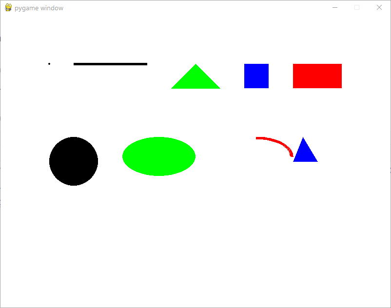

La carrocería la hemos dibujado con dos rectángulos, uno más grande para la parte inferior del coche y otro más pequeño en la parte superior. Las ruedas las conseguimos creando dos círculos negros y dos círculos grises más pequeños en su interior. Las ventanas y techo se delimitan trazando líneas en las coordenadas necesarias.

## **2.2. Procesamiento de imágenes**

El procesamiento de imágenes es una técnica que nos permite manipular imágenes digitales mediante código. Esta disciplina es clave en muchos campos, desde la edición de fotos y la creación de gráficos hasta áreas más avanzadas como la visión por computador. Podemos realizar tareas como aplicar filtros, mejorar la calidad de una imagen o incluso detectar objetos dentro de ella.

Python, junto con bibliotecas como [Pillow](https://pillow.readthedocs.io/en/stable/handbook/index.html) u [OpenCV](https://docs.opencv.org/4.x/d6/d00/tutorial_py_root.html), te ofrece las herramientas necesarias para realizar estas manipulaciones de manera sencilla.

Trabajar con imágenes en programación implica entender que cada imagen digital está compuesta por píxeles, pequeñas unidades que contienen información de color.

[https://youtu.be/Aeu-f9Ye0tQ](https://youtu.be/Aeu-f9Ye0tQ)

Por tanto, al modificar los valores de estos píxeles, podemos cambiar la apariencia de la imagen. Por ejemplo, si accedemos a cada píxel y reducimos el valor de color, obtendremos una imagen en escala de grises. Del mismo modo, al cambiar los valores de contraste o brillo, podemos hacer la imagen más clara o más oscura.

El procesamiento de imágenes también tiene aplicaciones mucho más amplias que van desde el diseño gráfico hasta la inteligencia artificial. Puedes pensar en los sistemas de reconocimiento facial, los filtros que usamos en redes sociales o incluso los coches autónomos que utilizan visión por computador para identificar objetos y señales en la carretera.

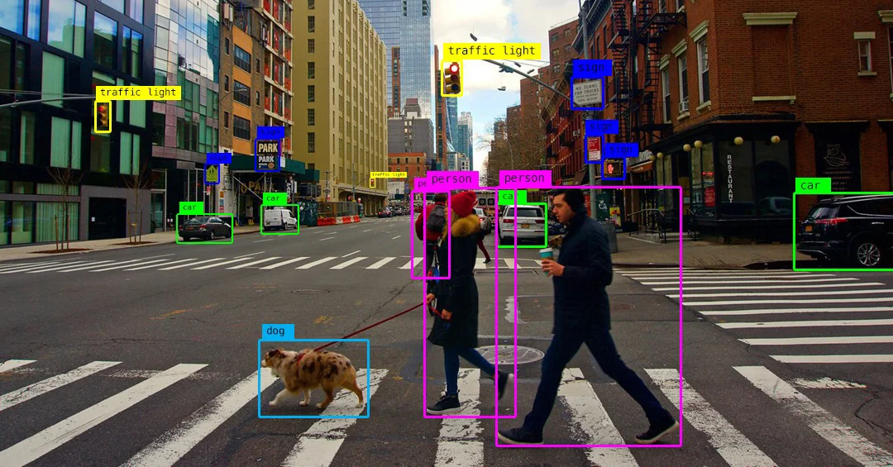

En los siguientes apartados comenzaremos a explorar cómo podemos usar Python para modificar imágenes.

## **2.3. Mapas de bits**

El procesamiento de imágenes basado en mapas de bits es fundamental para entender cómo se almacenan y manipulan imágenes digitales. Un **mapa de bits**, o «***bitmap***», es una representación de una imagen en la que cada píxel tiene asignado un valor que describe su color.

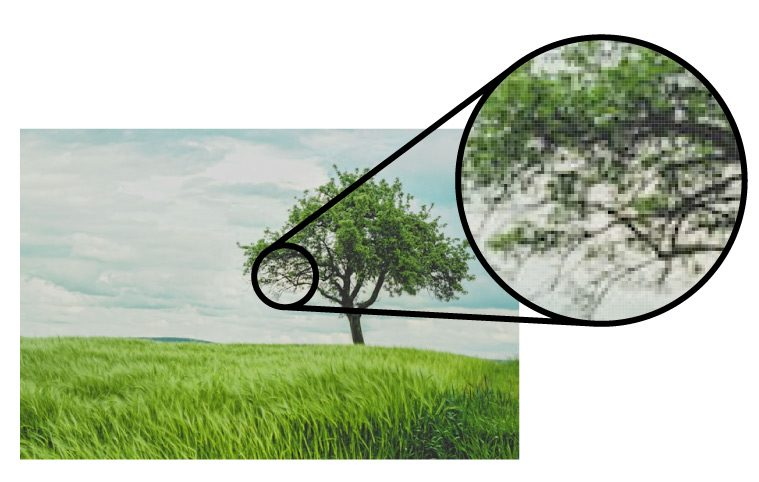

Al procesar una imagen píxel a píxel, podemos acceder a esa información y cambiarla, permitiéndonos aplicar una gran variedad de transformaciones.


Una de las aplicaciones más comunes del procesamiento de imágenes es la **aplicación de filtros**. Los filtros nos permiten realizar cambios globales o específicos en la imagen, como ajustar el brillo, el contraste, o aplicar efectos como convertir la imagen en escala de grises, invertir los colores o pixelar ciertas áreas para obtener efectos visuales particulares.

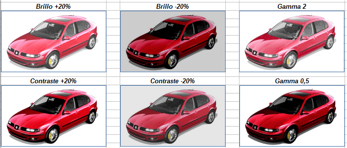

El procesamiento píxel a píxel implica acceder a cada punto de la imagen, analizar su valor de color (que generalmente **está compuesto por tres valores: rojo -R-, verde -G- y azul -B-**) y modificarlo. Por ejemplo, si queremos hacer una imagen monocromática, simplemente calculamos el promedio de los valores RGB de cada píxel y asignamos ese valor a los tres componentes de color, creando una escala de grises. Pero claro, para hacer ese trabajo ya tenemos numerosas bibliotecas que nos ayudan, como por ejemplo **Pillow**.

Para instalar Pillow, simplemente abrimos la terminal de nuestro editor de código y lanzamos este comando:

```python
pip install Pillow
```

*[De la misma manera haríamos para instalar OpenCV, Pygame o cualquier otra librería]*

Una vez que tengamos la biblioteca instalada, podemos **convertir una imagen a escala de grises**, simplemente escribiendo este pequeño programa:

```python
from PIL import Image

# Abrimos la imagen original
imagen_color = Image.open('ruta_de_tu_imagen.jpg')

# Convertimos la imagen a escala de grises
imagen_gris = imagen_color.convert('L')

# Guardamos la nueva imagen
imagen_gris.save('imagen_en_grises.jpg')
```

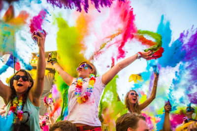

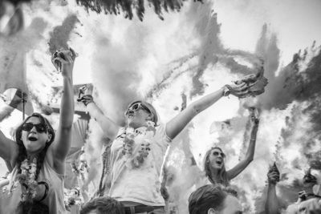

Fácil, ¿verdad?

Veamos ahora qué otras transformaciones comunes podemos hacerle a una imagen.

### **2.3.1. Inversión de colores**

En esta transformación lo que hacemos es **cambiar cada píxel al color opuesto en la escala de colores**.

Pero, ¿qué significa exactamente «el color opuesto» en este contexto?

Imagina que tienes una fotografía y quieres crear su negativo, como se hacía antiguamente con los carretes fotográficos. En un negativo, las áreas claras se vuelven oscuras y las oscuras se vuelven claras.

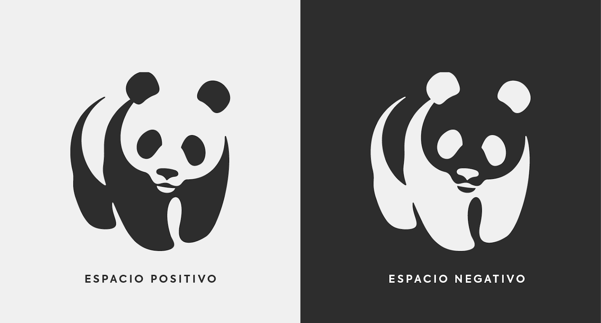

Los colores también cambian a sus tonalidades opuestas, creando un efecto visual interesante y a veces sorprendente.

En el mundo digital, cada color que ves en una imagen está compuesto por tres valores básicos: **rojo (R)**, **verde (G)** y **azul (B)**. Cada uno de estos tres valores pueden variar **desde 0 hasta 255**. Por ejemplo:

- El negro se representa como (0, 0, 0), ya que no tiene brillo en ningún componente.
- El blanco es (255, 255, 255), con el máximo brillo en todos los componentes.

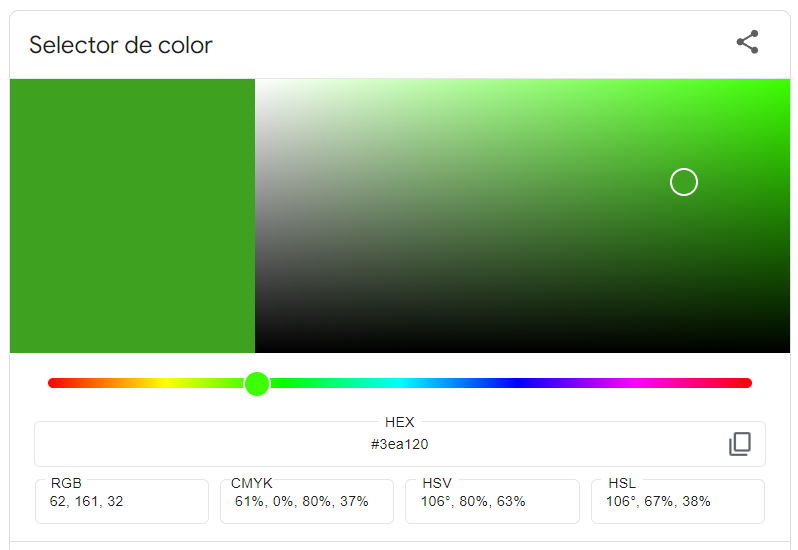

*[Puedes jugar con los valores RGB de los colores en esta [herramienta online](https://g.co/kgs/yHr6zUR)]*

**Para encontrar el color opuesto o invertido de un píxel, tomamos cada uno de sus valores RGB y los restamos de 255**. Es como si estuviéramos volteando la escala de colores. Por ejemplo, si un píxel tiene los valores:

Rojo (R): **50**

Verde (G): **100**

Azul (B): **150**

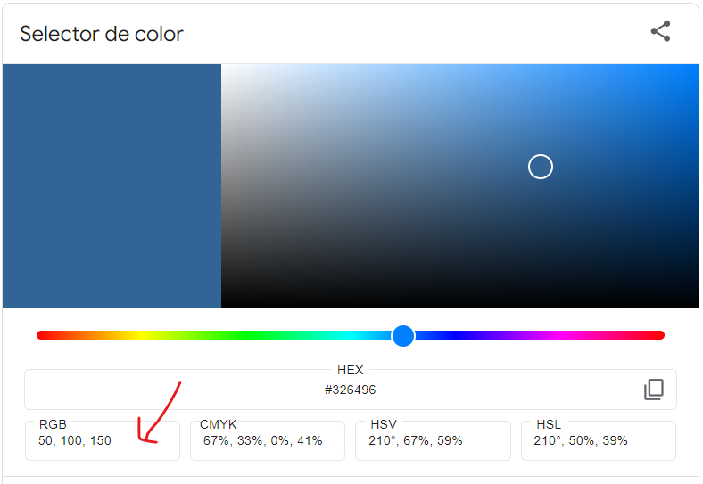

Al invertirlos, calculamos:

Rojo (R): 255 – 50 = **205**

Verde (G): 255 – 100 = **155**

Azul (B): 255 – 150 = **105**

El nuevo color sería **(205, 155, 105)**, que es el opuesto al original en la escala de colores.

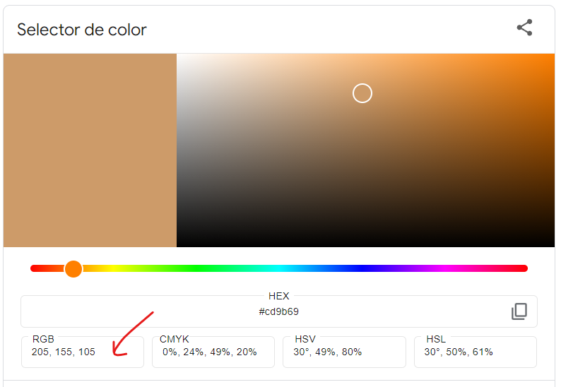

Por tanto, el azul que hemos seleccionado, cuando lo invertimos se convierte en ese naranja que tienes en la imagen anterior.

Esta transformación cambia los colores de tal manera que:

- Los tonos oscuros se vuelven claros y viceversa.
- Los colores adquieren tonalidades complementarias.
    
    Por ejemplo, los azules pueden transformarse en anaranjados, los verdes en magentas y los rojos en cianes.
    

Para visualizarlo mejor, piensa en una rueda de colores. En esta rueda, los colores opuestos o complementarios están en lados contrarios. Cuando invertimos los colores de una imagen, cada tono se desplaza a su posición opuesta en esta rueda, generando contrastes fuertes y resaltando detalles que quizás pasaban desapercibidos en la imagen original.

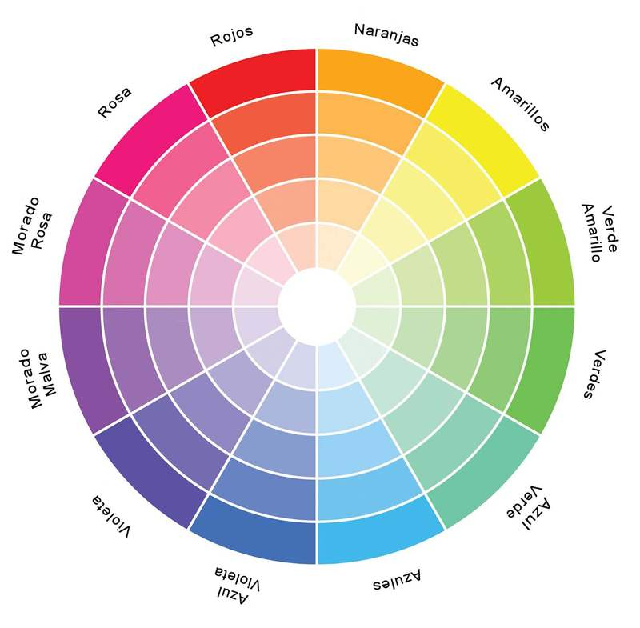

Este proceso no solo es útil para crear efectos artísticos, sino que también tiene aplicaciones prácticas. Por ejemplo, en fotografía para crear imágenes impactantes, en medicina al analizar radiografías o escáneres, donde invertir los colores puede ayudar a detectar anomalías.

Si, tu programa de transformación de imágenes, **puede salvarle la vida a alguien**.

¿Cómo podemos hacer esto en Python? Sencillo:

```python
from PIL import Image

# Abrimos la imagen original
imagen_original = Image.open('ruta_de_tu_imagen.jpg')

# Creamos una nueva imagen vacía con el mismo tamaño
imagen_invertida = Image.new('RGB', imagen_original.size)

# Obtenemos las dimensiones de la imagen
ancho, alto = imagen_original.size

# Recorremos cada píxel de la imagen
for x in range(ancho):
    for y in range(alto):
        # Obtenemos el color del píxel actual
        r, g, b = imagen_original.getpixel((x, y))
        
        # Invertimos cada componente de color
        r_invertido = 255 - r
        g_invertido = 255 - g
        b_invertido = 255 - b
        
        # Asignamos el nuevo color invertido al píxel de la nueva imagen
        imagen_invertida.putpixel((x, y), (r_invertido, g_invertido, b_invertido))

# Guardamos la imagen invertida
imagen_invertida.save('imagen_invertida.jpg')
```

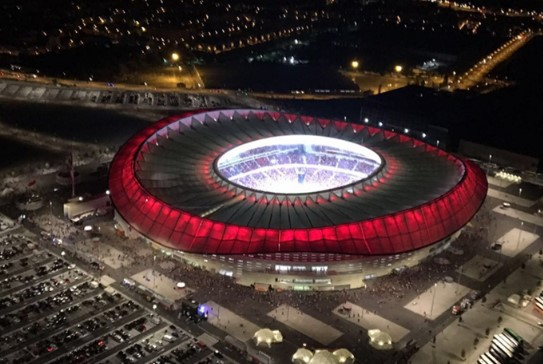

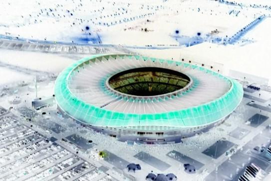

### **2.3.2. Binarización**

La **binarización de imágenes** es un proceso mediante el cual **convertimos una imagen en color o en escala de grises en una imagen que solo tiene dos colores: blanco y negro**. Es como si transformáramos una foto en una especie de dibujo donde solo existen dos tonos posibles. Este proceso es útil en muchas aplicaciones, como el reconocimiento de texto en documentos escaneados o en ciertas técnicas artísticas que buscan un efecto visual impactante.

Para entender mejor la binarización, imagina que estás viendo una película antigua en blanco y negro. Sin embargo, incluso en esas películas, hay diferentes tonos de gris que permiten distinguir detalles y profundidad. En la binarización, vamos un paso más allá y eliminamos todos esos tonos intermedios, dejando únicamente el blanco y el negro puros. Es como hacer un dibujo con un lápiz muy afilado donde solo puedes trazar líneas negras sobre un papel blanco, sin posibilidad de sombras o degradados.

El proceso de binarización se basa en **establecer un umbral**. Este umbral es un valor que determina si un píxel será blanco o negro en la imagen resultante. Si el valor de luminosidad de un píxel es mayor que el umbral, se convierte en blanco; si es menor, se convierte en negro. Por ejemplo, si establecemos el umbral en 128 (recordando que los valores de luminosidad van de 0 a 255), todos los píxeles con un valor mayor a 128 serán blancos, y los menores o iguales a 128 serán negros.

Este método nos permite simplificar una imagen y resaltar sus contornos y formas principales. Es especialmente útil cuando queremos destacar el contraste entre elementos claros y oscuros o cuando necesitamos procesar imágenes para análisis posteriores, como identificar texto escrito a mano o impreso.

Para que puedas ver el resultado en acción, prueba este sencillo programa:

```python
from PIL import Image

# Abrimos la imagen original
imagen_original = Image.open('binary.jpg')

# Convertimos la imagen a escala de grises
imagen_gris = imagen_original.convert('L')

# Creamos una nueva imagen vacía con el mismo tamaño
imagen_binarizada = Image.new('L', imagen_gris.size)

# Establecemos el umbral para la binarización
umbral = 128

# Obtenemos las dimensiones de la imagen
ancho, alto = imagen_gris.size

# Aplicamos la binarización
for x in range(ancho):
    for y in range(alto):
        # Obtenemos el valor de luminosidad del píxel actual
        valor = imagen_gris.getpixel((x, y))

        # Si el valor es mayor que el umbral, lo establecemos en blanco (255)
        # Si es menor o igual, lo establecemos en negro (0)
        if valor > umbral:
            imagen_binarizada.putpixel((x, y), 255)
        else:
            imagen_binarizada.putpixel((x, y), 0)

# Guardamos la imagen binarizada
imagen_binarizada.save('binarizada.png')
```
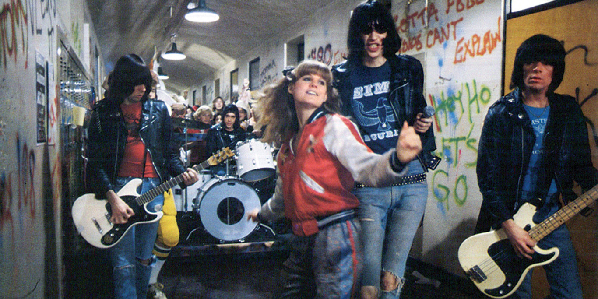

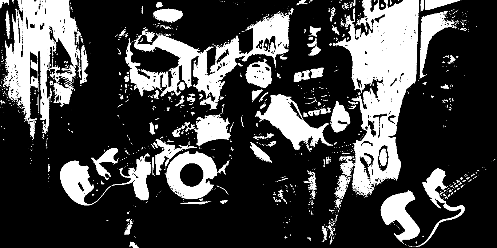


### **2.3.3. Posterización**

La **posterización** es un proceso que reduce la cantidad de colores en una imagen, creando un efecto visual donde los tonos cambian de manera más acentuada. Es como si convirtieras una fotografía en una ilustración con menos detalles de color, similar a los carteles antiguos o a las pinturas por números, donde se utilizan áreas de colores sólidos en lugar de gradientes suaves.

Como ya sabes, las imágenes digitales están formadas por píxeles, y cada píxel tiene valores para los colores **rojo (R)**, **verde (G)** y **azul (B)**, que van **desde 0 hasta 255**. Al posterizar una imagen, reducimos el número de valores posibles que cada componente de color puede tener. En lugar de permitir cualquier valor entre 0 y 255, limitamos los colores a unos pocos niveles específicos.

Por ejemplo, si reducimos los niveles de color a 4, cada componente solo puede tomar uno de cuatro valores posibles: 0, 85, 170 o 255. Esto se logra dividiendo el rango completo (0-255) entre el número de niveles que deseamos y ajustando los valores de los píxeles para que coincidan con los niveles más cercanos.

Basta de teoría, veamos un ejemplo:

```python
from PIL import Image

# Abrimos la imagen original
imagen_original = Image.open('leo.jpg')

# Aseguramos que la imagen esté en modo RGB
imagen_rgb = imagen_original.convert('RGB')

# Establecemos el número de niveles de posterización
niveles = 4  # Puedes cambiar este número para experimentar

# Calculamos el tamaño de cada nivel
tamaño_nivel = 256 // niveles

# Creamos una nueva imagen vacía con el mismo tamaño
imagen_posterizada = Image.new('RGB', imagen_rgb.size)

# Obtenemos las dimensiones de la imagen
ancho, alto = imagen_rgb.size

# Recorremos cada píxel de la imagen
for x in range(ancho):
    for y in range(alto):
        # Obtenemos el color del píxel actual
        r, g, b = imagen_rgb.getpixel((x, y))

        # Calculamos el nuevo valor de cada componente
        r_nuevo = int(r / tamaño_nivel) * tamaño_nivel
        g_nuevo = int(g / tamaño_nivel) * tamaño_nivel
        b_nuevo = int(b / tamaño_nivel) * tamaño_nivel

        # Aseguramos que los valores no excedan 255
        r_nuevo = min(r_nuevo, 255)
        g_nuevo = min(g_nuevo, 255)
        b_nuevo = min(b_nuevo, 255)

        # Asignamos el nuevo color al píxel de la nueva imagen
        imagen_posterizada.putpixel((x, y), (r_nuevo, g_nuevo, b_nuevo))

# Guardamos la imagen posterizada
imagen_posterizada.save('leo_posterizado.jpg')
```

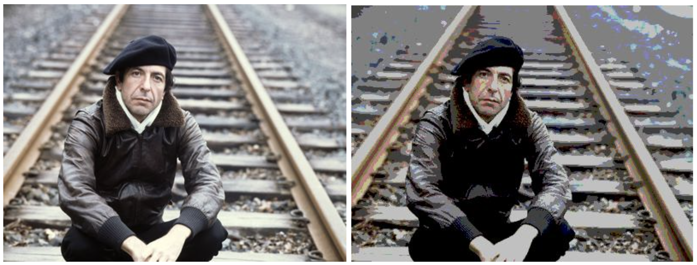

### **2.3.4. Pixelado**

La **pixelación** es una técnica que transforma una imagen para que aparezca como si estuviera compuesta por bloques de color más grandes, creando un efecto visual similar a los gráficos de los videojuegos antiguos o a mirar una imagen muy de cerca. Es como si ampliáramos una fotografía hasta el punto en que los pequeños cuadrados de color, conocidos como píxeles, se vuelven visibles y dominan la imagen.

Este proceso **simplifica la imagen** y puede utilizarse tanto para crear efectos artísticos como para ocultar detalles, como en los casos donde se necesita proteger la identidad de una persona en una fotografía.

Como siempre, esto se ve mejor con un ejemplo:

```python
from PIL import Image

# Abrimos la imagen original
imagen_original = Image.open('jim.jpg')

# Definimos el tamaño de los píxeles grandes
tamano_pixel = 10  # Puedes cambiar este valor para ver diferentes efectos

# Obtenemos las dimensiones de la imagen
ancho, alto = imagen_original.size

# Redimensionamos la imagen a un tamaño más pequeño
imagen_pequena = imagen_original.resize(
    (ancho // tamano_pixel, alto // tamano_pixel),
    resample=Image.NEAREST)

# Volvemos a ampliar la imagen al tamaño original
imagen_pixelada = imagen_pequena.resize(
    (ancho, alto),
    resample=Image.NEAREST)

# Guardamos la imagen pixelada
imagen_pixelada.save('jim_pixelado.jpg')
```
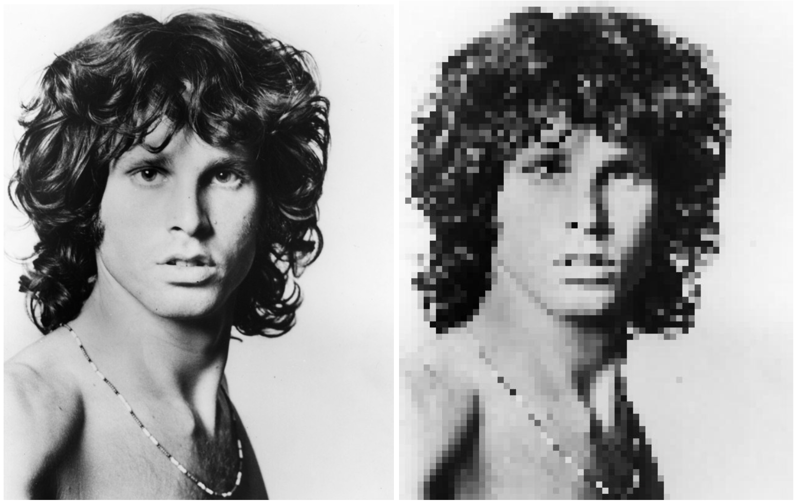


### **2.3.5. Puntillismo animado**

El **puntillismo** es una técnica artística en la que se utilizan pequeños puntos de color para crear una imagen. Cuando observas de cerca, ves los puntos individuales, pero al alejarte, tu ojo mezcla los colores y percibes la imagen completa. Es similar a cuando miras una pantalla de televisión muy de cerca y notas los píxeles; al aumentar la distancia, ves la imagen clara y definida.

El **puntillismo animado** lleva esta idea un paso más allá al agregar movimiento a los puntos. En el procesamiento de imágenes, esto significa que **los colores de los puntos pueden cambiar con el tiempo o en respuesta a los colores de los píxeles vecinos**. Puedes imaginarlo pensando que cada punto en la imagen no es estático, sino que interactúa con los que están a su alrededor, creando un efecto visual en constante cambio.

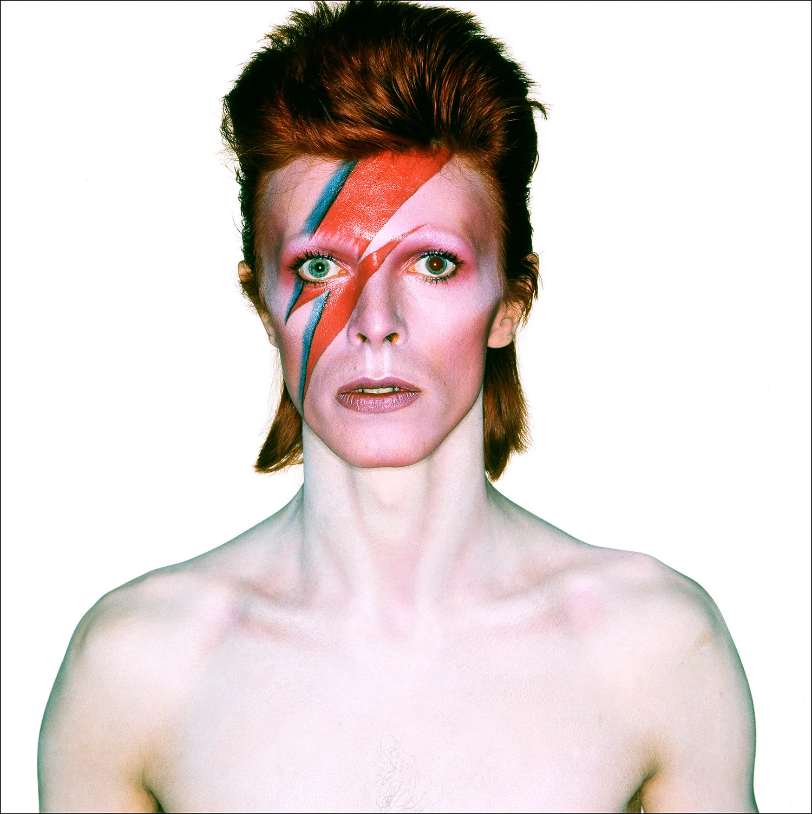


En una imagen digital, podemos representar cada píxel como un punto. Para aplicar el efecto de puntillismo, reemplazamos áreas de la imagen por puntos de color que representan el valor promedio de los píxeles en esa área. Para agregar la parte «*animada*», hacemos que el color de cada punto cambie dinámicamente, por ejemplo, variando ligeramente con respecto al tiempo o en función de los colores de los píxeles vecinos.

En este ejemplo hemos partido de una imagen JPG y aplicando la técnica anterior, hemos creado varias versiones de la misma imagen cambiando ligeramente el color de algunos puntos, de manera que cuando las mostramos una tras otra, el efecto es de animación. Tal y como funcionan las animaciones GIF:

```python
from PIL import Image, ImageDraw
import random

# Abrimos la imagen original
imagen_original = Image.open('bowie.jpg')

# Convertimos la imagen a modo RGB
imagen_rgb = imagen_original.convert('RGB')

# Definimos el tamaño de los puntos
tamano_punto = 5  # Puedes cambiar este valor para ver diferentes efectos

# Obtenemos las dimensiones de la imagen
ancho, alto = imagen_rgb.size

# Número de cuadros para la animación
numero_cuadros = 10  # Puedes aumentar este número para una animación más larga

# Lista para almacenar los cuadros de la animación
cuadros = []

for i in range(numero_cuadros):
    # Creamos una nueva imagen en blanco
    imagen_puntillismo = Image.new('RGB', (ancho, alto), color='white')
    draw = ImageDraw.Draw(imagen_puntillismo)

    # Recorremos la imagen en pasos del tamaño de los puntos
    for x in range(0, ancho, tamano_punto):
        for y in range(0, alto, tamano_punto):
            # Obtenemos el color del píxel actual
            r, g, b = imagen_rgb.getpixel((x, y))

            # Añadimos una variación aleatoria al color para el efecto animado
            variacion = random.randint(-20, 20)
            r_nuevo = min(max(r + variacion, 0), 255)
            g_nuevo = min(max(g + variacion, 0), 255)
            b_nuevo = min(max(b + variacion, 0), 255)

            # Dibujamos un punto (círculo) en la posición actual
            draw.ellipse(
                (x, y, x + tamano_punto, y + tamano_punto),
                fill=(int(r_nuevo), int(g_nuevo), int(b_nuevo))
            )

    # Añadimos el cuadro actual a la lista de cuadros
    cuadros.append(imagen_puntillismo)

# Guardamos los cuadros como una animación GIF
cuadros[0].save(
    'bowie_animado.gif',
    save_all=True,
    append_images=cuadros[1:],
    duration=200,
    loop=0
)
```

## **2.4. Mezcla de imágenes.**

La **mezcla de imágenes** es una técnica que nos permite combinar dos o más imágenes en una sola, creando efectos visuales interesantes y a veces sorprendentes. Esta técnica es ampliamente utilizada en fotografía, diseño gráfico y en la creación de efectos especiales en películas y videojuegos. Al mezclar imágenes, podemos superponer elementos, crear transiciones suaves entre escenas o incluso generar composiciones artísticas únicas.

Cuando mezclamos imágenes digitalmente, estamos combinando los valores de color de los píxeles correspondientes en cada imagen. Cada píxel en una imagen tiene valores para los colores rojo (R), verde (G) y azul (B), que determinan su color específico. Al combinar estos valores de manera controlada, podemos crear una nueva imagen que es una fusión de las originales.

Una de las formas más sencillas de mezclar dos imágenes es calcular el promedio de los valores de color de cada píxel. Por ejemplo, si en una posición determinada un píxel en la primera imagen es de color rojo brillante (R=255, G=0, B=0) y el píxel correspondiente en la segunda imagen es de color azul brillante (R=0, G=0, B=255), el píxel resultante tendrá valores (R=127, G=0, B=127), que es un tono de púrpura.


Además del promedio simple, podemos ajustar la mezcla utilizando un **factor de opacidad o transparencia** (también conocido como «***alfa***»), que nos permite controlar cuánto de cada imagen contribuye al resultado final. Esto es similar a superponer dos láminas transparentes, donde puedes ver ambas imágenes al mismo tiempo, pero una puede ser más visible que la otra dependiendo de la opacidad.


Veamos cómo podemos mezclar dos imágenes usando Python:

```python
from PIL import Image

# Abrimos las dos imágenes que queremos mezclar
imagen1 = Image.open('messi.jpg')
imagen2 = Image.open('ronaldo.jpg')

# Aseguramos que ambas imágenes tengan el mismo tamaño
imagen1 = imagen1.resize((500, 500))
imagen2 = imagen2.resize((500, 500))

# Definimos el factor de mezcla (entre 0.0 y 1.0)
factor = 0.5  # Puedes cambiar este valor para ver diferentes efectos

# Mezclamos las imágenes usando el método blend
imagen_mezclada = Image.blend(imagen1, imagen2, factor)

# Guardamos la imagen resultante
imagen_mezclada.save('messironaldomezcladas.jpg')
```

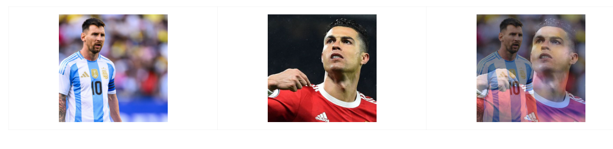

## **2.5. Gráficos vectoriales y diseño digital generativo**

Hasta ahora hemos trabajado con imágenes de mapa de bits, donde cada imagen se compone de una matriz de píxeles que, al ampliarse, pueden perder calidad y volverse borrosos.

Sin embargo, existe otra forma de representar imágenes en el mundo digital: los **gráficos vectoriales**. En lugar de estar formados por píxeles individuales, los gráficos vectoriales **se crean a partir de formas geométricas como líneas, curvas y polígonos, definidos matemáticamente mediante coordenadas y ecuaciones**.

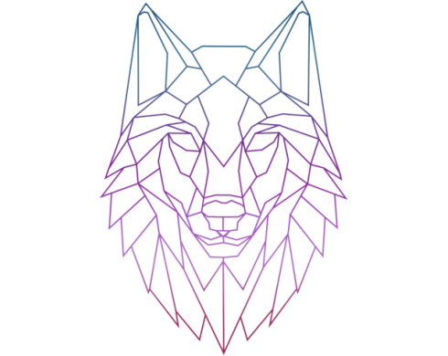

Imagina que dibujas un círculo en un programa de diseño. Si utilizas gráficos vectoriales, ese círculo no está compuesto por puntos individuales, sino por una fórmula que describe su forma y tamaño. Esto significa que puedes agrandarlo o reducirlo tanto como quieras sin perder calidad o definición.

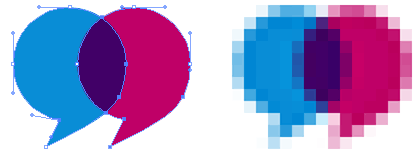

Los gráficos vectoriales son especialmente útiles cuando necesitamos imágenes que puedan escalarse sin perder nitidez, como logotipos, iconos o tipografías. Al trabajar con vectores, podemos modificar fácilmente las propiedades de las formas, como su color, posición o tamaño, de manera precisa y flexible.

Vamos a crear nuestras tres primeras formas básicas (triángulo, cuadrado y círculo) con un programa que usa la popular librería [**Matplotlib**](https://matplotlib.org/stable/users/index):

```python
import matplotlib.pyplot as plt
from matplotlib.patches import Circle, Rectangle, Polygon

# Creamos una figura y un eje
fig, ax = plt.subplots()

# Dibujamos un círculo
circulo = Circle((0.5, 0.5), 0.2, facecolor='skyblue', edgecolor='black')
ax.add_patch(circulo)

# Dibujamos un rectángulo
rectangulo = Rectangle((0.1, 0.1), 0.2, 0.3, facecolor='salmon', edgecolor='black')
ax.add_patch(rectangulo)

# Dibujamos un triángulo
triangulo = Polygon([[0.7, 0.2], [0.9, 0.2], [0.8, 0.4]], facecolor='limegreen', edgecolor='black')
ax.add_patch(triangulo)

# Configuramos el área de dibujo
ax.set_xlim(0, 1)
ax.set_ylim(0, 1)
ax.set_aspect('equal')
ax.axis('off')

# Mostramos la figura
plt.show()
```

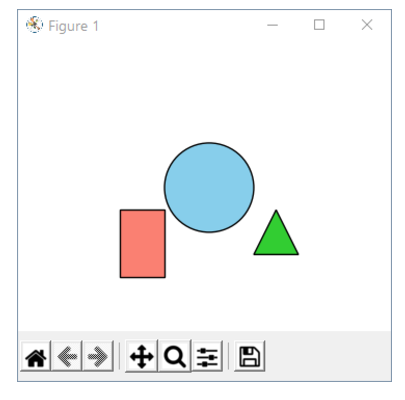

En este otro ejemplo vamos a crear un muñeco tipo androide usando sólo formas básicas:

```python
import matplotlib.pyplot as plt
from matplotlib.patches import Circle, Rectangle
from matplotlib.lines import Line2D

# Creamos una figura y un eje
fig, ax = plt.subplots()

# Cabeza (círculo)
cabeza = Circle((0.5, 0.8), 0.1, facecolor='lightgreen', edgecolor='black')
ax.add_patch(cabeza)

# Ojos (círculos pequeños)
ojo_izquierdo = Circle((0.47, 0.82), 0.02, facecolor='black')
ojo_derecho = Circle((0.53, 0.82), 0.02, facecolor='black')
ax.add_patch(ojo_izquierdo)
ax.add_patch(ojo_derecho)

# Antenas (líneas)
antena_izquierda = Line2D([0.5, 0.45], [0.9, 0.85], linewidth=2, color='black')
antena_derecha = Line2D([0.5, 0.55], [0.9, 0.85], linewidth=2, color='black')
ax.add_line(antena_izquierda)
ax.add_line(antena_derecha)

# Cuerpo (rectángulo)
cuerpo = Rectangle((0.35, 0.5), 0.3, 0.3, facecolor='lightgreen', edgecolor='black')
ax.add_patch(cuerpo)

# Brazos (rectángulos)
brazo_izquierdo = Rectangle((0.25, 0.55), 0.1, 0.1, facecolor='lightgreen', edgecolor='black')
brazo_derecho = Rectangle((0.65, 0.55), 0.1, 0.1, facecolor='lightgreen', edgecolor='black')
ax.add_patch(brazo_izquierdo)
ax.add_patch(brazo_derecho)

# Piernas (rectángulos)
pierna_izquierda = Rectangle((0.4, 0.3), 0.05, 0.2, facecolor='lightgreen', edgecolor='black')
pierna_derecha = Rectangle((0.55, 0.3), 0.05, 0.2, facecolor='lightgreen', edgecolor='black')
ax.add_patch(pierna_izquierda)
ax.add_patch(pierna_derecha)

# Ajustamos los límites y ocultamos los ejes
ax.set_xlim(0, 1)
ax.set_ylim(0, 1)
ax.axis('off')

# Mostramos el androide
plt.show()
```

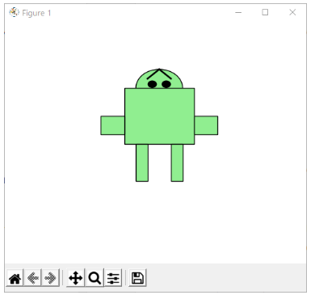

Por su parte, el **diseño generativo** es una **técnica que combina programación y arte para crear obras visuales mediante algoritmos**. En lugar de dibujar cada elemento de forma manual, escribimos código que establece reglas y patrones para generar diseños. Esto nos permite crear composiciones complejas y únicas que pueden variar cada vez que se ejecuta el programa, ofreciendo infinitas posibilidades creativas.

Piensa en cómo en la naturaleza se forman patrones como las vetas de una hoja, las espirales de una concha o las ramificaciones de un rayo. Estos patrones siguen reglas matemáticas y físicas que podemos emular mediante algoritmos en nuestros programas.

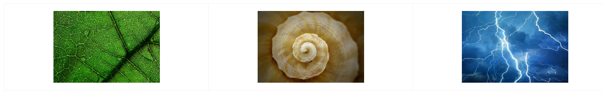

Por ejemplo, podríamos escribir código que genere una serie de líneas que se bifurcan como las ramas de un árbol, o que cree formas geométricas que se repiten y transforman siguiendo secuencias matemáticas como la de Fibonacci.

En este primer ejemplo de diseño generativo (usando la librería ***turtle***) vamos a crear una espiral que cambie de color mientras se dibuja, creando un efecto visual muy bonito. Y lo más espectacular de todo es que sólo usaremos líneas rectas.

¿Construir una espiral con líneas rectas? 😱 Observa 👇:

```python
import turtle

turtle.speed(0)  # Velocidad máxima de dibujo
colores = ['red', 'purple', 'blue', 'green', 'yellow', 'orange']

for i in range(360):
    turtle.pencolor(colores[i % 6])  # Cambia el color cada vuelta
    turtle.width(i / 100 + 1)        # Aumenta el grosor gradualmente
    turtle.forward(i)
    turtle.left(59)                  # Cambia el ángulo para crear la espiral

turtle.done()
```

En este otro ejemplo, crearemos un patrón de flor fractal usando únicamente circunferencias:

```python
import turtle

turtle.speed(0)
turtle.color('magenta')

def dibujar_flor(tamaño, nivel):
    if nivel > 0:
        for _ in range(6):
            turtle.circle(tamaño)
            turtle.left(60)
            dibujar_flor(tamaño / 2, nivel - 1)

dibujar_flor(100, 3)
turtle.done()
```

Como puedes ver, usando la programación podemos automatizar la creación de composiciones artísticas tremendamente atractivas. Lo único que te separa de crear una obra de arte, conociendo estas herramientas, es tu creatividad a través de la experimentación.

## **2.6. Eventos (ratón y teclado).**

En el mundo de la programación gráfica, uno de los aspectos que más gustan a los programadores junior como nosotros es la capacidad de interactuar con el usuario a través de dispositivos como el ratón y el teclado.

Cada vez que en un videojuego mueves un personaje usando las flechas del teclado, cada vez que en Photoshop haces clic en la pantalla para dibujar o seleccionar elementos, estás **disparando eventos**, que son acciones que ocurren, que el programa puede detectar y a los que puede responder adecuadamente.


Cuando utilizamos una aplicación en nuestros dispositivos digitales, constantemente estamos **generando eventos** sin darnos cuenta. Por ejemplo, al mover el ratón, al hacer clic en un botón, o al escribir un texto. En la programación gráfica, podemos capturar estos eventos y definir cómo queremos que el programa reaccione. Esto nos permite crear aplicaciones interactivas, donde el usuario no es un espectador pasivo, sino que participa activamente en lo que ocurre en la pantalla.

Para entender mejor cómo funcionan los eventos, vamos a crear un pequeño programa en Python utilizando la biblioteca ***Pygame***. Este programa mostrará una ventana en la que podremos mover un círculo con las flechas del teclado y cambiar su color al hacer clic con el ratón.

```python
import pygame
import sys
import random

# Inicializamos Pygame
pygame.init()

# Definimos el tamaño de la ventana
ancho_ventana = 800
alto_ventana = 600
ventana = pygame.display.set_mode((ancho_ventana, alto_ventana))
pygame.display.set_caption('Eventos de ratón y teclado')

# Definimos colores
blanco = (255, 255, 255)
negro = (0, 0, 0)

# Posición inicial del círculo
x = ancho_ventana // 2
y = alto_ventana // 2
radio = 30
color_circulo = (0, 128, 255)

# Velocidad de movimiento
velocidad = 5

# Bucle principal del juego
while True:
    for evento in pygame.event.get():
        if evento.type == pygame.QUIT:
            pygame.quit()
            sys.exit()
        elif evento.type == pygame.MOUSEBUTTONDOWN:
            # Si se hace clic con el ratón, cambiamos el color del círculo
            color_circulo = (random.randint(0, 255), random.randint(0, 255), random.randint(0, 255))
        elif evento.type == pygame.KEYDOWN:
            # Si se presiona una tecla, movemos el círculo
            if evento.key == pygame.K_LEFT:
                x -= velocidad
            elif evento.key == pygame.K_RIGHT:
                x += velocidad
            elif evento.key == pygame.K_UP:
                y -= velocidad
            elif evento.key == pygame.K_DOWN:
                y += velocidad

    # Limitamos la posición del círculo a la ventana
    x = max(radio, min(x, ancho_ventana - radio))
    y = max(radio, min(y, alto_ventana - radio))

    # Rellenamos el fondo de blanco
    ventana.fill(blanco)

    # Dibujamos el círculo
    pygame.draw.circle(ventana, color_circulo, (x, y), radio)

    # Actualizamos la pantalla
    pygame.display.flip()

    # Controlamos la velocidad del bucle
    pygame.time.Clock().tick(60)
```

## **2.7. Uso de la línea y el punto para dibujar líneas a mano alzada.**

Cuando dibujamos con lápiz y papel, trazamos líneas continuas moviendo el lápiz sobre el papel. En programación, **podemos simular este efecto capturando la posición del ratón a medida que se mueve y dibujando líneas o puntos en esas posiciones**. Al conectar estos puntos, creamos el efecto de una línea continua que sigue el movimiento del ratón.

Para lograr esto, necesitamos:

- **Detectar cuándo el usuario está dibujando**: esto suele implicar detectar cuándo el botón del ratón está presionado. Cuando el usuario mantiene pulsado el botón izquierdo del ratón, interpretamos que quiere dibujar.
- **Registrar las posiciones del ratón**: mientras el botón está presionado, capturamos las coordenadas (x, y) del cursor a medida que se mueve.
- **Dibujar líneas o puntos**: utilizamos estas coordenadas para dibujar en la pantalla, ya sea trazando líneas entre puntos consecutivos o dibujando pequeños círculos que representen los trazos.

Vamos a crear un programa sencillo en Python utilizando la biblioteca ***Pygame*** que nos permitirá dibujar en la pantalla moviendo el ratón mientras mantenemos pulsado el botón izquierdo.

```python
import pygame
import sys

# Inicializamos Pygame
pygame.init()

# Definimos el tamaño de la ventana
ancho_ventana = 800
alto_ventana = 600
ventana = pygame.display.set_mode((ancho_ventana, alto_ventana))
pygame.display.set_caption('Dibujo a mano alzada')

# Definimos colores
blanco = (255, 255, 255)
negro = (0, 0, 0)
color_dibujo = (0, 0, 255)  # Azul

# Rellenamos el fondo de blanco
ventana.fill(blanco)

# Variable para controlar si el ratón está presionado
dibujando = False

# Posición anterior del ratón
pos_anterior = None

# Bucle principal
while True:
    for evento in pygame.event.get():
        if evento.type == pygame.QUIT:
            pygame.quit()
            sys.exit()
        elif evento.type == pygame.MOUSEBUTTONDOWN:
            if evento.button == 1:  # Botón izquierdo del ratón
                dibujando = True
                pos_anterior = evento.pos
        elif evento.type == pygame.MOUSEBUTTONUP:
            if evento.button == 1:
                dibujando = False
                pos_anterior = None
        elif evento.type == pygame.MOUSEMOTION:
            if dibujando:
                # Dibujamos una línea desde la posición anterior a la actual
                pos_actual = evento.pos
                pygame.draw.line(ventana, color_dibujo, pos_anterior, pos_actual, 3)
                pos_anterior = pos_actual

    # Actualizamos la pantalla
    pygame.display.flip()

    # Controlamos la velocidad del bucle
    pygame.time.Clock().tick(60)
```

Felicidades, acabas de programar un panel de firmas.

Además, puedes asignar diferentes teclas para cambiar el color del pincel, haciendo:

```python
#...
elif evento.type == pygame.KEYDOWN:
    if evento.key == pygame.K_r:
        color_dibujo = (255, 0, 0)  # Rojo
    elif evento.key == pygame.K_g:
        color_dibujo = (0, 255, 0)  # Verde
    elif evento.key == pygame.K_b:
        color_dibujo = (0, 0, 255)  # Azul
```

Incluso, puedes permitir que el usuario guarde su creación en una imagen. Para hacerlo, agrega esta línea cuando quieras guardar (por ejemplo, al presionar la tecla ***s***):

```python
#...
elif evento.type == pygame.KEYDOWN:
    if evento.key == pygame.K_s:
        pygame.image.save(ventana, 'mi_firma.png')
```

Fácil, ¿verdad?

Te invito a que investigues la librería ***Pygame***, su gestión de eventos y que consigas ampliar el programa con alguna otra funcionalidad útil.

## **2.8. Operaciones en el espacio**

Las **operaciones en el espacio** **son transformaciones que aplicamos a las figuras o imágenes para cambiar su posición, tamaño u orientación en el plano**. Estas operaciones nos permiten mover, escalar o rotar elementos gráficos de manera controlada, lo que es fundamental en campos como la animación, el diseño gráfico y el desarrollo de videojuegos.

Las principales transformaciones espaciales son:

- **Traslación**: mover una figura de un lugar a otro sin alterar su forma, tamaño u orientación.
- **Escalado**: cambiar el tamaño de una figura, ya sea agrandándola o reduciéndola, manteniendo o no sus proporciones.
- **Rotación**: girar una figura alrededor de un punto fijo, cambiando su orientación.

Estas operaciones se basan en transformaciones matemáticas que aplicamos a las coordenadas de los puntos que componen las figuras. Al modificar las coordenadas de manera sistemática, podemos lograr los efectos deseados.

Vamos a explorar cada una de estas transformaciones utilizando Python y la biblioteca ***Pygame***.

### **2.8.1. Traslación**

La **traslación** consiste en desplazar una figura de un lugar a otro sumando una cantidad fija a sus coordenadas. Por ejemplo, para mover un cuadrado con el teclado:

```python
import pygame
import sys

# Inicializamos Pygame
pygame.init()

# Definimos el tamaño de la ventana
ancho_ventana = 800
alto_ventana = 600
ventana = pygame.display.set_mode((ancho_ventana, alto_ventana))
pygame.display.set_caption('Traslación de un cuadrado')

# Definimos colores
blanco = (255, 255, 255)
rojo = (255, 0, 0)

# Posición inicial del cuadrado
x = ancho_ventana // 2 - 25
y = alto_ventana // 2 - 25
ancho_cuadrado = 50
alto_cuadrado = 50

# Velocidad de movimiento
velocidad = 5

# Bucle principal
while True:
    for evento in pygame.event.get():
        if evento.type == pygame.QUIT:
            pygame.quit()
            sys.exit()
    
    # Obtener las teclas presionadas
    teclas = pygame.key.get_pressed()
    if teclas[pygame.K_LEFT]:
        x -= velocidad
    if teclas[pygame.K_RIGHT]:
        x += velocidad
    if teclas[pygame.K_UP]:
        y -= velocidad
    if teclas[pygame.K_DOWN]:
        y += velocidad

    # Limitar la posición del cuadrado a la ventana
    x = max(0, min(x, ancho_ventana - ancho_cuadrado))
    y = max(0, min(y, alto_ventana - alto_cuadrado))

    # Rellenar el fondo
    ventana.fill(blanco)

    # Dibujar el cuadrado
    pygame.draw.rect(ventana, rojo, (x, y, ancho_cuadrado, alto_cuadrado))

    # Actualizar la pantalla
    pygame.display.flip()
    pygame.time.Clock().tick(60)
```

### **2.8.2. Escalado**

El **escalado** modifica el tamaño de una figura multiplicando sus coordenadas por un factor de escala. Por ejemplo, una imagen se agranda o reduce utilizando la rueda del ratón:

```python
import pygame
import sys

# Inicializamos Pygame
pygame.init()

# Definimos el tamaño de la ventana
ancho_ventana = 800
alto_ventana = 600
ventana = pygame.display.set_mode((ancho_ventana, alto_ventana))
pygame.display.set_caption('Escalado de una imagen')

# Cargamos la imagen
imagen = pygame.image.load('imagen.png')
rect_imagen = imagen.get_rect(center=(ancho_ventana // 2, alto_ventana // 2))

# Factor de escala inicial
factor_escala = 1.0

# Bucle principal
while True:
    for evento in pygame.event.get():
        if evento.type == pygame.QUIT:
            pygame.quit()
            sys.exit()
        elif evento.type == pygame.MOUSEBUTTONDOWN:
            if evento.button == 4:  # Rueda hacia arriba
                factor_escala += 0.1
            elif evento.button == 5:  # Rueda hacia abajo
                factor_escala = max(0.1, factor_escala - 0.1)

    # Escalamos la imagen
    nueva_imagen = pygame.transform.rotozoom(imagen, 0, factor_escala)
    rect_nueva_imagen = nueva_imagen.get_rect(center=(ancho_ventana // 2, alto_ventana // 2))

    # Rellenar el fondo
    ventana.fill((255, 255, 255))

    # Dibujar la imagen escalada
    ventana.blit(nueva_imagen, rect_nueva_imagen)

    # Actualizar la pantalla
    pygame.display.flip()
    pygame.time.Clock().tick(60)
```

### **2.8.3. Rotación**

La **rotación** cambia la orientación de una figura girándola alrededor de un punto, generalmente su centro. Por ejemplo, una imagen rota a medida que presionamos las teclas izquierda y derecha:

```python
import pygame
import sys

# Inicializamos Pygame
pygame.init()

# Definimos el tamaño de la ventana
ancho_ventana = 800
alto_ventana = 600
ventana = pygame.display.set_mode((ancho_ventana, alto_ventana))
pygame.display.set_caption('Rotación de una imagen')

# Cargamos la imagen
imagen = pygame.image.load('imagen.png')
rect_imagen = imagen.get_rect(center=(ancho_ventana // 2, alto_ventana // 2))

# Ángulo de rotación inicial
angulo = 0

# Bucle principal
while True:
    for evento in pygame.event.get():
        if evento.type == pygame.QUIT:
            pygame.quit()
            sys.exit()

    # Obtener las teclas presionadas
    teclas = pygame.key.get_pressed()
    if teclas[pygame.K_LEFT]:
        angulo += 2  # Girar a la izquierda
    if teclas[pygame.K_RIGHT]:
        angulo -= 2  # Girar a la derecha

    # Rotamos la imagen
    imagen_rotada = pygame.transform.rotate(imagen, angulo)
    rect_rotado = imagen_rotada.get_rect(center=(ancho_ventana // 2, alto_ventana // 2))

    # Rellenar el fondo
    ventana.fill((255, 255, 255))

    # Dibujar la imagen rotada
    ventana.blit(imagen_rotada, rect_rotado)

    # Actualizar la pantalla
    pygame.display.flip()
    pygame.time.Clock().tick(60)
```

### **2.8.4. Transformaciones combinadas**

Podemos aplicar múltiples transformaciones a la vez, como trasladar y rotar una figura simultáneamente.

En este ejemplo, usaremos las flechas para mover un rectángulo y las teclas A y D para rotarlo:

```python
import pygame
import sys

# Inicializamos Pygame
pygame.init()

# Definimos el tamaño de la ventana
ancho_ventana = 800
alto_ventana = 600
ventana = pygame.display.set_mode((ancho_ventana, alto_ventana))
pygame.display.set_caption('Transformaciones combinadas')

# Definimos colores
blanco = (255, 255, 255)
verde = (0, 255, 0)

# Posición inicial del rectángulo
x = ancho_ventana // 2
y = alto_ventana // 2
ancho_rect = 100
alto_rect = 50

# Ángulo de rotación inicial
angulo = 0

# Velocidad de movimiento y rotación
velocidad = 5
velocidad_rotacion = 2

# Bucle principal
while True:
    for evento in pygame.event.get():
        if evento.type == pygame.QUIT:
            pygame.quit()
            sys.exit()

    # Obtener las teclas presionadas
    teclas = pygame.key.get_pressed()
    if teclas[pygame.K_LEFT]:
        x -= velocidad
    if teclas[pygame.K_RIGHT]:
        x += velocidad
    if teclas[pygame.K_UP]:
        y -= velocidad
    if teclas[pygame.K_DOWN]:
        y += velocidad
    if teclas[pygame.K_a]:
        angulo += velocidad_rotacion
    if teclas[pygame.K_d]:
        angulo -= velocidad_rotacion

    # Crear el rectángulo original
    rect = pygame.Surface((ancho_rect, alto_rect))
    rect.fill(verde)
    rect.set_colorkey((0, 0, 0))  # Hacemos transparente el fondo negro

    # Rotar el rectángulo
    rect_rotado = pygame.transform.rotate(rect, angulo)
    rect_rotado_rect = rect_rotado.get_rect(center=(x, y))

    # Rellenar el fondo
    ventana.fill(blanco)

    # Dibujar el rectángulo rotado
    ventana.blit(rect_rotado, rect_rotado_rect)

    # Actualizar la pantalla
    pygame.display.flip()
    pygame.time.Clock().tick(60)
```

Además de ***Pygame***, podemos utilizar ***Matplotlib*** para aplicar transformaciones a figuras geométricas en gráficos vectoriales. Por ejemplo, aplicar transformaciones a un triángulo:

```python
import matplotlib.pyplot as plt
from matplotlib.patches import Polygon
import numpy as np

# Definimos las coordenadas del triángulo original
triangulo = np.array([[0, 0], [1, 0], [0.5, 1]])

# Funciones de transformación
def traslacion(puntos, dx, dy):
    matriz = np.array([dx, dy])
    return puntos + matriz

def escalado(puntos, sx, sy):
    matriz = np.array([[sx, 0], [0, sy]])
    return puntos.dot(matriz)

def rotacion(puntos, angulo):
    rad = np.radians(angulo)
    matriz = np.array([[np.cos(rad), -np.sin(rad)], [np.sin(rad), np.cos(rad)]])
    return puntos.dot(matriz)

# Aplicamos las transformaciones
triangulo_trasladado = traslacion(triangulo, 2, 1)
triangulo_escalado = escalado(triangulo, 1.5, 1.5)
triangulo_rotado = rotacion(triangulo, 45)

# Configuramos la figura
fig, ax = plt.subplots()
ax.set_xlim(-2, 4)
ax.set_ylim(-2, 4)
ax.set_aspect('equal')

# Dibujamos los triángulos
ax.add_patch(Polygon(triangulo, closed=True, fill=None, edgecolor='blue', label='Original'))
ax.add_patch(Polygon(triangulo_trasladado, closed=True, fill=None, edgecolor='red', label='Trasladado'))
ax.add_patch(Polygon(triangulo_escalado, closed=True, fill=None, edgecolor='green', label='Escalado'))
ax.add_patch(Polygon(triangulo_rotado, closed=True, fill=None, edgecolor='purple', label='Rotado'))

# Añadimos una leyenda
ax.legend(['Original', 'Trasladado', 'Escalado', 'Rotado'])

# Mostramos el gráfico
plt.show()
```

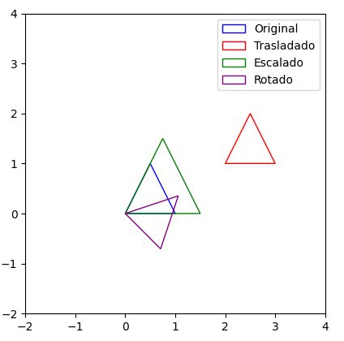

## **2.9. Arte generativo en la naturaleza**

La naturaleza está llena de patrones que se repiten y estructuras que, a simple vista, pueden parecer complejas, pero que siguen reglas matemáticas simples y elegantes.

Dos conceptos fundamentales en el **arte generativo** inspirado en la naturaleza son la **secuencia de Fibonacci** y los **fractales**. Ambos nos permiten explorar cómo patrones simples pueden generar formas complejas que son completamente fascinantes.

### **2.9.1. Fibonacci**

La secuencia de Fibonacci es una serie de números en la que cada número es la suma de los dos anteriores. Comienza así:

0, 1, 1, 2, 3, 5, 8, 13, 21, 34, …

Matemáticamente, se define como:

- F(0) = 0
- F(1) = 1
- F(n) = F(n-1) + F(n-2) para n > 1

Esta secuencia aparece en numerosos fenómenos naturales, como:

- Disposición de las hojas en los tallos de las plantas.
- Patrones en frutos como las piñas y las alcachofas.
- Espirales en las conchas de caracoles
- En los huracanes.
- Distribución de semillas en girasoles.
- Etc.

La razón entre dos números consecutivos de Fibonacci tiende al **número áureo** (*phi* ≈ 1.618), que es considerado estéticamente agradable apareciendo en numerosos elementos del arte, la arquitectura y muchísimos objetos de nuestro día a día, como las tarjetas bancarias:

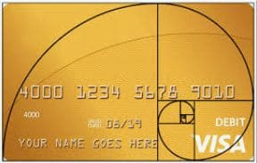

Vamos a dibujar con Python y la librería ***Turtle*** una espiral de Fibonacci:

```python
import turtle

# Configuración inicial
turtle.speed(0)
turtle.bgcolor("white")
turtle.pencolor("blue")

# Inicializamos los primeros valores de la secuencia
a, b = 0, 1

# Dibujamos 10 segmentos de la espiral
for i in range(10):
    turtle.circle(b, 90)  # Dibujamos un cuarto de círculo con radio 'b'
    a, b = b, a + b       # Actualizamos los valores de Fibonacci

turtle.done()
```

### **2.8.2. Fractales**

Un fractal es una figura geométrica que se repite a diferentes escalas, es decir, es autosemejante. Esto significa que **si hacemos zoom en una parte de la figura, encontramos una estructura similar a la original**.

Los fractales aparecen en muchos elementos naturales:

- Copos de nieve.
- Ramificaciones de árboles.
- Cauces de ríos.
- Costas.
- Montañas.
- Formación de nubes.
- Etc.

Los fractales pueden generarse mediante algoritmos recursivos, donde una función se llama a sí misma para crear patrones cada vez más pequeños.

Por ejemplo, vamos a crear un árbol fractal utilizando la biblioteca ***Turtle***. Este árbol se crea dibujando una línea que se bifurca en dos ramas más pequeñas, y cada una de estas ramas se bifurca nuevamente, y así sucesivamente.

```python
import turtle

# Configuración inicial
turtle.speed(0)
turtle.left(90)        # Orientamos la tortuga hacia arriba
turtle.up()
turtle.backward(100)
turtle.down()
turtle.color("green")

def dibujar_arbol(longitud, nivel):
    if nivel > 0:
        turtle.forward(longitud)
        turtle.left(30)
        dibujar_arbol(longitud * 0.7, nivel - 1)
        turtle.right(60)
        dibujar_arbol(longitud * 0.7, nivel - 1)
        turtle.left(30)
        turtle.backward(longitud)

# Dibujamos el árbol
dibujar_arbol(100, 5)

turtle.done()
```

Cambia el nivel de 5 a 10 y observa el efecto hipnótico que tiene.

El **Triángulo de Sierpinski** es un fractal formado por repetidas subdivisiones de triángulos:

```python
import turtle

# Configuración inicial
turtle.speed(0)
turtle.color('blue')

def dibujar_triangulo(vertices, color):
    turtle.fillcolor(color)
    turtle.up()
    turtle.goto(vertices[0][0], vertices[0][1])
    turtle.down()
    turtle.begin_fill()
    for vertex in vertices:
        turtle.goto(vertex[0], vertex[1])
    turtle.goto(vertices[0][0], vertices[0][1])
    turtle.end_fill()

def sierpinski(vertices, nivel):
    colores = ['red', 'yellow', 'green', 'blue', 'violet', 'orange', 'white']
    dibujar_triangulo(vertices, colores[nivel % len(colores)])
    if nivel > 0:
        # Puntos medios de los lados
        mid0 = [(vertices[0][0] + vertices[1][0]) / 2,
                (vertices[0][1] + vertices[1][1]) / 2]
        mid1 = [(vertices[1][0] + vertices[2][0]) / 2,
                (vertices[1][1] + vertices[2][1]) / 2]
        mid2 = [(vertices[2][0] + vertices[0][0]) / 2,
                (vertices[2][1] + vertices[0][1]) / 2]
        # Llamadas recursivas
        sierpinski([vertices[0], mid0, mid2], nivel - 1)
        sierpinski([vertices[1], mid1, mid0], nivel - 1)
        sierpinski([vertices[2], mid2, mid1], nivel - 1)

# Definimos los vértices del triángulo inicial
vertices = [[-200, -100], [0, 200], [200, -100]]

# Dibujamos el triángulo de Sierpinski
sierpinski(vertices, 4)

turtle.done()
```

Pero sin duda el fractal más bonito es el **Conjunto de Mandelbrot**. Se genera a partir de números complejos y representa una figura con una frontera infinitamente detallada.

Vamos a combinar las librerías de Python ***matplotlib*** y ***numpy*** para generar una de estas espectaculares imágenes:

```python
import numpy as np
import matplotlib.pyplot as plt

# Definimos los límites y la resolución
resolucion = 500
x_min, x_max = -2.0, 1.0
y_min, y_max = -1.5, 1.5

# Creamos una matriz para almacenar los valores
mandelbrot = np.zeros((resolucion, resolucion))

# Iteramos sobre cada píxel
for i, x in enumerate(np.linspace(x_min, x_max, resolucion)):
    for j, y in enumerate(np.linspace(y_min, y_max, resolucion)):
        c = complex(x, y)
        z = 0
        iteraciones = 0
        max_iteraciones = 50
        while abs(z) <= 2 and iteraciones < max_iteraciones:
            z = z * z + c
            iteraciones += 1
        mandelbrot[j, i] = iteraciones

# Mostramos el fractal
plt.imshow(mandelbrot, extent=(x_min, x_max, y_min, y_max), cmap='inferno')
plt.xlabel('Parte Real')
plt.ylabel('Parte Imaginaria')
plt.title('Conjunto de Mandelbrot')
plt.show()
```

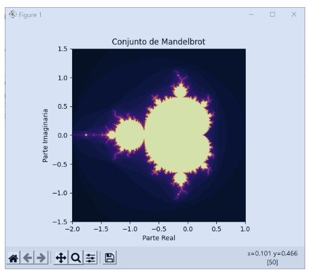
