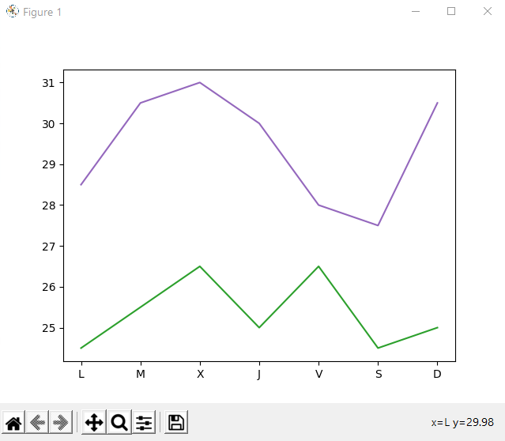

# Introduccion a Python

## 1. Tipos de datos en Python

### 1.1 Tipos de datos básicos
Los tipos básicos de datos, también llamados primitivos, se pueden agrupar en 3: Los tipos de datos numéricos, los lógicos y los de texto (o alfanuméricos).

Dentro del grupo de los tipos de datos numéricos, a su vez, destacan dos tipos: los enteros y los reales.


1. **Números enteros (int)**
   - Son números sin decimales, positivos o negativos.
   - Ejemplo: `10`, `-3`, `0`.
   - Útil para contar cosas o representar cantidades.

   ```python
   edad = 17
   numero_de_estudiantes = 30
   ```

2. **Números de punto flotante (float)**
   - Son números con decimales.
   - Ejemplo: `3.14`, `-0.5`, `2.0`.
   - Se usan cuando se necesitan cálculos más precisos, como notas o medidas.

   ```python
   precio = 19.99
   temperatura = -2.5
   ```

3. **Cadenas de texto (str)**
   - Representan secuencias de caracteres o texto.
   - Se escriben entre comillas simples o dobles.
   - Ejemplo: `"Hola"`, `'Python es divertido'`.
   - Útil para almacenar nombres, palabras, frases, etc.

   ```python
   nombre = "Ana"
   saludo = 'Hola, ¿cómo estás?'
   ```

4. **Booleanos (bool)**
   - Solo tienen dos valores posibles: `True` (verdadero) o `False` (falso).
   - Se utilizan en condiciones y comparaciones.
   - Ejemplo: `True`, `False`.

   ```python
   es_mayor_de_edad = True
   tiene_permiso = False
   ```

### 1.2. Tipos de datos compuestos

Los tipos de datos compuestos en Python son aquellos que permiten agrupar múltiples tipos de datos en una única variable. Pueden contener tanto tipos de datos primitivos como otros tipos de datos compuestos. Estos tipos de datos ofrecen la flexibilidad de estructurar y organizar información de manera más compleja, permitiendo la creación de estructuras más avanzadas.

1. **Listas (list)**
   - Son colecciones ordenadas de elementos que pueden ser de cualquier tipo.
   - Se escriben entre corchetes `[]` y los elementos se separan por comas.
   - Las listas son mutables, lo que significa que se pueden modificar.

   ```python
   numeros = [1, 2, 3, 4, 5]
   nombres = ["Ana", "Luis", "Carlos"]
   ```

2. **Tuplas (tuple)**
   - Son similares a las listas, pero son inmutables (no se pueden cambiar después de crearlas).
   - Se escriben entre paréntesis `()` y los elementos se separan por comas.

   ```python
   coordenadas = (10, 20)
   colores = ("rojo", "azul", "verde")
   ```

3. **Diccionarios (dict)**
   - Son colecciones de pares clave-valor, donde cada valor está asociado con una clave única.
   - Se escriben entre llaves `{}` y los pares se separan por comas.
   - Útiles para representar datos estructurados como las propiedades de un objeto.

   ```python
   estudiante = {"nombre": "Ana", "edad": 17, "grado": "12°"}
   ```

4. **Conjuntos (set)**
   - Son colecciones desordenadas de elementos únicos (no se permiten duplicados).
   - Se escriben usando llaves `{}` pero no se pueden tener pares clave-valor como en los diccionarios.

   ```python
   numeros_unicos = {1, 2, 3, 3, 4}  # El número 3 solo se guardará una vez
   ```

## Resumen práctico para los estudiantes

- **`int`**: Números enteros.
- **`float`**: Números decimales.
- **`str`**: Texto.
- **`bool`**: Verdadero o falso.
- **`list`**: Lista de elementos (se puede cambiar).
- **`tuple`**: Lista de elementos (no se puede cambiar).
- **`dict`**: Pares clave-valor.
- **`set`**: Conjunto de elementos únicos.


## 3. Variables y Constantes en Python


### 3.1. Variables en Python
- Una **variable** es un espacio en la memoria del ordenador donde se almacena un valor.
- El valor de una variable puede cambiar durante la ejecución del programa.
- Para crear una variable en Python, solo necesitas darle un nombre y asignarle un valor usando el símbolo `=`.
- Ejemplo:
  ```python
  edad = 17
  nombre = "Ana"
  ```
  En este ejemplo, `edad` y `nombre` son variables que almacenan los valores `17` y `"Ana"`, respectivamente.

### Reglas para nombrar variables
- El nombre de una variable debe empezar con una letra o un guion bajo (`_`), pero no con un número.
- No puede contener espacios ni caracteres especiales como `@`, `#`, `%`.
- Es sensible a mayúsculas y minúsculas, es decir, `nombre` y `Nombre` serían dos variables diferentes.

### 3.2. Constantes en Python
- Una **constante** es un valor que no cambia durante la ejecución del programa.
- En Python, no existe una manera estricta de declarar constantes, pero por convención se utilizan nombres en **mayúsculas** para identificarlas.
- Ejemplo:
  ```python
  PI = 3.1416
  VELOCIDAD_DE_LUZ = 299792458  # en metros por segundo
  ```
  En este ejemplo, `PI` y `VELOCIDAD_DE_LUZ` son constantes, y aunque el lenguaje permite cambiarlas, por convención no se deben modificar.

### Diferencias entre variables y constantes
- **Variables**: su valor puede cambiar.
- **Constantes**: su valor se mantiene igual durante todo el programa (aunque Python permite cambiarlas, es una mala práctica hacerlo).

## 4. Operadores y expresiones

Los operadores son fundamentales en programación, ya que permiten realizar cálculos, comparaciones y operaciones lógicas sobre los datos. Veamos algunos de los más importantes.

Comenzaremos con los **operadores aritméticos** clásicos, los que se utilizan para realizar operaciones matemáticas básicas:

*   **Suma (+)**: suma dos operandos.
```python
a = 10
b = 5
resultado = a + b
```
*   **Resta (-)**: resta el segundo operando del primero.
```python
resultado = a - b
```
*   **Multiplicación (\*)**: multiplica dos operandos.
```python
resultado = a * b
```
*   **División (/)**: divide el primer operando por el segundo. El resultado es un número de punto flotante.
```python
resultado = a / b
```
*   **División entera (//)**: divide el primer operando por el segundo y devuelve la parte entera del resultado.
```python
resultado = a // b
```
*   **Módulo (%)**: devuelve el resto de la división del primer operando por el segundo.
```python
resultado = a % b
```
*   **Exponenciación (\*\*)**: eleva el primer operando a la potencia del segundo.
```python
resultado = a ** b
```
Sigamos con los **operadores de comparación**. Estos se utilizan para comparar dos valores y devuelven un valor booleano (**True** o **False**).

Su uso es similar a realizar una pregunta que se contesta con si o no.

Por ejemplo, ¿tienes más de 18 años? No. En Python se haría algo así: **_(edad > 18)_** y el programa devolvería **_False_**.

Veamos los operadores que podemos encontrar en esta categoría:

*   **Igual a (==)**: verifica si los operandos son iguales.
```python
a=7
b=12
resultado = (a == b)
```
*   **Distinto de (!=)**: verifica si los operandos son diferentes.
```python
resultado = (a != b)
```
*   **Mayor que (>) y mayor o igual que (>=)**: verifica si el primer operando es mayor que el segundo.
```python
resultado = (a > b)
```
*   **Menor que (<) y Menor o igual que (<=)**: verifica si el primer operando es menor que el segundo.
```python
resultado = (a < b )
```
El tercer y último tipo de operadores que vamos a ver son los **operadores lógicos**. Estos nos permiten trabajar con valores de tipo booleano, y su resultado también lo será.

*   **and**: el operador **_and_** evalúa si el valor a la izquierda y el de la derecha son **_True_**, y en el caso de ser cierto, devuelve **_True_**. Si uno de los dos valores es **_False_**, el resultado será **_False_**. Es realmente un operador muy intuitivo que usamos en la vida real. Por ejemplo, si el semáforo está en verde y no vienen coches, cruzamos. Si ambas condiciones se cumplen, es decir que la variable **_semaforoVerde=True_** y la variable **_noVienenCoches=True_**, cruzaré, o visto de otra forma **_cruzar=(semaforoVerde and noVienenCoches)_**.

*   **or**: el operador **_or_** devuelve **_True_** cuando al menos uno de los elementos es igual a **_True_**. Es decir, evalúa si el valor a la izquierda o el de la derecha son **_True_**.

*   **not**: simplemente invierte **_True_** por **_False_** y **_False_** por **_True_**.

Es importante notar que el orden de aplicación de los operadores puede influir en el resultado, por lo que es importante tener muy claro su prioridad de aplicación. De mayor a menor prioridad, el primero sería **_not_**, seguido de _**and**_ y **_or_**.

Intenta averiguar el resultado de estos ejemplos sin ejecutar el programa:
```python
print(False and False or True)
print(True or False and False)
print(0 and not 1 or 1 and not 0 or 1 and 0)
```
Todas las instrucciones que hemos visto hasta ahora son expresiones bastante simples. Sin embargo, las expresiones se pueden volver más difíciles de entender cuando se combinan múltiples operadores para realizar cálculos más complejos.

Es importante entender el **orden de precedencia de los operadores** para evaluar correctamente estas expresiones. Python sigue reglas de precedencia similares a las matemáticas tradicionales, donde las operaciones dentro de paréntesis se evalúan primero, seguidas por exponenciación, multiplicación/división/módulo, y finalmente suma/resta.

*   **Paréntesis ()**: Evalúan las expresiones dentro de los paréntesis primero.
*   **Exponenciación \*\***.
*   **Signos + y –**: Signos unarios antes de una variable (por ejemplo, -a).
*   **Multiplicación *, división /, división entera //, y módulo %**.
*   **Suma + y resta –**.
*   **Operadores de comparación**: ==, !=, >, <, >=, <=.
*   **Operadores lógicos** not, and, or.

Veamos un ejemplo de expresiones compuestas:
```python
a = 5
b = 3
c = 2
d = 4

resultado = (a + b) * c / d 
resultado = a + b * c ** d - (a / b)
```
Además, también podemos realizar operaciones con las cadenas de texto. Python permite **concatenar** (unir) cadenas usando el operador **_+_**, y repetir cadenas usando el operador **_\*_**. Por ejemplo:
```python
nombre = "Juan"
saludo = "Hola, " + nombre + "!"

repetir = "Hola" * 3  
```
## 5. Comentarios

Los comentarios dentro del código son fundamentales para su comprensión y mantenimiento. Una cosa importante que es necesario entender es que, a pesar de que están en el código, no intervienen en el funcionamiento del mismo, ya que son líneas que no se ejecutan. Sólo están ahí para que los programadores se dejen mensajes sobre el funcionamiento del programa.

Python utiliza el símbolo **_#_** para los comentarios de una sola línea y las triple comillas (**_”’_** o **_“””_**) para los comentarios de más de una línea.
```python
# Este es un comentario de una sola línea

"""
Este es un comentario multilínea.
Puede ser utilizado para proporcionar descripciones detalladas
de funciones, clases o módulos.
También se suele usar para explicar porqué el programador
ha tomado una decisión de diseño concreta y no otra.
"""
```
## 6. Interacción con el usuario


Cuando programamos, la interacción con el usuario es muy importante porque nos permite mostrarle datos al usuario (_output_), y también leer datos que el usuario introduce por el teclado (_input_). Python facilita enormemente este proceso, haciendo de las tareas de entrada/salida un trabajo realmente simple.

### 6.1. Mostrar datos en pantalla

Python utiliza la función **_print()_** para mostrar datos en la pantalla. Esta función es muy flexible y permite mostrar texto, variables y resultados de expresiones de manera fácil.
```python
print(valor1, valor2, ..., sep=' ', end='n')
```
Donde:

*   **_valor1_**, **_valor2_**, …: los valores que se desean mostrar. Pueden ser cadenas de texto, números, variables, etc.
*   **sep**: especifica el separador entre los valores (por defecto es un espacio).
*   **end**: especifica lo que se muestra al final de la salida (por defecto es un salto de línea).

Veamos un ejemplo práctico de su uso:
```python
# Mostrar una cadena de texto
print("Hola, mundo")

# Mostrar múltiples valores
nombre = "Juan"
edad = 25
print("Nombre:", nombre, "Edad:", edad)

# Cambiar el separador y el final de línea
print("Python", "es", "genial", sep='-', end='!n')
```
A veces, podemos necesitar usar la sintaxis **F-strings**, que nos facilita la escritura de salidas en pantalla:
```python
nombre = "Ana"
edad = 30
print(f"Nombre: {nombre}, Edad: {edad}")
```
### 6.2. Obtener datos de teclado

La función **_input()_** se utiliza para leer datos introducidos por el usuario desde el teclado. Esta función siempre devuelve una cadena de texto, por lo que es necesario convertir los datos al tipo adecuado si se espera un valor numérico.
```python
# Leer una cadena de texto
nombre = input("Introduce tu nombre: ")
print("Hola", nombre)

# Leer un número entero
edad = int(input("Introduce tu edad: "))
print("Tienes ", edad, " años")

# Leer un número de punto flotante
altura = float(input("Introduce tu altura en metros: "))
print("Mides", altura, " metros")
```
[Ejercicios resueltos sobre variables, operadores e interacción con el usuario »](ejercicios_intro.md)

## 7. Estructuras de control


Las estructuras de control nos permiten dirigir el flujo de ejecución del programa según ciertas condiciones, es decir, habrá unas instrucciones que se ejecutarán y otras que no. ¿Cómo se decide qué instrucciones se ejecutarán y cuáles no? Dependerá de las condiciones que escribamos en el código. Incluyen las estructuras condicionales, repetitivas y de salto.

###  7.1. Estructuras condicionales

Las estructuras condicionales **permiten ejecutar bloques de código solo si se cumplen ciertas condiciones**. Python utiliza las palabras clave **_if_**, **_elif_** (abreviatura de «else if») y **_else_** para definir estas condiciones.
```python
edad = 20

if edad < 18:
    print("Eres menor de edad")
elif edad >= 18 and edad < 65:
  	print("Eres un adulto")
else:
    print("¡Jubilado! Enhorabuena")
```
En la primera línea hemos creado una variable llamada **_edad_** y hemos almacenado el valor 20. El resto del código es una estructura condicional que tiene dos condiciones. Primero (en la línea 3) decimos “¿es la edad menor que 18?”. Si lo es, se ejecutará el bloque de instrucciones que tiene en su interior (línea 4) y no se ejecutarán el resto de instrucciones (5, 6, 7 y 8). Pero si no lo es, el programa no ejecutará la línea 4, sino que saltará a la 5 y comprobará la segunda condición. “¿Es edad mayor o igual que 18 y menor que 65?”. Si lo es, el programa ejecutará el bloque de instrucciones que contiene (línea 6) y no se ejecutarán el resto de instrucciones (líneas 7 y 8). Pero ni tampoco lo es, el programa saltará a la línea 7 y ejecutará el bloque de instrucciones contenidos en el **_else_** (la línea 8).

Como puedes ver, para indicar que un **bloque de código** está dentro de algún otro elemento, lo que hacemos es tabularlo, es decir, escribimos la instrucción después de pulsar la **tecla tabulador**:


### 7.2. Estructuras repetitivas

Las estructuras repetitivas nos permiten **repetir un bloque de código las veces que necesitemos**. Popularmente se les conoce como **bucles**, y en Python tenemos dos: los bucles **_for_** y los bucles **_while_**.

El bucle **_for_** se utiliza para repetir un bloque de código **cuando sabemos exactamente cuantas veces queremos repetirlo**.
```python
for numero in range(5):
  print(numero)  # Muestra 0 1 2 3 4

for numero in range(5,7):
  print(numero) # Muestra 5 6
    
for numero in range(5,11,2):
  print(numero) # Muestra 5 7 9
    
for numero in range(9,2,-2):
  print(numero) # Muestra 9 7 5 3
```
Como puedes ver por el fragmento de código anterior, **_range_** usa 1, 2 o 3 parámetros. Cuando usa uno, el bloque se repetirá el número de veces que se indique -1 (sin incluir al número). Cuando se usan dos parámetros, el primero indica el punto inicial y el segundo el punto final (sin incluir este último). Cuando se usan tres parámetros, los dos primeros funcionan igual y el tercero indica el salto de avance desde el primero al siguiente hasta llegar al último.

EL bucle **_while_**, a diferencia del **_for_**, **se repite siempre que una condición especificada sea verdadera**.
```python
contador = 0

while contador < 5:
    print(contador)
    contador = contador + 1
```
### 7.3. Estructuras de salto

Permiten alterar el flujo normal de ejecución de las estructuras de control.

**_break_**, se utiliza para terminar el bucle actual de manera anticipada.
```python
for numero in range(10):
    if numero == 5:
        break
    print(numero) # Muestra 0 1 2 3 4
```
**_continue_**, se usa para omitir el resto del bloque de código en la iteración actual y pasar a la siguiente iteración del bucle.
```python
for numero in range(10):
    if numero == 5:
        continue
    print(numero) # Muestra 0 1 2 3 4 6 7 8 9
```
[Ejercicios resueltos sobre estructuras de control »](ejercicios_control.md)

## 8. Estructuras de datos

Las **estructuras de datos** son una parte fundamental de la programación, ya que permiten organizar y gestionar de manera eficiente los datos en la memoria. En Python, existen varias estructuras de datos integradas que son ampliamente utilizadas debido a su flexibilidad. Aunque las principales estructuras de datos que se suelen manejar incluyen listas, tuplas, conjuntos, diccionarios y clases, nosotros por tratarse de un estudio introductorio a la programación, sólo aprenderemos lo básico de listas y diccionarios.

### 8.1. Listas

Las **listas** son **colecciones ordenadas y mutables de elementos**. Esto significa que se pueden modificar (agregar, eliminar o cambiar elementos) después de haber sido creadas.


Cada elemento de la lista ocupa una posición, llamada **índice**, a la que podemos acceder contando desde el **_0_** hasta el **número máximo de elementos – 1**. En este caso, tenemos tres elementos, por lo que sus índices serán **_0_**, **_1_** y **_2_**.

Las listas en Python se definen utilizando corchetes **_\[ \]_** y los elementos se separan por **comas**.
```python
# Crear una lista
frutas = ["manzana", "platano", "cereza"\]

# Acceder a elementos de la lista
print(frutas[0])  # Salida: manzana
print(frutas[1])  # Salida: banana

# Modificar un elemento de la lista
frutas[1] = "kiwi"
print(frutas)  # Salida: ['manzana', 'kiwi', 'cereza']
```
También disponemos de muchas funciones integradas en el lenguaje, que nos permiten realizar operaciones comunes con las listas.
```python
# Agregar elementos
frutas.append("naranja") # Añade un elemento al final de la lista
print(frutas)  # Salida: ['manzana', 'kiwi', 'cereza', 'naranja']

# Eliminar elementos
frutas.remove("kiwi") # Elimina el elemento que le indiquemos
print(frutas)  # Salida: ['manzana', 'cereza', 'naranja']

# Insertar elementos en una posición específica
frutas.insert(1, "pera")
print(frutas)  # Salida: ['manzana', 'pera', 'cereza', 'naranja']

# Obtener la longitud de la lista
longitud = len(frutas)
print(longitud)  # Salida: 4
```
Por último, necesitamos saber cómo podemos recorrer una lista para poder realizar comprobaciones u operaciones sobre cada uno de los elementos que contiene.
```python
# Definir una lista
frutas = ["manzana", "pera", "cereza"]

# Recorrer la lista con un bucle for
for fruta in frutas:
    print(fruta)
```
En este ejemplo, el bucle **_for_** itera sobre cada elemento de la lista **_frutas_**, asignando cada elemento a la variable **_fruta_** en cada iteración, y luego imprime el valor de **_fruta_**.

Esto mismo también puede hacerse recorriendo la lista por medio de un índice que indica la posición que ocupa cada elemento en la lista:
```python
# Definir una lista
frutas = ["manzana", "pera", "cereza"]

# Recorrer la lista con un bucle for
for indice in range(0,len(frutas)):
    print(frutas[indice])
```
¿Cuándo debes usar un método u otro? Te lo dirá las necesidades que tengas en cada momento para resolver un problema concreto.

[Ejercicios resueltos sobre listas »](ejercicios_listas.md)

### 8.2. Diccionarios

Los **diccionarios** son **colecciones desordenadas de pares clave-valor**. Cada clave debe ser única, y se utiliza para acceder al valor asociado.

Puedes imaginarlos como una lista en la que los índices no son numéricos, sino que los definimos nosotros al crear el diccionario:


Los diccionarios se definen utilizando llaves **{}** y pares clave-valor separados por dos puntos **:**.

Por ejemplo vamos a crear un diccionario **_persona_** que almacene los datos personales:
```python
# Crear un diccionario
persona = {
    "nombre": "Juan",
    "edad": 30,
    "ciudad": "Madrid"
}
```
#### Acceder a valores por clave
```python
print(persona["nombre"])  # Salida: Juan
print(persona["edad"])  # Salida: 30
```
#### Modificar un valor
```python
persona["edad"] = 31
print(persona)  # Salida: {'nombre': 'Juan', 'edad': 31, 'ciudad': 'Madrid'}

# Agregar un nuevo par clave-valor
persona["profesion"] = "Ingeniero"
print(persona)  # Salida: {'nombre': 'Juan', 'edad': 31, 'ciudad': 'Madrid', 'profesion': 'Ingeniero'}

# Eliminar un par clave-valor
del persona["ciudad"]
print(persona)  # Salida: {'nombre': 'Juan', 'edad': 31, 'profesion': 'Ingeniero'}
```
De la misma manera que hicimos para las listas, también podemos recorrer los diccionarios. Recorrer un diccionario implica iterar sobre sus pares clave-valor. En Python, esto se puede hacer utilizando el método **_items()_**, que devuelve una vista de pares clave-valor del diccionario.
```python
# Definir un diccionario
persona = {
    "nombre": "Juan",
    "edad": 30,
    "ciudad": "Madrid"
}
```
#### Recorrer el diccionario con un bucle for
```python
for clave, valor in persona.items():
    print(f"{clave}: {valor}")
```
En este ejemplo, el método **_items()_** se utiliza para obtener una vista de pares clave-valor del diccionario **_persona_**. El bucle **_for_** itera sobre cada par, asignando la clave a **_clave_** y el valor a **_valor_**, y luego imprime ambos.

Pero puede que necesitemos recorrer sólo claves o sólo valores. Para esos casos también disponemos de métodos que agilizan estos procesos:
```python
# Recorrer solo las claves del diccionario
for clave in persona.keys():
    print(clave)

# Recorrer solo los valores del diccionario
for valor in persona.values():
    print(valor)
```
En el primer ejemplo, el método **_keys()_** se utiliza para obtener una vista de las claves del diccionario **_persona_**. En el segundo ejemplo, el método **_values()_** se utiliza para obtener una vista de los valores del diccionario **_persona_**.

[Ejercicios resueltos sobre diccionarios »](ejercicios_diccionarios.md)

## 9. Funciones y módulos


Desde el punto de vista de la escritura de código, las **funciones** son bloques de código que realizan una tarea específica y se pueden invocar -ser llamadas- desde otras partes del programa. En Python se definen utilizando la palabra clave **_def_** seguida del nombre de la función y paréntesis que pueden incluir parámetros.
```python
# Esquema conceptual de la definición de una función
def nombre_de_la_funcion(parametro1, parametro2):
    # Bloque de código
    return valor_de_retorno
```
Por ejemplo, esta función saluda al usuario que hayamos indicado en el parámetro **_nombre_**:
```python
def saludar(nombre):
    print(f"Hola, {nombre}")

saludar("Ana")  # Output: Hola, Ana
```
Como hemos indicado más arriba, las funciones pueden aceptar **parámetros**, que son variables que se pasan a la función para que pueda utilizarlas en su bloque de código. Además, las funciones pueden devolver un valor utilizando la palabra clave **_return_**.
```python
def sumar(a, b):
    return a + b

resultado = sumar(5, 3)
print(resultado)  # Salida: 8
```
Veamos cuál sería el flujo de ejecución del programa anterior:

*   El ordenador lee las líneas 1 y 2, pero **no las ejecuta** (ya que la definición de una función sólo se ejecuta cuando la función es llamada).
*   Se ejecuta la línea 4, de derecha a izquierda, por tanto, lo primero que se hace es llamar a **_sumar(5,3)_**.
*   Se busca la definición de la función **_sumar_**, se encuentra en la línea 1, y se sustituyen los parámetros por los valores, es decir, **_a=5_** y **_b=3_**.
*   Con los parámetros establecidos se entra a ejecutar el bloque interior de la función: **_return 5+3_**.
*   La función devuelve **_8_** y el programa vuelve al punto en el que se llamó a la función, línea 4, y como consecuencia de ello se hace **_resultado=8_**.
*   Se ejecuta la línea 5, mostrándose **_8_** en pantalla.


Además de lo anterior, cuando se trabajan con funciones es muy importante entender el **alcance de las variables**.

El alcance de una variable (**«_scope_»**) determina dónde puede ser utilizada dentro del código.

Las **variables definidas dentro de una función** tienen un alcance **LOCAL**, es decir, solo pueden ser utilizadas dentro de esa función. Las **variables definidas fuera de cualquier función** tienen un alcance **GLOBAL** y pueden ser utilizadas en cualquier parte del programa.

Por ejemplo, en el siguiente programa, la variable **_mensaje_** se ha creado en el interior de la función (línea 2), por tanto, cuando la usamos en la línea 6 (fuera de la función), nos va a generar un error.
```python
def mostrar_mensaje():
    mensaje = "Hola desde la función"
    print(mensaje)

mostrar_mensaje()
print(mensaje)  # Esto generará un error porque 'mensaje' es una variable local
```
Cuando nuestros programas empiezan a crecer, acumulando cientos o miles de líneas de código, por mucho que tengamos nuestro código organizado en funciones, seguirá siendo algo muy difícil de mantener. Por eso, podemos ir un paso más allá en la organización del código, usando **módulos**.

Los módulos son archivos que contienen definiciones de funciones, de esta manera, podemos aliviar la cantidad de código que tenemos en nuestro programa principal, y cuando necesitemos usar una función, simplemente importamos el archivo que contiene su definición.

Por ejemplo, vamos a crear un archivo llamado **_matematicas.py_** donde incluiremos la definición de algunas funciones:
```python
def sumar(a, b):
    return a + b

def restar(a, b):
    return a - b
```
Si luego, en nuestro programa principal necesitamos usar las funciones **_sumar_** o **_restar_**, o cualquier otra incluida en ese módulo, lo importamos y lo usamos.
```python
import matematicas

resultado_suma = matematicas.sumar(10, 5)
resultado_resta = matematicas.restar(10, 5)

print(f"Suma: {resultado_suma}")
print(f"Resta: {resultado_resta}")
```
Además, esa instrucción **_import_** no sólo nos permite importar un módulo que hayamos creado nosotros, sino cualquier módulo sea quien sea el propietario. Y aquí es donde radica una de los mayores atractivos de Python: dispone de un enorme catálogo de módulos extremadamente potentes que podemos usar para programar cualquier cosa.

Por ejemplo, usando el módulo **fpdf** podemos crear un PDF con muy pocas líneas de código:

Para poder usar este módulo, debes instalarlo previamente ejecutando en la consola:  
**_pip install fpdf_**
```python
from fpdf import FPDF

pdf = FPDF(orientation='P', unit='mm', format='A4')
pdf.add_page()
pdf.set_font('Arial','',16)
pdf.text(x=60,y=50,txt='Mi primer PDF')
pdf.output('unpdf.pdf','F')
```
Si ahora vamos al directorio donde se encuentra nuestro archivo de código, veremos cómo se ha creado un archivo nuevo llamado **unpdf.pdf** con este contenido:


Así de sencillo es crear un PDF usando un programa escrito por nosotros mismos. Esto tiene innumerables utilidades para automatizar procesos, como por ejemplo: generar diplomas, boletines de notas, informes, imprimir estadísticas, etc…

Otro ejemplo muy interesante podría ser el de visualizar gráficamente datos que tengamos recogidos por sensores. Un módulo muy popular que nos permite hacer esto es **matplotlib**. Vamos a usarlo para graficar las temperaturas de la última semana en Madrid y Barcelona:
```python
import matplotlib.pyplot as plt

fig, ax = plt.subplots()
dias = ['L', 'M', 'X', 'J', 'V', 'S', 'D']
temperaturas = {'Madrid':[28.5, 30.5, 31, 30, 28, 27.5, 30.5], 'Barcelona':[24.5, 25.5, 26.5, 25, 26.5, 24.5, 25]}
ax.plot(dias, temperaturas['Madrid'], color = 'tab:purple')
ax.plot(dias, temperaturas['Barcelona'], color = 'tab:green')
plt.show()
```
El resultado tras ejecutar el programa anterior, sería:



Como ves, podemos hacer cualquier cosa que se nos ocurra si dominamos la sintaxis de Python para importar módulos y conocemos las instrucciones que nos permiten programar los módulos que importamos (esto último debes consultarlo en la web de cada módulo). Puedes revisar **[este sencillo manual de matplotlib](https://aprendeconalf.es/docencia/python/manual/matplotlib/)** para que compruebes de primera mano lo sencillo que es.

[Ejercicios resueltos sobre funciones y módulos »](ejercicios_funciones.md)

Llegados a este punto, ya conoces un número importante de conceptos y herramientas de programación con las que construir programas interesantes. A partir del próximo tema, los usaremos para programar utilidades creativas.