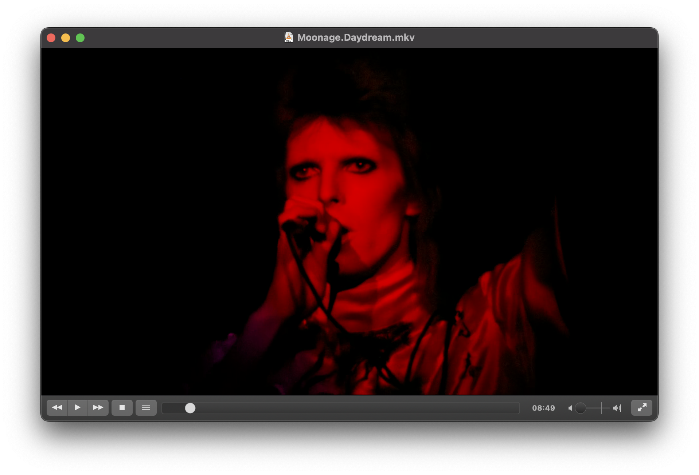
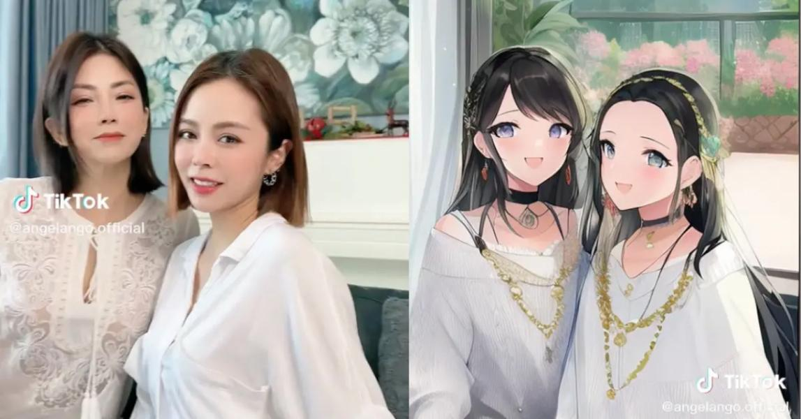
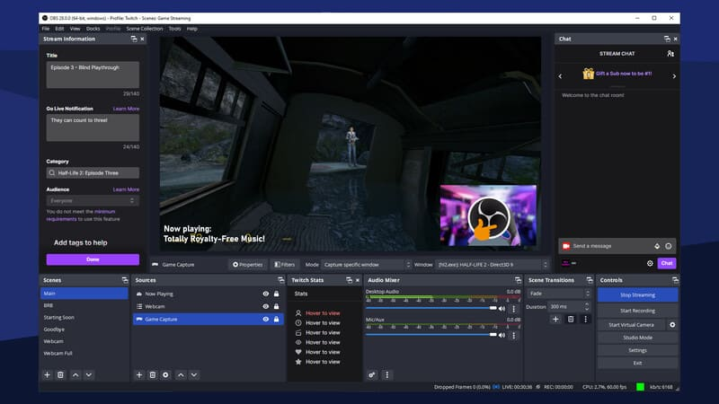
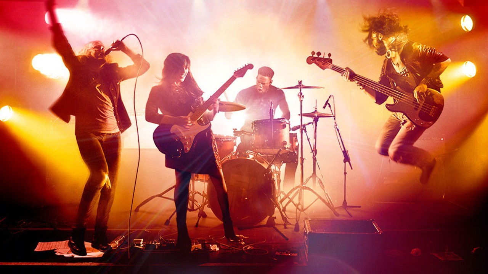
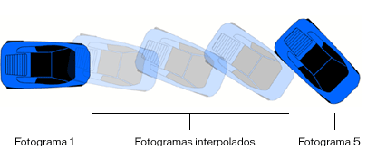
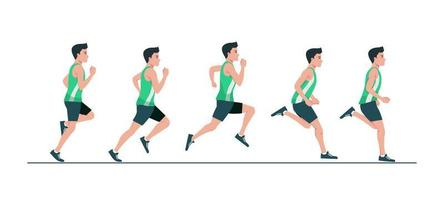
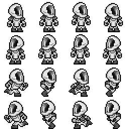
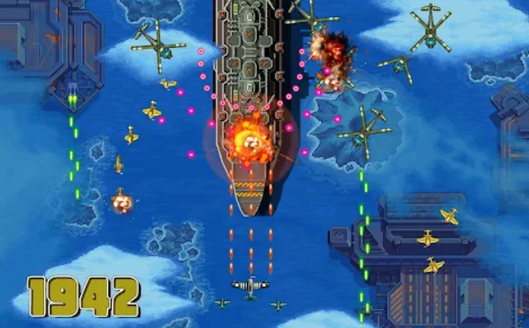

Tabla de contenidos
-------------------

- [1. Programación de vídeo, audio y animaciones](#1-programación-de-vídeo-audio-y-animaciones)
    - [1.1. Programación de vídeo](#11-programación-de-vídeo)
    - [1.2. Programación de audio](#12-programación-de-audio)
      - [1.2.1. Reproducción de audio](#121-reproducción-de-audio)
      - [1.2.2. Grabación de audio](#122-grabación-de-audio)
      - [1.2.3. Procesamiento de audio](#123-procesamiento-de-audio)
      - [1.2.4. Generación de sonido](#124-generación-de-sonido)
    - [1.3. Programación de animaciones](#13-programación-de-animaciones)
      - [1.3.1. Animaciones con PyGame](#131-animaciones-con-pygame)
      - [1.3.2. Animaciones con Matplotlib](#132-animaciones-con-matplotlib)
      - [1.3.3. Animaciones con Tkinter](#133-animaciones-con-tkinter)
      - [1.3.4. Control del tiempo](#134-control-del-tiempo)
      - [1.3.5. Animaciones basadas en fotogramas](#135-animaciones-basadas-en-fotogramas)
      - [1.3.6. Aplicando física básica](#136-aplicando-física-básica)
- [2. Tratamiento de vídeo como vector de fotogramas](#2-tratamiento-de-vídeo-como-vector-de-fotogramas)
    - [2.1. Leer vídeos fotograma a fotograma](#21-leer-vídeos-fotograma-a-fotograma)
    - [2.2. Procesamiento de fotogramas](#22-procesamiento-de-fotogramas)
    - [2.3. Escritura de vídeos](#23-escritura-de-vídeos)
    - [2.4. Aplicaciones prácticas](#24-aplicaciones-prácticas)
      - [2.4.1. Detección de movimiento](#241-detección-de-movimiento)
      - [2.4.2. Trabajar con cámaras en tiempo real](#242-trabajar-con-cámaras-en-tiempo-real)
      - [2.4.3. Seguimiento de objetos](#243-seguimiento-de-objetos)
- [3. Diseño de mini-juegos e instalaciones artísticas generativas e interactivas](#3-diseño-de-mini-juegos-e-instalaciones-artísticas-generativas-e-interactivas)
    - [3.1. Mini-juegos con Pygame](#31-mini-juegos-con-pygame)
    - [3.2. Instalaciones Artísticas Generativas con p5py (Processing en Python)](#32-instalaciones-artísticas-generativas-con-p5py-processing-en-python)
    - [3.3. Instalaciones Interactivas](#33-instalaciones-interactivas)
- [4. Recursos adicionales](#4-recursos-adicionales)

En el tema anterior comenzamos a caminar la senda de la programación multimedia centrándonos en el **[mundo de las imágenes](prog_grafica.md)**. En este tema, iremos un paso más allá para que descubras **cómo manipular vídeo y audio**, crear animaciones dinámicas, procesar fotogramas y diseñar experiencias interactivas que cautiven a tu audiencia.

Este recorrido te va a proporcionar habilidades técnicas sólidas, que te inspirarán a explorar nuevas formas de expresión y a combinar tus intereses en programación.

Mezclar con éxito programación y arte es posible. Si no lo crees, sigue leyendo.


# 1. Programación de vídeo, audio y animaciones


La programación de vídeo, audio y animaciones es una extensión natural del mundo de la programación gráfica. Mientras que en los gráficos estáticos trabajamos con imágenes que no cambian, al incorporar vídeo, audio y animaciones añadimos una nueva dimensión: **el tiempo**. Esto nos permite crear aplicaciones más dinámicas e interactivas, como videojuegos, reproductores multimedia, simulaciones y experiencias inmersivas.

### 1.1. Programación de vídeo

La **programación de vídeo** implica la manipulación y reproducción de secuencias de imágenes en movimiento. Esto abarca desde la simple reproducción de un vídeo hasta el procesamiento en tiempo real de secuencias capturadas por una cámara.

Repasando lo que ya conocemos, debemos añadir otros conceptos clave para entender la programación de vídeo:

*   **Reproducción de vídeos**: crear aplicaciones que puedan reproducir archivos de vídeo en diferentes formatos (MP4, AVI, etc.). Por ejemplo, podrías crear tu propio reproductor de vídeo al estilo VLC Media Player o Windows Media Player.



*   **Procesamiento de vídeo en tiempo real**: aplicar filtros, detectar objetos o reconocer rostros mientras el vídeo se reproduce. Por ejemplo, podrías crear tus propios filtros de Snapchat, Instagram o TikTok para aplicarlos a un vídeo que un usuario está grabando en tiempo real.



*   **Captura de vídeo**: utilizar la cámara de un dispositivo para grabar y procesar vídeo en vivo. Por ejemplo, podrías crear un programa que ayude a capturar el vídeo como Camtasia Studio, OBS Studio o CapCut.



Para realizar todo lo anterior el ecosistema de aplicaciones y librerías de Python aporta, entre otras:

*   **[OpenCV](https://docs.opencv.org/4.x/d6/d00/tutorial_py_root.html)**: una biblioteca potente para el procesamiento de imágenes y vídeo que permite realizar operaciones avanzadas de visión por computador.
*   **[Pygame](https://www.pygame.org/wiki/GettingStarted)**: aunque se usa principalmente para juegos, también permite reproducir y manipular vídeos básicos.
*   **[MoviePy](https://zulko.github.io/moviepy/)**: una biblioteca para editar vídeos, cortar clips, añadir efectos y generar nuevos vídeos.

Para ilustrar las capacidades de Python en la programación de vídeo, vamos a utilizar la biblioteca **_MoviePy_**.

La idea es crear un pequeño programa que:

*   Crea un vídeo a partir de una imagen de fondo, esta en concreto.



*   Añade texto animado sobre la imagen (aparece desde abajo, se sitúa en el centro y desaparece por abajo).
*   Incluye una transición de entrada y salida (_fade in_, _fade out_).
*   Genera un archivo de vídeo reproducible.

Para hacer esto, como nuestro sistema operativo es Windows, necesitaremos instalar una funcionalidad que no viene por defecto y que ayuda al sistema operativo a trabajar con texto dentro de los vídeos. Debes instalar **_[ImageMagick](https://imagemagick.org/archive/binaries/ImageMagick-7.1.1-39-Q16-HDRI-x64-dll.exe)_** (deja las opciones que vienen marcadas por defecto).

_[Si no vas a usar texto dentro de los vídeos, no necesitas instalar la herramienta anterior]_

Además, también debes instalar la librería **_MoviePy_**. Para ello, hacemos lo de siempre: desde el terminal de PyCharm ejecutamos este comando:

```
pip install moviepy
```

Ya tenemos todo lo necesario para escribir nuestro programa, decirle qué foto queremos que use y que nos genere el vídeo:

🔗 Desde aquí puedes descargar la imagen de partida: **[concierto-rock.jpg](images/concierto-rock.jpg)**
```python
import os
os.environ['IMAGEMAGICK_BINARY'] = r'C:Program FilesImageMagick-7.1.1-Q16-HDRImagick.exe'
# Sustituye en la línea anterior 'C:Program FilesImageMagick-7.1.1-Q16-HDRImagick.exe'
# por la ruta en la que se encuentre el archivo en tu ordenador

from moviepy.editor import *

# Creamos un clip de imagen de fondo
imagen_fondo = ImageClip('concierto-rock.jpg').set_duration(5)  # Duración de 5 segundos

# Creamos el clip de texto
texto = TextClip('¡Hola, Mundo!', fontsize=70, color='white', font='Arial-Bold')
texto = texto.set_duration(5)

# Obtenemos las dimensiones de la imagen y del texto
ancho_imagen, alto_imagen = imagen_fondo.size
ancho_texto, alto_texto = texto.size

# Definimos la función de animación para la posición
def mover_desde_abajo(t):
    # Duración total: 5 segundos
    if t < 1:
        # Primer segundo: el texto se mueve desde abajo hasta el centro
        y = alto_imagen + alto_texto/2 - (t / 1) * (alto_imagen / 2 + alto_texto/2)
    elif t < 4:
        # Del segundo 1 al 4: el texto permanece en el centro
        y = alto_imagen / 2
    else:
        # Último segundo: el texto se mueve desde el centro hacia abajo
        y = alto_imagen / 2 + ((t - 4) / 1) * (alto_imagen / 2 + alto_texto/2)
    # La posición en x es siempre el centro
    x = ancho_imagen / 2
    return (x, y)

# Aplicamos la función de posición al texto
texto = texto.set_position(mover_desde_abajo)

# Componemos el texto sobre la imagen de fondo
video = CompositeVideoClip([imagen_fondo, texto])

# Exportamos el vídeo final
video.write_videofile('concierto-rock.mp4', fps=24)

```
Además de esto, nos permite hacer muchas otras cosas, como por ejemplo:

🔗 Desde aquí puedes descargar el vídeo de ejemplo: **[video_ejemplo.mp4](video/video_ejemplo.mp4)**

*   **Rotar un vídeo**:

```python
video = VideoFileClip("video_ejemplo.mp4").rotate(180)
video.write_videofile("rotado.mp4")
```

*   **Acelerarlo**:

```python
video = VideoFileClip("video_ejemplo.mp4").fx(vfx.speedx, 2)
video.write_videofile("rapido.mp4")
```

*   **Cortarlo**:

```python
video = VideoFileClip("video_ejemplo.mp4")
cortado = video.subclip(1, 2)
cortado.write_videofile("cortado.mp4")
```

*   **Cambiarle el formato**:

```python
video = VideoFileClip("video_ejemplo.mp4")
video.write_videofile("otro_formato.webm")
```

*   **Unirlos**:

```python
clip1 = VideoFileClip("video1.mp4")
clip2 = VideoFileClip("video2.mp4").subclip(5,20)
clip3 = VideoFileClip("video3.mp4")
final_clip = concatenate_videoclips([clip1,clip2,clip3])
final_clip.write_videofile("resultado.mp4")
```

*   **Redimensionarlos**:

```python
video = VideoFileClip("video_ejemplo.mp4")
reducido = video.resize(width=480).write_videofile("reducido.mp4")
reducido.write_videofile("resultado.mp4")
```

*   **Extraer audio**:

```python
video = VideoFileClip("video_ejemplo.mp4")
audio = video.audio
audio.write_audiofile("audio.mp3")
```

Este es sólo un pequeño ejemplo para ir abriendo boca, pero te animo a que investigues un poco esta librería para que puedas hacerte una idea más clara de lo que es capaz de hacer.

### 1.2. Programación de audio

La **programación de audio** es un campo apasionante que nos permite trabajar con sonidos, música y otras señales sonoras mediante código. Con esto, podemos crear aplicaciones que reproduzcan música, graben sonidos, apliquen efectos y hasta generen composiciones musicales de manera algorítmica.

Para ello podemos utilizar bibliotecas como `Pygame` y [`PyAudio`](https://people.csail.mit.edu/hubert/pyaudio/). 

A continuación, veremos cómo reproducir sonidos, grabar audio desde un micrófono, aplicar efectos básicos y generar sonidos mediante programación.

#### 1.2.1. Reproducción de audio

La reproducción de audio es fundamental en muchas aplicaciones, desde reproductores de música hasta videojuegos. En Python, podemos utilizar la biblioteca Pygame para reproducir archivos de sonido de manera sencilla.

🔗 Desde aquí puedes descargar el audio de ejemplo: **[intro.mp3](video/intro.mp3)**

```python
# Reproducir un archivo de audio
import pygame

# Inicializamos el módulo mixer de Pygame
pygame.mixer.init()

# Cargamos un archivo de sonido
pygame.mixer.music.load('intro.mp3')

# Reproducimos el sonido
pygame.mixer.music.play()

# Esperamos a que termine la reproducción
while pygame.mixer.music.get_busy():
```

#### 1.2.2. Grabación de audio

Para grabar audio desde un micrófono, podemos utilizar la biblioteca `PyAudio`. Esta biblioteca nos permite acceder a dispositivos de entrada y salida de audio así como controlar el audio en tiempo real.

Recuerda que la primera vez que vayas a usar la librería en tu equipo, debes instalarla desde la terminal, haciendo:
```
pip install pyaudio
```

Este programa grabará el sonido que capte desde el micrófono de tu dispositivo durante 5 segundos:  
```python
#Grabar audio desde el micrófono y guardarlo en un archivo WAV

import pyaudio
import wave

# Parámetros de grabación
formato = pyaudio.paInt16
canales = 1
frecuencia_muestreo = 44100
tamaño_buffer = 1024
duracion_grabacion = 5  # En segundos
nombre_archivo = 'grabacion.wav'

# Inicializamos PyAudio
audio = pyaudio.PyAudio()

# Abrimos el stream para grabar
stream = audio.open(format=formato,
                    channels=canales,
                    rate=frecuencia_muestreo,
                    input=True,
                    frames_per_buffer=tamaño_buffer)

print("Grabando...")

# Lista para almacenar los frames de audio
frames = []

for i in range(0, int(frecuencia_muestreo / tamaño_buffer * duracion_grabacion)):
    data = stream.read(tamaño_buffer)
    frames.append(data)

print("Grabación finalizada.")

# Detenemos el stream
stream.stop_stream()
stream.close()
audio.terminate()

# Guardamos la grabación en un archivo WAV
archivo_wave = wave.open(nombre_archivo, 'wb')
archivo_wave.setnchannels(canales)
archivo_wave.setsampwidth(audio.get_sample_size(formato))
archivo_wave.setframerate(frecuencia_muestreo)
archivo_wave.writeframes(b''.join(frames))
archivo_wave.close()
```

#### 1.2.3. Procesamiento de audio

El **procesamiento de audio** implica manipular las señales de audio para aplicar efectos, analizar frecuencias o modificar características como el volumen, el tono o la velocidad.

Para este propósito, podemos utilizar bibliotecas tremendamente populares como [`NumPy`](https://numpy.org/) y [`SciPy`](https://scipy.org/), que nos permiten trabajar con herramientas matemáticas avanzadas y que son usadas por toda la comunidad científica.

Recuerda:
```
pip install numpy
pip install scipy
```

En este primer ejemplo, leeremos un archivo .WAV -el que hicimos en el ejemplo anterior-, modificaremos su velocidad de reproducción y guardaremos el resultado en un nuevo archivo.

```python
import numpy as np
from scipy.io import wavfile

# Leemos el archivo de audio original
frecuencia_muestreo, datos = wavfile.read('grabacion.wav')

# Cambiamos la velocidad de reproducción (factor)
factor_velocidad = 1.2  # Mayor que 1 acelera, menor que 1 desacelera

# Verificamos si los datos son mono o estéreo
if len(datos.shape) == 1:
    # Audio monoaural
    numero_muestras_original = datos.shape[0]
    numero_muestras_nuevo = int(numero_muestras_original / factor_velocidad)

    # Usamos interpolación para cambiar la velocidad
    datos_nuevos = np.interp(
        np.linspace(0, numero_muestras_original, numero_muestras_nuevo),
        np.arange(numero_muestras_original),
        datos
    ).astype(np.int16)
else:
    # Audio estéreo
    numero_muestras_original = datos.shape[0]
    numero_muestras_nuevo = int(numero_muestras_original / factor_velocidad)

    # Procesamos cada canal por separado
    datos_nuevos = []
    for canal in range(datos.shape[1]):
        datos_canal = datos[:, canal]
        datos_canal_nuevo = np.interp(
            np.linspace(0, numero_muestras_original, numero_muestras_nuevo),
            np.arange(numero_muestras_original),
            datos_canal
        )
        datos_nuevos.append(datos_canal_nuevo)

    # Convertimos la lista de canales a un array 2D de tipo int16
    datos_nuevos = np.stack(datos_nuevos, axis=1).astype(np.int16)

# Guardamos el nuevo archivo de audio
wavfile.write('modificado.wav', int(frecuencia_muestreo * factor_velocidad), datos_nuevos)
```

Puedes aplicar otros efectos como eco, reverberación o filtros utilizando las funciones de procesamiento de señales que se incluyen en la librería. Te animo a que explores su documentación y pruebes más modificaciones.

#### 1.2.4. Generación de sonido

Hasta ahora lo que hemos hecho es trabajar con sonidos que ya estaban creados digitalmente. Pero con programación, también **podemos generar sonidos sintéticos, creando ondas de diferentes formas y frecuencias desde la nada**.

Por ejemplo, ese programa genera un tono de 440 Hz (La4) y guardarlo en un archivo WAV:
```python
import numpy as np
from scipy.io.wavfile import write

# Parámetros
frecuencia_muestreo = 44100  # Hz en calidad CD
duracion = 2  # segundos
frecuencia_tono = 440  # Frecuencia del tono en Hz (La4)

# Generamos los datos
t = np.linspace(0, duracion, int(frecuencia_muestreo * duracion), endpoint=False) # t es el vector de tiempos
onda = 0.5 * np.sin(2 * np.pi * frecuencia_tono * t) # Es la onda sinusoidal con amplitud de 0.5

# Convertimos a formato adecuado para poder crear un archivo WAV
datos = (onda * np.iinfo(np.int16).max).astype(np.int16)

# Guardamos el archivo de audio
write('tono_440Hz.wav', frecuencia_muestreo, datos)

```

Para crear melodías puedes combinar varios tonos con diferentes frecuencias y duraciones. Además de ondas sinusoidales, puedes generar ondas cuadradas, triangulares o diente de sierra para diferentes efectos sonoros.

Si te interesa el procesamiento de señales, **[aquí tienes un tesoro](https://lectures.scientific-python.org/)** del que disfrutarás mucho.

### 1.3. Programación de animaciones

La **programación de animaciones** es una rama muy creativa de la programación gráfica que nos permite dar vida a nuestros proyectos. A través de las animaciones, podemos crear movimientos fluidos, transiciones visuales y efectos dinámicos que enriquecen la experiencia del usuario en aplicaciones, juegos y representaciones de datos.

En esta ocasión utilizaremos bibliotecas como Pygame, **[Matplotlib](https://matplotlib.org/)** y **[Tkinter](https://docs.python.org/es/3/library/tkinter.html)** para crear animaciones básicas, controlar el movimiento de objetos, trabajar con fotogramas y aplicar principios de física que generen movimientos más realistas.

Pero antes de empezar con todo ello, necesitamos establecer un marco conceptual para asegurarnos de que entendemos lo que vamos a ver, así que aclaremos algunos términos:

*   **Fotogramas por segundo (_fps_)**: número de imágenes que se muestran por segundo. Una tasa más alta resulta en animaciones más suaves.

*   **Bucle de animación**: ciclo que actualiza y dibuja los elementos en la pantalla repetidamente para crear la ilusión de movimiento.

*   **Interpolación**: técnica para calcular valores intermedios entre dos puntos clave, creando movimientos fluidos.



*   **Sincronización**: controlar el tiempo es vital para coordinar movimientos y eventos en una animación para que no se pierda el realismo.

*   **Sprites**: son imágenes o elementos gráficos que representan objetos en movimiento dentro de una animación.



#### 1.3.1. Animaciones con PyGame

Como ya sabes, `Pygame` es una biblioteca popular para el desarrollo de juegos en Python. También ofrece herramientas para crear animaciones gestionando eventos, gráficos y sonidos.

Para que veas un ejemplo, vamos a crear una animación donde un círculo se mueve de izquierda a derecha en la pantalla.
```python
import pygame
import sys

# Inicializamos Pygame
pygame.init()

# Definimos el tamaño de la ventana
ancho_ventana = 800
alto_ventana = 600
ventana = pygame.display.set_mode((ancho_ventana, alto_ventana))
pygame.display.set_caption('Animación básica')

# Definimos colores
blanco = (255, 255, 255)
azul = (0, 128, 255)

# Posición inicial del círculo
x = 0
y = alto_ventana // 2
radio = 30

# Velocidad de movimiento
velocidad_x = 5

# Reloj para controlar los FPS
reloj = pygame.time.Clock()

# Bucle principal
while True:
    for evento in pygame.event.get():
        if evento.type == pygame.QUIT:
            pygame.quit()
            sys.exit()

    # Actualizamos la posición del círculo
    x += velocidad_x
    if x > ancho_ventana + radio:
        x = -radio  # Reiniciamos la posición

    # Rellenamos el fondo
    ventana.fill(blanco)

    # Dibujamos el círculo
    pygame.draw.circle(ventana, azul, (x, y), radio)

    # Actualizamos la pantalla
    pygame.display.flip()

    # Controlamos los FPS
    reloj.tick(60)  # 60 FPS
```

#### 1.3.2. Animaciones con Matplotlib

`Matplotlib` -que ya es otra vieja conocida- se usa para visualización de datos, aunque también permite crear animaciones, especialmente útiles para mostrar datos cambiantes o simulaciones.

Por ejemplo, en este programa vamos a animar una onda sinusoidal para darle movimiento.
```python
import numpy as np
import matplotlib.pyplot as plt
import matplotlib.animation as animation

# Creamos la figura y el eje
fig, ax = plt.subplots()

# Definimos los datos iniciales
x = np.linspace(0, 2 * np.pi, 100)
linea, = ax.plot(x, np.sin(x))

# Función de actualización para la animación
def actualizar(frame):
    linea.set_ydata(np.sin(x + frame / 10.0))
    return linea,

# Creamos la animación. Frames=nº de fotogramas. Interval=ms entre cada fotograma
ani = animation.FuncAnimation(fig, actualizar, frames=100, interval=20, blit=True)

# Mostramos la animación
plt.show()
```

#### 1.3.3. Animaciones con Tkinter

`Tkinter`, por su parte, es la biblioteca estándar de Python para crear interfaces gráficas. Aunque es más básica, permite crear animaciones sencillas, como por ejemplo este rectángulo en movimiento:
```python
import tkinter as tk

# Configuramos la ventana
ventana = tk.Tk()
ventana.title('Animación con Tkinter')
ancho_ventana = 800
alto_ventana = 600

# Creamos el lienzo donde dibujaremos
lienzo = tk.Canvas(ventana, width=ancho_ventana, height=alto_ventana)
lienzo.pack()

# Dibujamos un rectángulo
x = 0
y = alto_ventana // 2 - 25
ancho_rect = 50
alto_rect = 50
rect = lienzo.create_rectangle(x, y, x + ancho_rect, y + alto_rect, fill='red')

# Velocidad de movimiento
velocidad_x = 5

def animar():
    global x
    x += velocidad_x
    if x > ancho_ventana:
        x = -ancho_rect
    lienzo.coords(rect, x, y, x + ancho_rect, y + alto_rect)
    ventana.after(20, animar)  # Llama a la función cada 20 ms (~50 FPS)

# Iniciamos la animación
animar()

# Ejecutamos la ventana
ventana.mainloop()

```

#### 1.3.4. Control del tiempo

El **control del tiempo** es fundamental para crear animaciones que sean fluidas y resulten coherentes al ojo humano, independientemente de las capacidades del hardware o las fluctuaciones en el rendimiento del sistema. Al utilizar el tiempo transcurrido entre fotogramas (`delta time`), podemos asegurarnos de que los movimientos y las acciones en nuestra animación ocurran a la velocidad correcta.

A continuación, vamos a ver un ejemplo en Pygame que demuestra cómo utilizar el delta time para mover un objeto a una velocidad constante, sin importar la tasa de fotogramas (FPS).
```python
import pygame
import sys

# Inicializamos Pygame
pygame.init()

# Definimos el tamaño de la ventana
ancho_ventana = 800
alto_ventana = 600
ventana = pygame.display.set_mode((ancho_ventana, alto_ventana))
pygame.display.set_caption('Control del Tiempo')

# Definimos colores
blanco = (255, 255, 255)
verde = (0, 255, 0)

# Posición inicial del rectángulo
x = 0
y = alto_ventana // 2 - 25
ancho_rect = 50
alto_rect = 50

# Velocidad de movimiento en píxeles por segundo
velocidad = 200  # El rectángulo se moverá a 200 píxeles por segundo

# Reloj para controlar el tiempo
reloj = pygame.time.Clock()

# Bucle principal
while True:
    # Manejamos eventos
    for evento in pygame.event.get():
        if evento.type == pygame.QUIT:
            pygame.quit()
            sys.exit()

    # Calculamos el tiempo transcurrido desde el último fotograma (en segundos)
    delta_tiempo = reloj.tick(60) / 1000.0  # Dividimos entre 1000 para convertir milisegundos a segundos

    # Actualizamos la posición del rectángulo
    # Al multiplicar la velocidad (en píxeles por segundo) por el tiempo transcurrido desde el último fotograma para obtener la distancia a mover en este fotograma, nos aseguramos que el movimiento sea consistente independientemente de la tasa de fotogramas.

    x += velocidad * delta_tiempo

    # Si el rectángulo sale de la pantalla, lo reiniciamos
    if x > ancho_ventana:
        x = -ancho_rect

    # Rellenamos el fondo
    ventana.fill(blanco)

    # Dibujamos el rectángulo
    pygame.draw.rect(ventana, verde, (int(x), y, ancho_rect, alto_rect))

    # Actualizamos la pantalla
    pygame.display.flip()
```

Al utilizar `delta_tiempo`, nos aseguramos de que el movimiento del rectángulo sea el mismo sin importar si el programa se ejecuta a 30 FPS, 60 FPS o cualquier otra tasa de refresco.

Esto es clave para que la animación sea consistente en diferentes sistemas y condiciones de rendimiento. Además, evitamos movimientos bruscos o inconsistencias en la animación, lo cual mejora la experiencia visual.

En aplicaciones más complejas, donde múltiples objetos se mueven siguiendo las leyes de la física (donde la exigencia computacional es elevada), el control del tiempo es fundamental para mantener la coherencia del movimiento.

Para que puedas comprobar la importancia de lo que se ha descrito, vamos a simular una tasa de fotogramas baja: modifica la llamada a `reloj.tick(60)` para limitar la tasa de fotogramas a un valor más bajo, como `15 FPS`:

```python
delta_tiempo = reloj.tick(15) / 1000.0
```


Si ahora ejecutas el programa, notarás que la animación se ve menos fluida debido a la baja tasa de fotogramas, pero el rectángulo seguirá moviéndose a la misma velocidad (200 píxeles por segundo), recorriendo la pantalla en el mismo tiempo total.

Por otro lado, si no utilizáramos `delta_tiempo` y simplemente incrementáramos `x` por un valor fijo en cada fotograma, la velocidad del rectángulo dependería directamente de la tasa de fotogramas, y la animación sería inconsistente en diferentes sistemas.

```
# Sin control de tiempo (no recomendado)
velocidad_fija = 5  # Incremento fijo por fotograma
x += velocidad_fija
```

En sistemas con tasas de fotogramas más altas, el rectángulo se movería más rápido, y en sistemas más lentos, más despacio.

#### 1.3.5. Animaciones basadas en fotogramas

En animaciones y juegos, es común utilizar `spritesheets` o `hojas de sprites`, que son imágenes que contienen múltiples fotogramas de una animación.



_[En sitios como [**OpenGameArt**](https://opengameart.org/art-search?keys=spritesheet) o [**Itch.io**](https://itch.io/search?type=games&q=spritesheet) puedes conseguir este tipo de imágenes de forma gratuita ]_

A partir de esta única imagen, podemos crear 16 fotogramas usando la programación para animar un personaje que por ejemplo se gira a derecha e izquierda (usando las 2 primeras filas de fotogramas), que corre hacia la derecha (usando la tercera fila de fotogramas) o que corre a la izquierda (usando la cuarta fila de fotogramas).

Para que lo veas en un ejemplo, hemos recortado la imagen anterior para quedarnos sólo con estos 4 fotogramas:


Ahora, vamos a animarlo:

🔗 Desde aquí puedes descargar el _spritesheet_ del astronauta de 1 fila y 4 columnas: **[astronauta.png](https://lopegonzalez.es/wp-content/uploads/2024/11/atronauta.png)**
```python
import pygame
import sys

# Inicializamos Pygame
pygame.init()

# Definimos el tamaño de la ventana
ancho_ventana = 800
alto_ventana = 600
ventana = pygame.display.set_mode((ancho_ventana, alto_ventana))
pygame.display.set_caption('Animación basada en fotogramas')

# Definimos el reloj para controlar el tiempo
reloj = pygame.time.Clock()

# Cargamos el spritesheet
spritesheet = pygame.image.load('astronauta.png').convert_alpha()

# Especificamos las dimensiones de cada fotograma
ancho_frame = 64   # Ancho de cada fotograma en píxeles
alto_frame = 64    # Alto de cada fotograma en píxeles
num_frames = 4     # Número total de fotogramas en el spritesheet

# Extraemos los fotogramas individuales del spritesheet
frames = []
for i in range(num_frames):
    frame = spritesheet.subsurface((i * ancho_frame, 0, ancho_frame, alto_frame))
    frames.append(frame)

# Variables para la animación
indice_frame = 0
tiempo_acumulado = 0
duracion_frame = 0.1  # Duración de cada fotograma en segundos

# Posición inicial del objeto
x = 0
y = alto_ventana // 2 - alto_frame // 2

# Velocidad de movimiento en píxeles por segundo
velocidad_x = 200

# Bucle principal
while True:
    for evento in pygame.event.get():
        if evento.type == pygame.QUIT:
            pygame.quit()
            sys.exit()

    # Calculamos el tiempo transcurrido desde el último fotograma
    delta_tiempo = reloj.tick(60) / 1000.0  # Dividimos entre 1000 para convertir milisegundos a segundos

    # Actualizamos la posición del objeto
    x += velocidad_x * delta_tiempo
    if x > ancho_ventana:
        x = -ancho_frame

    # Actualizamos la animación
    tiempo_acumulado += delta_tiempo
    if tiempo_acumulado > duracion_frame:
        indice_frame = (indice_frame + 1) % num_frames
        tiempo_acumulado = 0

    # Rellenamos el fondo
    ventana.fill((255, 255, 255))

    # Dibujamos el fotograma actual en la posición (x, y)
    ventana.blit(frames[indice_frame], (int(x), int(y)))

    # Actualizamos la pantalla
    pygame.display.flip()
```

Interesante, ¿verdad?

Lo realmente interesante sucede cuando conseguimos programar la imagen completa con 16 posturas del personaje, donde cada fila representa un movimiento (mirar a derecha, mirar a izquierda, correr a la derecha, correr a la izquierda). El código es un poco más largo, pero no me resisto a mostrártelo porque el resultado es muy chulo:

🔗 Desde aquí puedes descargar el _spritesheet_ del astronauta de 4 filas y 4 columnas: **[spritesheet.png](images/spreadsheet.png)**
```python
import pygame
import sys

# Inicializamos Pygame
pygame.init()

# Configuración de la ventana
ancho_ventana = 800
alto_ventana = 600
ventana = pygame.display.set_mode((ancho_ventana, alto_ventana))
pygame.display.set_caption('Animación con Spritesheet - Secuencia Compleja')

# Reloj para controlar el tiempo
reloj = pygame.time.Clock()

# Cargamos el spritesheet
spritesheet = pygame.image.load('spritesheet.png').convert_alpha()

# Dimensiones de los fotogramas
ancho_frame = 64
alto_frame = 64
num_frames_por_fila = 4

# Definimos las filas correspondientes a cada acción
FILA_MIRANDO_DERECHA = 0
FILA_MIRANDO_IZQUIERDA = 1
FILA_CORRIENDO_DERECHA = 2
FILA_CORRIENDO_IZQUIERDA = 3

# Función para cargar los fotogramas de una fila específica
def cargar_fotogramas(fila):
    fotogramas = []
    for i in range(num_frames_por_fila):
        rect = pygame.Rect(i * ancho_frame, fila * alto_frame, ancho_frame, alto_frame)
        fotograma = spritesheet.subsurface(rect)
        fotogramas.append(fotograma)
    return fotogramas

# Cargamos los fotogramas para cada acción
fotogramas_mirando_derecha = cargar_fotogramas(FILA_MIRANDO_DERECHA)
fotogramas_mirando_izquierda = cargar_fotogramas(FILA_MIRANDO_IZQUIERDA)
fotogramas_corriendo_derecha = cargar_fotogramas(FILA_CORRIENDO_DERECHA)
fotogramas_corriendo_izquierda = cargar_fotogramas(FILA_CORRIENDO_IZQUIERDA)

# Variables de animación
indice_fotograma = 0
tiempo_acumulado = 0
duracion_fotograma = 0.1  # Duración de cada fotograma en segundos

# Posición inicial del personaje
x = -ancho_frame  # Comienza fuera de la pantalla por la izquierda
y = alto_ventana // 2 - alto_frame // 2  # Centrado verticalmente

# Velocidad de movimiento en píxeles por segundo
velocidad = 200

# Estados de animación
ESTADO_CORRIENDO_DERECHA = 'corriendo_derecha'
ESTADO_MIRANDO_IZQUIERDA = 'mirando_izquierda'
ESTADO_MIRANDO_DERECHA = 'mirando_derecha'
ESTADO_CORRIENDO_IZQUIERDA = 'corriendo_izquierda'

# Secuencia de acciones
acciones = [
    {'estado': ESTADO_CORRIENDO_DERECHA, 'duracion': None},  # Corre hasta el centro
    {'estado': ESTADO_MIRANDO_IZQUIERDA, 'duracion': 1.0},   # Mira a la izquierda 1 segundo
    {'estado': ESTADO_MIRANDO_DERECHA, 'duracion': 1.0},     # Mira a la derecha 1 segundo
    {'estado': ESTADO_CORRIENDO_IZQUIERDA, 'duracion': None} # Corre hacia la izquierda
]

indice_accion_actual = 0
accion_actual = acciones[indice_accion_actual]
tiempo_accion = 0

# Bucle principal
ejecutando = True
while ejecutando:
    # Manejamos eventos
    for evento in pygame.event.get():
        if evento.type == pygame.QUIT:
            ejecutando = False

    # Calculamos el tiempo transcurrido
    delta_tiempo = reloj.tick(60) / 1000.0  # En segundos

    # Actualizamos el tiempo de la acción actual
    tiempo_accion += delta_tiempo

    estado = accion_actual['estado']

    if estado == ESTADO_CORRIENDO_DERECHA:
        # Movemos al personaje hacia la derecha
        x += velocidad * delta_tiempo
        if x >= ancho_ventana // 2 - ancho_frame // 2:
            # Ha llegado al centro, cambiamos de acción
            x = ancho_ventana // 2 - ancho_frame // 2
            indice_accion_actual += 1
            if indice_accion_actual >= len(acciones):
                ejecutando = False
                continue
            accion_actual = acciones[indice_accion_actual]
            tiempo_accion = 0
            indice_fotograma = 0
            tiempo_acumulado = 0
            continue

        # Actualizamos la animación
        tiempo_acumulado += delta_tiempo
        if tiempo_acumulado > duracion_fotograma:
            indice_fotograma = (indice_fotograma + 1) % len(fotogramas_corriendo_derecha)
            tiempo_acumulado = 0
        fotograma_actual = fotogramas_corriendo_derecha[indice_fotograma]

    elif estado == ESTADO_MIRANDO_IZQUIERDA:
        # Permanece mirando a la izquierda durante el tiempo especificado
        if tiempo_accion >= accion_actual['duracion']:
            indice_accion_actual += 1
            if indice_accion_actual >= len(acciones):
                ejecutando = False
                continue
            accion_actual = acciones[indice_accion_actual]
            tiempo_accion = 0
            indice_fotograma = 0
            tiempo_acumulado = 0
            continue

        # Usamos el fotograma de mirar a la izquierda
        fotograma_actual = fotogramas_mirando_izquierda[0]

    elif estado == ESTADO_MIRANDO_DERECHA:
        # Permanece mirando a la derecha durante el tiempo especificado
        if tiempo_accion >= accion_actual['duracion']:
            indice_accion_actual += 1
            if indice_accion_actual >= len(acciones):
                ejecutando = False
                continue
            accion_actual = acciones[indice_accion_actual]
            tiempo_accion = 0
            indice_fotograma = 0
            tiempo_acumulado = 0
            continue

        # Usamos el fotograma de mirar a la derecha
        fotograma_actual = fotogramas_mirando_derecha[0]

    elif estado == ESTADO_CORRIENDO_IZQUIERDA:
        # Movemos al personaje hacia la izquierda
        x -= velocidad * delta_tiempo
        if x <= -ancho_frame:
            # Ha salido de la pantalla, terminamos la animación
            ejecutando = False
            continue

        # Actualizamos la animación
        tiempo_acumulado += delta_tiempo
        if tiempo_acumulado > duracion_fotograma:
            indice_fotograma = (indice_fotograma + 1) % len(fotogramas_corriendo_izquierda)
            tiempo_acumulado = 0
        fotograma_actual = fotogramas_corriendo_izquierda[indice_fotograma]

    else:
        # Estado desconocido, usamos un fotograma por defecto
        fotograma_actual = fotogramas_mirando_derecha[0]

    # Dibujamos en pantalla
    ventana.fill((255, 255, 255))  # Fondo blanco
    ventana.blit(fotograma_actual, (int(x), int(y)))
    pygame.display.flip()

pygame.quit()
sys.exit()

```

Partiendo de estos dos ejemplos, te animo a que busques en alguna de las dos páginas de artes gráficas que te he proporcionado, algún otro personaje u objeto (una moneda que gira, un volcán en erupción, un vehículo en movimiento, etc.) y lo animes haciendo una secuencia de movimientos similar a la de mi astronauta.

#### 1.3.6. Aplicando física básica

Para animaciones más realistas, podemos aplicar `principios de física`, como velocidad, aceleración y gravedad.

Por ejemplo, la animación de una pelota cayendo con gravedad hasta que se para:
```python
import pygame
import sys

pygame.init()

ancho_ventana = 800
alto_ventana = 600
ventana = pygame.display.set_mode((ancho_ventana, alto_ventana))
pygame.display.set_caption('Gravedad básica')

blanco = (255, 255, 255)
rojo = (255, 0, 0)

x = ancho_ventana // 2
y = 0
radio = 20

velocidad_y = 0
gravedad = 9.8  # Pixeles por segundo al cuadrado

reloj = pygame.time.Clock()

while True:
    for evento in pygame.event.get():
        if evento.type == pygame.QUIT:
            pygame.quit()
            sys.exit()

    delta_tiempo = reloj.tick(60) / 1000.0

    # Actualizamos la velocidad y posición
    velocidad_y += gravedad * delta_tiempo
    y += velocidad_y

    # Si la pelota llega al suelo, rebota
    if y > alto_ventana - radio:
        y = alto_ventana - radio
        velocidad_y = -velocidad_y * 0.8  # Pérdida de energía en el rebote

    ventana.fill(blanco)
    pygame.draw.circle(ventana, rojo, (int(x), int(y)), radio)
    pygame.display.flip()

```

En la caída aplicamos la aceleración de la gravedad para cambiar la velocidad en `y`. Cuando la pelota toca el suelo, invertimos la velocidad y aplicamos un factor para simular la pérdida de energía. La pelota acelera al caer y desacelera después del rebote, creando un efecto más realista.

# 2. Tratamiento de vídeo como vector de fotogramas

El **tratamiento de vídeo como un vector de fotogramas** es una técnica fundamental en el procesamiento de vídeo y visión por computador. Como un vídeo no es otra cosa que una secuencia de imágenes estáticas (fotogramas), podemos aplicar operaciones de procesamiento de imágenes a cada fotograma individualmente o en conjunto, lo que nos permite:

*   **Extraer información**: como detección de objetos, seguimiento de movimiento, análisis de color, etc.
*   **Aplicar efectos**: filtros, transformaciones geométricas, ajustes de brillo y contraste.
*   **Realizar transformaciones**: como conversión a escala de grises, detección de bordes, entre otros.

En esta sección, veremos cómo manipular vídeos en Python como vectores de fotogramas utilizando la biblioteca **_OpenCV_**.

### 2.1. Leer vídeos fotograma a fotograma

`OpenCV` proporciona funciones para leer vídeos desde archivos o dispositivos de captura (como cámaras web). El objeto **_cv2.VideoCapture_** se utiliza para este propósito.

Veamos un ejemplo de cómo podemos abrir un vídeo y leerlo fotograma a fotograma:

🔗 Desde aquí puedes descargar el vídeo de ejemplo: **[video.mp4](https://lopegonzalez.es/wp-content/uploads/2024/11/Pnk.mp4)**

```python
import cv2

# Ruta del archivo de vídeo
ruta_video = 'video.mp4'

# Crear un objeto VideoCapture
cap = cv2.VideoCapture(ruta_video)

# Verificar si la apertura fue exitosa
if not cap.isOpened():
    print("Error al abrir el archivo de vídeo")
    exit()

# Bucle para leer fotogramas
while cap.isOpened():
    ret, frame = cap.read()
    if not ret:
        print("Fin del vídeo o error al leer el fotograma")
        break

    # Mostrar el fotograma
    cv2.imshow('Fotograma', frame)

    # Salir con la tecla 'q'
    if cv2.waitKey(25) & 0xFF == ord('q'):
        break

# Liberar recursos
cap.release()
cv2.destroyAllWindows()
```

Lo que hemos hecho es: importamos la biblioteca `cv2`, creamos un objeto
`VideoCapture` pasando la ruta del vídeo, verificamos si el vídeo se abrió correctamente, leemos fotograma a fotograma con `cap.read()`, mostramos cada fotograma en una ventana, esperamos 25 milisegundos entre fotogramas (`cv2.waitKey(25)`) para controlar la velocidad de reproducción y permitimos al usuario salir del bucle presionando la tecla `q`

Si modificas el valor de 25 por un valor muy alto, como 1000, verás que cada fotograma tarda un segundo en aparecer.

### 2.2. Procesamiento de fotogramas

Podemos aplicar cualquier operación de procesamiento de imágenes a cada fotograma. Por ejemplo, convertir el vídeo a escala de grises.

🔗 Desde aquí puedes descargar el vídeo de ejemplo: **[video_ejemplo.mp4](video/TheWailers-CouldYouBeLoved.mp4)**
```python
import cv2

ruta_video = 'video_entrada.mp4'
cap = cv2.VideoCapture(ruta_video)

if not cap.isOpened():
    print("Error al abrir el archivo de vídeo")
    exit()

while cap.isOpened():
    ret, frame = cap.read()
    if not ret:
        break

    # Convertir el fotograma a escala de grises
    gris = cv2.cvtColor(frame, cv2.COLOR_BGR2GRAY)

    # Mostrar el fotograma en escala de grises
    cv2.imshow('Fotograma en escala de grises', gris)

    if cv2.waitKey(25) & 0xFF == ord('q'):
        break

cap.release()
cv2.destroyAllWindows()

```

En el tema anterior vimos una enorme cantidad de transformaciones que podíamos hacerle a las imágenes, y ahora descubrimos cómo trabajar con cada imagen de un vídeo. ¿Te animas a modificar un vídeo aplicando las distintas transformaciones de imágenes que ya conoces? 

### 2.3. Escritura de vídeos

En los ejemplos anteriores hemos aplicado cambios a los fotogramas del vídeo pero sólo para que se visualizaran de una determinada manera, porque **el vídeo original quedó intacto**. Abrimos un vídeo, y en la visualización aplicamos los cambios. Una vez que el programa acaba, el vídeo original sigue exactamente igual que al principio.

Sin embargo, es habitual que nos gusten los cambios que hemos aplicado al vídeo y queramos guardarlo. 

En este ejemplo hemos invertido los colores y guardado el resultado en un nuevo vídeo.
```python
import cv2

ruta_video = 'video_entrada.mp4'
ruta_salida = 'video_salida.mp4'

cap = cv2.VideoCapture(ruta_video)

if not cap.isOpened():
    print("Error al abrir el archivo de vídeo")
    exit()

# Obtener propiedades del vídeo original
ancho = int(cap.get(cv2.CAP_PROP_FRAME_WIDTH))
alto = int(cap.get(cv2.CAP_PROP_FRAME_HEIGHT))
fps = cap.get(cv2.CAP_PROP_FPS)
codec = cv2.VideoWriter_fourcc(*'mp4v')

# Crear el objeto VideoWriter
out = cv2.VideoWriter(ruta_salida, codec, fps, (ancho, alto))

while cap.isOpened():
    ret, frame = cap.read()
    if not ret:
        break

    # Aplicar el filtro de invertir colores
    frame_invertido = cv2.bitwise_not(frame)

    # Escribir el fotograma procesado en el vídeo de salida
    out.write(frame_invertido)

    # Mostrar el fotograma procesado
    cv2.imshow('Fotograma procesado', frame_invertido)

    if cv2.waitKey(25) & 0xFF == ord('q'):
        break

cap.release()
out.release()
cv2.destroyAllWindows()
```

### 2.4. Aplicaciones prácticas

Quizás a lo largo de este tema te hayas preguntado en varias ocasiones, cuál es la utilidad de todo esto. ¿Tantas molestias solo para elaborar contenido multimedia original y creativo?

Bueno, aunque esa sea una de las aplicaciones, existen muchísimas más que además en muchos casos mejoran sustancialmente la vida de las personas.

Te dejo sólo tres ejemplos de ellas.

#### 2.4.1. Detección de movimiento

Tienes una cámara de vídeo grabando el salón de tu casa y quieres crear un programa para que vaya analizando el vídeo y detecte cuándo se produce un movimiento.

Sabiendo lo que ya sabes de procesamiento de imágenes y vídeos, ¿se te ocurre qué estrategia seguir para conseguirlo?

Piensa un par de minutos.

Si analizas bien el problema, nuestra tarea se reduce a comparar dos imágenes y ver si hay cambios sustanciales en ella.

Si no hay movimiento las imágenes van a ser prácticamente idénticas (digo prácticamente porque si hay algo de aire, podría mover una flor, una cortina o aparecer un reflejo de luz en la ventana). Pero si aparece alguien en el centro de tu salón, el cambio entre el fotograma actual y el anterior sí que va a ser considerablemente distinto.

Haz la prueba, graba un espacio vacío durante unos segundos y luego haz que aparezca alguien a ver si este programa consigue detectar el movimiento:

🔗 Desde aquí puedes descargar el vídeo de ejemplo: **[vigilancia.mp4](video/vigilancia.mp4)**
```python
import cv2
import numpy as np

ruta_video = 'vigilancia.mp4'
cap = cv2.VideoCapture(ruta_video)

if not cap.isOpened():
    print("Error al abrir el archivo de vídeo")
    exit()

# Obtener los FPS (fotogramas por segundo) del vídeo
fps = cap.get(cv2.CAP_PROP_FPS)

# Inicializar contador de fotogramas
numero_fotograma = 0

# Leer el primer fotograma
ret, frame_anterior = cap.read()
if not ret:
    print("No se pudo leer el primer fotograma")
    exit()

numero_fotograma += 1

# Convertir el primer fotograma a escala de grises
frame_anterior_gris = cv2.cvtColor(frame_anterior, cv2.COLOR_BGR2GRAY)

while cap.isOpened():
    ret, frame_actual = cap.read()
    if not ret:
        break

    numero_fotograma += 1

    # Convertir el fotograma actual a escala de grises
    frame_actual_gris = cv2.cvtColor(frame_actual, cv2.COLOR_BGR2GRAY)

    # Calcular la diferencia absoluta entre el fotograma actual y el anterior
    diferencia = cv2.absdiff(frame_anterior_gris, frame_actual_gris)

    # Aplicar un umbral para destacar las diferencias significativas
    _, umbral = cv2.threshold(diferencia, 25, 255, cv2.THRESH_BINARY)

    # Calcular la cantidad de movimiento (número de píxeles blancos)
    cantidad_movimiento = np.sum(umbral) / 255  # Dividimos entre 255 para contar píxeles

    # Definir un umbral para considerar que hay movimiento
    umbral_movimiento = 5000  # Ajusta este valor según tus necesidades

    if cantidad_movimiento > umbral_movimiento:
        # Calcular el tiempo en segundos
        tiempo_segundos = numero_fotograma / fps
        print(f"Movimiento detectado en el segundo {tiempo_segundos:.2f}")

    # Mostrar la imagen umbralizada
    cv2.imshow('Detección de movimiento', umbral)

    # Actualizar el fotograma anterior
    frame_anterior_gris = frame_actual_gris.copy()

    # Salir con la tecla 'q'
    if cv2.waitKey(25) & 0xFF == ord('q'):
        break

cap.release()
cv2.destroyAllWindows()
```


Cuando termine la ejecución de tu programa, ve a la consola y observa en qué instante de tiempo se detectó por primera vez el movimiento.

Para que termines de entender completamente el código, debes saber que:

*   `umbral` es una imagen binaria donde los píxeles blancos (valor 255) indican diferencias significativas entre fotogramas (posible movimiento).
*   Al sumar todos los valores y dividir entre 255, obtenemos el número total de píxeles blancos.
*   Si `cantidad_movimiento` supera `umbral_movimiento`, consideramos que hay movimiento significativo en el fotograma.

#### 2.4.2. Trabajar con cámaras en tiempo real

Además de procesar vídeos desde archivos, podemos **capturar y procesar fotogramas en tiempo real desde una cámara**, así:
```python
import cv2

# Usar 0 para la cámara por defecto
cap = cv2.VideoCapture(0)

if not cap.isOpened():
    print("No se pudo acceder a la cámara")
    exit()

while True:
    ret, frame = cap.read()
    if not ret:
        break

    # Procesamiento, por ejemplo, invertir colores
    frame_invertido = cv2.bitwise_not(frame)

    # Mostrar el fotograma procesado
    cv2.imshow('Cámara en tiempo real', frame_invertido)

    if cv2.waitKey(1) & 0xFF == ord('q'):
        break

cap.release()
cv2.destroyAllWindows()
```

En este caso utilizamos `cv2.VideoCapture(0)` para acceder a la cámara por defecto. Procesamos y mostramos cada fotograma en tiempo real. La velocidad de visualización se controla con `cv2.waitKey(1)` para una respuesta más rápida.

El resto de procesamiento se haría exactamente igual que hemos hecho cuando trabajamos a partir de archivos.

#### 2.4.3. Seguimiento de objetos

Esta es otra aplicación realmente interesante del tratamiento de imágenes y vídeos. Se trata de **hacerle un seguimiento a un objeto** de color específico en un vídeo.

En el ejemplo que vamos a procesar se puede ver un chico realizando movimientos. Lleva un pantalón naranja rojizo que resalta en la imagen, así que vamos a intentar hacerle un seguimiento a los pantalones:

🔗 Desde aquí puedes descargar el vídeo de ejemplo: **[pantalon.mp4](video/pantalon.mp4**
```python
import cv2
import numpy as np

ruta_video = 'pantalon.mp4'
cap = cv2.VideoCapture(ruta_video)

if not cap.isOpened():
    print("Error al abrir el archivo de vídeo")
    exit()

while cap.isOpened():
    ret, frame = cap.read()
    if not ret:
        break

    # Convertir a espacio de color HSV
    hsv = cv2.cvtColor(frame, cv2.COLOR_BGR2HSV)

    # Definir el rango de colores para detectar (por ejemplo, color rojo)
    lower_color = np.array([0, 100, 100])
    upper_color = np.array([10, 255, 255])

    # Crear una máscara con los colores especificados
    mascara = cv2.inRange(hsv, lower_color, upper_color)

    # Aplicar operaciones morfológicas para eliminar ruido
    kernel = np.ones((5, 5), np.uint8)
    mascara = cv2.morphologyEx(mascara, cv2.MORPH_OPEN, kernel)
    mascara = cv2.morphologyEx(mascara, cv2.MORPH_CLOSE, kernel)

    # Encontrar contornos en la máscara
    contornos, _ = cv2.findContours(mascara, cv2.RETR_EXTERNAL, cv2.CHAIN_APPROX_SIMPLE)

    # Dibujar rectángulos alrededor de los objetos detectados
    for contorno in contornos:
        area = cv2.contourArea(contorno)
        if area > 500:
            x, y, w, h = cv2.boundingRect(contorno)
            cv2.rectangle(frame, (x, y), (x + w, y + h), (0, 255, 0), 2)

    # Mostrar el resultado
    cv2.imshow('Seguimiento de objetos', frame)

    if cv2.waitKey(25) & 0xFF == ord('q'):
        break

cap.release()
cv2.destroyAllWindows()
```

El resultado es espectacular, aunque aquí la clave está en saber definir correctamente las gamas de colores que queremos seleccionar, y eso a veces no es fácil.

Aunque también es interesante arrojar algo de luz a la manera en la que funciona este programa:

*   Convertimos el fotograma al espacio de color HSV para facilitar la detección de colores.
*   Definimos un rango de color para detectar objetos rojos/naranjas.
*   Creamos una máscara que resalta las áreas del color especificado.
*   Aplicamos operaciones morfológicas para reducir el ruido en la máscara.
*   Encontramos contornos en la máscara y dibujamos rectángulos alrededor de los objetos detectados.

Hasta aquí nuestro pequeño recorrido por las aplicaciones prácticas del procesamiento de vídeo. Si te has quedado con ganas de más, un buen lugar para profundizar es la [**documentación oficial de OpenCV**](https://docs.opencv.org/4.x/d6/d00/tutorial_py_root.html).


# 3. Diseño de mini-juegos e instalaciones artísticas generativas e interactivas


El **diseño de mini-juegos, instalaciones artísticas generativas y también aquellas que son interactivas** es un campo realmente interesante que combina programación, arte y creatividad. A través del código de nuestros programas, podemos crear experiencias únicas que responden a la interacción del usuario, generando contenido dinámico que además resulta visualmente atractivo. ¿Qué más se puede pedir?

Con este apartado cerramos nuestra caja de herramientas en forma de bibliotecas de Python, pero antes, asegúrate de meter en ella [**_Processing (p5py)_**](https://github.com/p5py/p5?tab=readme-ov-file) y [**_OpenFrameworks_**](https://py5coding.org/index.html).

### 3.1. Mini-juegos con Pygame

A lo largo de este tema (y también de los dos anteriores) hemos visto numerosos ejemplos que por medio de la librería Pygame conseguimos realizar pequeñas utilidades para resolver tareas muy concretas.

Se trata de una extensa librería que nos permite programar desde juegos muy sencillos a otros de mucha más complejidad, pero abordar su estudio en profundidad está completamente fuera del alcance de una asignatura con tan pocas horas.

Te animo a que practiques con ella e investigues las páginas de recursos disponibles para Pygame, que son realmente muchas. En este punto de tu aprendizaje te será de enorme utilidad copiar el código de juegos, pegarlos en tu ordenador y hacerle modificaciones que te ayuden a entender cómo están construidos.

Sólo a modo de ejemplo te dejo el código de este juego:
```python
import pygame
import random
import sys

# Inicialización de Pygame
pygame.init()

# Configuración de la ventana
ANCHO = 800
ALTO = 600
ventana = pygame.display.set_mode((ANCHO, ALTO))
pygame.display.set_caption('Atrapa los objetos')

# Colores
BLANCO = (255, 255, 255)
NEGRO = (0, 0, 0)
ROJO = (255, 0, 0)
AZUL = (0, 0, 255)

# Jugador
jugador_ancho = 50
jugador_alto = 50
jugador_x = ANCHO // 2 - jugador_ancho // 2
jugador_y = ALTO - jugador_alto - 10
velocidad_jugador = 7

# Objetos
objeto_ancho = 30
objeto_alto = 30
objetos = []
velocidad_objetos = 5
frecuencia_objetos = 30  # Mayor valor = menos objetos
contador_frames = 0

# Puntuación
puntuacion = 0
fuente = pygame.font.SysFont(None, 36)

# Reloj para controlar FPS
reloj = pygame.time.Clock()

# Bucle principal
ejecutando = True
while ejecutando:
    reloj.tick(60)  # 60 FPS

    # Eventos
    for evento in pygame.event.get():
        if evento.type == pygame.QUIT:
            ejecutando = False

    # Movimiento del jugador
    teclas = pygame.key.get_pressed()
    if teclas[pygame.K_LEFT] and jugador_x > 0:
        jugador_x -= velocidad_jugador
    if teclas[pygame.K_RIGHT] and jugador_x < ANCHO - jugador_ancho:
        jugador_x += velocidad_jugador

    # Generación de objetos
    contador_frames += 1
    if contador_frames % frecuencia_objetos == 0:
        objeto_x = random.randint(0, ANCHO - objeto_ancho)
        objeto_y = -objeto_alto
        objetos.append([objeto_x, objeto_y])

    # Movimiento de objetos
    for objeto in objetos:
        objeto[1] += velocidad_objetos

    # Colisiones
    objetos_capturados = []
    for objeto in objetos:
        rect_objeto = pygame.Rect(objeto[0], objeto[1], objeto_ancho, objeto_alto)
        rect_jugador = pygame.Rect(jugador_x, jugador_y, jugador_ancho, jugador_alto)
        if rect_objeto.colliderect(rect_jugador):
            puntuacion += 1
            objetos_capturados.append(objeto)
        elif objeto[1] > ALTO:
            objetos_capturados.append(objeto)

    # Eliminar objetos capturados o fuera de pantalla
    for objeto in objetos_capturados:
        objetos.remove(objeto)

    # Dibujar en pantalla
    ventana.fill(BLANCO)
    pygame.draw.rect(ventana, AZUL, (jugador_x, jugador_y, jugador_ancho, jugador_alto))
    for objeto in objetos:
        pygame.draw.rect(ventana, ROJO, (objeto[0], objeto[1], objeto_ancho, objeto_alto))

    # Mostrar puntuación
    texto_puntuacion = fuente.render(f'Puntuación: {puntuacion}', True, NEGRO)
    ventana.blit(texto_puntuacion, (10, 10))

    pygame.display.flip()

pygame.quit()
sys.exit()
```

¿Decepcionado? ¿Te esperabas algo más espectacular?

No subestimes el código que te he dado porque es la base para construir exitazos arcade como este:



El movimiento del avión protagonista y los enemigos, ya lo tienes, simplemente añade al fondo del escenario un sprite que se desliza hacia abajo, sustituye los cuadrados de nuestro programa por sprites con fondo transparente y todo empieza a verse de otra manera.

¿Serás capaz de hacer que tu avión dispare y destruya a un enemigo?

### 3.2. Instalaciones Artísticas Generativas con p5py (Processing en Python)

`p5py` es una implementación de la biblioteca `Processing` en Python, diseñada para crear proyectos multiedia.

Para poder usarla, haremos lo mismo de siempre:
```
pip install p5
```

Para que empieces a ver algunas de sus capacidades, vamos a escribir un programa que genera patrones basados en la posición del ratón y variaciones aleatorias.
```python
from p5 import *

def setup():
    size(800, 600)
    no_loop()

def draw():
    background(255)
    no_fill()
    stroke(0)
    for i in range(0, width, 20):
        for j in range(0, height, 20):
            d = distance((mouse_x, mouse_y), (i, j))
            ellipse(i, j, d % 20, d % 20)

def mouse_moved(event):
    redraw()

run()

```

Nuestro programa recorre la pantalla en una cuadrícula con pasos de 20 píxeles. Calculamos la distancia entre el ratón y cada punto de la cuadrícula, y dibujamos elipses cuya dimensión depende de esa distancia, creando un efecto interactivo: la visualización cambia en función de la posición del ratón, generando patrones dinámicos.

Revisa las [**capacidades de la biblioteca**](https://p5.readthedocs.io/en/latest/), busca otros ejemplos y experimenta con ella.

### 3.3. Instalaciones Interactivas

Las **instalaciones interactivas** son un recurso que utilizan muchos museos, centros comerciales, aeropuertos, y sobre todo agencias de publicidad para transmitir mensajes de una manera más original.

En este ejemplo que hemos construido con Pygame se generan puntos de color aleatorios por toda la pantalla. Cuando mueves el ratón a una localización concreta, los puntos de colores se agrupan aleatoriamente en torno a él.
```python
import pygame
import random
import math
import sys

# Inicialización de Pygame
pygame.init()

# Configuración de la ventana
ANCHO = 800
ALTO = 600
ventana = pygame.display.set_mode((ANCHO, ALTO))
pygame.display.set_caption('Simulación de Partículas Interactivas')

# Colores
NEGRO = (0, 0, 0)
BLANCO = (255, 255, 255)
COLORES_PARTICULAS = [
    (255, 0, 0),  # Rojo
    (0, 255, 0),  # Verde
    (0, 0, 255),  # Azul
    (255, 255, 0),  # Amarillo
    (255, 0, 255),  # Magenta
    (0, 255, 255)  # Cian
]


# Clase Partícula
class Particula:
    def __init__(self):
        self.x = random.uniform(0, ANCHO)
        self.y = random.uniform(0, ALTO)
        self.vx = random.uniform(-2, 2)
        self.vy = random.uniform(-2, 2)
        self.radio = random.uniform(2, 5)
        self.color = random.choice(COLORES_PARTICULAS)

    def mover(self):
        self.x += self.vx
        self.y += self.vy

        # Rebote en los bordes
        if self.x <= 0 or self.x >= ANCHO:
            self.vx *= -1
        if self.y <= 0 or self.y >= ALTO:
            self.vy *= -1

    def dibujar(self, superficie):
        pygame.draw.circle(superficie, self.color, (int(self.x), int(self.y)), int(self.radio))

    def atraer_hacia(self, objetivo_x, objetivo_y):
        dx = objetivo_x - self.x
        dy = objetivo_y - self.y
        distancia = math.hypot(dx, dy)
        if distancia > 0:
            fuerza = 100 / (distancia)
            self.vx += (dx / distancia) * fuerza * 0.05
            self.vy += (dy / distancia) * fuerza * 0.05

            # Limitar la velocidad máxima
            velocidad_maxima = 5
            velocidad = math.hypot(self.vx, self.vy)
            if velocidad > velocidad_maxima:
                factor = velocidad_maxima / velocidad
                self.vx *= factor
                self.vy *= factor


# Crear partículas
cantidad_particulas = 200
particulas = [Particula() for _ in range(cantidad_particulas)]

# Reloj para controlar FPS
reloj = pygame.time.Clock()

# Bucle principal
ejecutando = True
while ejecutando:
    reloj.tick(60)  # 60 FPS

    # Eventos
    for evento in pygame.event.get():
        if evento.type == pygame.QUIT:
            ejecutando = False

    # Obtener posición del ratón
    mouse_x, mouse_y = pygame.mouse.get_pos()

    # Actualizar partículas
    for particula in particulas:
        particula.mover()
        particula.atraer_hacia(mouse_x, mouse_y)

    # Dibujar en pantalla
    ventana.fill(NEGRO)
    for particula in particulas:
        particula.dibujar(ventana)
    pygame.display.flip()

pygame.quit()
sys.exit()

```

_Una instalación así estuvo presente durante mucho tiempo en uno de los aeropuertos más importantes de nuestro país. Era un videowall enorme y el puntero del ratón eras tú: cuando te parabas frente a la instalación, las figuras de colores se concentraban frente a tí._

En esta otra instalación, vamos a crear una visualización interactiva de audio utilizando [**PyQt5**](https://doc.qt.io/qtforpython/) y [**PyQtGraph**](http://www.pyqtgraph.org/documentation/). La idea es crear una aplicación que visualiza el espectro de audio en tiempo real capturado desde el micrófono del sistema. Usaremos:

*   **_PyQt5_**: biblioteca para crear interfaces gráficas de usuario (GUI).
*   **_PyQtGraph_**: biblioteca para visualización rápida de datos en tiempo real, basada en PyQt5.
*   [**_SoundDevice_**](https://python-sounddevice.readthedocs.io/en/latest/): biblioteca para captura de audio.

Podemos instalar todo lo que necesitamos, haciendo:
```
pip install PyQt5 pyqtgraph sounddevice numpy
```


Aquí tienes el código resultante:
```python
import sys
import numpy as np
import sounddevice as sd
from PyQt5 import QtWidgets, QtCore
import pyqtgraph as pg

class AudioStreamVisualizer(QtWidgets.QMainWindow):
    def __init__(self):
        super().__init__()

        # Configuración de la ventana principal
        self.setWindowTitle('Visualización Interactiva de Audio')
        self.setGeometry(100, 100, 800, 600)

        # Widget central
        self.central_widget = QtWidgets.QWidget()
        self.setCentralWidget(self.central_widget)

        # Layout
        self.layout = QtWidgets.QVBoxLayout()
        self.central_widget.setLayout(self.layout)

        # Gráfico de pyqtgraph
        self.plot_widget = pg.PlotWidget()
        self.layout.addWidget(self.plot_widget)

        # Configuración del gráfico
        self.plot_widget.setYRange(0, 1)
        self.plot_widget.setTitle('Espectro de Audio en Tiempo Real')
        self.plot_widget.setLabel('left', 'Amplitud')
        self.plot_widget.setLabel('bottom', 'Frecuencia', units='Hz')

        # Línea para actualizar los datos
        self.curve = self.plot_widget.plot(pen='y')

        # Parámetros de audio
        self.FS = 44100  # Frecuencia de muestreo
        self.CHUNK = 1024  # Tamaño del buffer

        # Iniciar flujo de audio
        self.stream = sd.InputStream(channels=1, samplerate=self.FS, callback=self.audio_callback)
        self.stream.start()

        # Temporizador para actualizar el gráfico
        self.timer = QtCore.QTimer()
        self.timer.setInterval(30)  # Actualiza cada 30 ms
        self.timer.timeout.connect(self.update_plot)
        self.timer.start()

        # Buffer para almacenar los datos de audio
        self.audio_buffer = np.zeros(self.CHUNK)

    def audio_callback(self, indata, frames, time, status):
        if status:
            print(status)
        # Copiamos los datos al buffer
        self.audio_buffer = indata[:, 0]

    def update_plot(self):
        # Calculamos la FFT
        fft_data = np.abs(np.fft.rfft(self.audio_buffer))
        fft_freq = np.fft.rfftfreq(len(self.audio_buffer), 1./self.FS)

        # Normalizamos los datos
        fft_data = fft_data / np.max(fft_data)

        # Actualizamos el gráfico
        self.curve.setData(fft_freq, fft_data)

    def closeEvent(self, event):
        # Cerramos el stream de audio al cerrar la aplicación
        self.stream.stop()
        self.stream.close()
        event.accept()

def main():
    app = QtWidgets.QApplication(sys.argv)
    visualizer = AudioStreamVisualizer()
    visualizer.show()
    sys.exit(app.exec_())

if __name__ == '__main__':
    main()
```

Esto es sólo un ejemplo de alguna pequeña cosa que podemos hacer combinando estas librerías de Python. Si te gustaría ver qué otros resultados interactivos puedes lograr con PyQtGraph, te invito a que ejecutes en el terminal el siguiente comando y disfrutes de la experiencia:
```
python -m pyqtgraph.examples
```

Por último, podemos combinar la creación de imágenes dinámicas con la interactividad que aportaba el último ejemplo, creando una instalación donde el paisaje va cambiando en función del nivel y tipo de sonido que se capta por el micrófono del sistema:
```python
import pygame
import random
import sys
import pyaudio
import numpy as np

# Inicialización de Pygame
pygame.init()

# Configuración de la ventana
ANCHO = 800
ALTO = 600
ventana = pygame.display.set_mode((ANCHO, ALTO))
pygame.display.set_caption('Paisaje Interactivo con Audio')

# Colores
AZUL_CIELO = (135, 206, 235)
VERDE = (34, 139, 34)
MARRON = (139, 69, 19)

# Configuración de PyAudio
CHUNK = 1024
FORMATO = pyaudio.paInt16
CANAL = 1
RATE = 44100

p = pyaudio.PyAudio()
stream = p.open(format=FORMATO, channels=CANAL, rate=RATE, input=True, frames_per_buffer=CHUNK)

# Generar colinas basadas en el nivel de audio
def generar_colinas(nivel_audio):
    puntos = []
    x = 0
    altura_base = ALTO // 2 + int(nivel_audio * 200)
    while x < ANCHO:
        y = random.randint(altura_base, ALTO - 50)
        puntos.append((x, y))
        x += random.randint(20, 100)
    puntos.append((ANCHO, ALTO))
    puntos.append((0, ALTO))
    return puntos

# Dibujar paisaje
def dibujar_paisaje(nivel_audio):
    ventana.fill(AZUL_CIELO)
    # Dibujar colinas
    puntos_colinas = generar_colinas(nivel_audio)
    pygame.draw.polygon(ventana, VERDE, puntos_colinas)
    # Dibujar sol (cambia de tamaño con el audio)
    radio_sol = 30 + int(nivel_audio * 100)
    pygame.draw.circle(ventana, (255, 255, 0), (ANCHO - 100, 100), radio_sol)

# Bucle principal
ejecutando = True
while ejecutando:
    for evento in pygame.event.get():
        if evento.type == pygame.QUIT:
            ejecutando = False

    # Leer datos de audio
    data = stream.read(CHUNK, exception_on_overflow=False)
    audio_np = np.frombuffer(data, dtype=np.int16)
    nivel_audio = np.abs(audio_np).mean() / 32768  # Normalizar

    dibujar_paisaje(nivel_audio)
    pygame.display.flip()

pygame.quit()
stream.stop_stream()
stream.close()
p.terminate()
sys.exit()
```


# 4. Recursos adicionales


A lo largo de los apartados anteriores, hemos utilizado diversas herramientas y bibliotecas para la programación multimedia en Python. Para finalizar este tema, quiero proporcionarte una recopilación de todas las herramientas, bibliotecas y recursos mencionados, así como otros adicionales que pueden serte de gran utilidad para profundizar en el interesante mundo de la programación de vídeo y audio con Python.


|     |     |     |
| --- | --- | --- |
| **Recursos** | **Descripción** | **Enlaces** |
| **Pygame** | Biblioteca para el desarrollo de videojuegos y animaciones en 2D. Ofrece funciones para manejar gráficos, sonido y eventos de entrada. | [Página oficial](https://www.pygame.org/) |
| **PyAudio** | Biblioteca que permite trabajar con audio en tiempo real, incluyendo grabación y reproducción desde dispositivos de entrada/salida. | [PyPI PyAudio](https://pypi.org/project/PyAudio/) |
| **NumPy** | Biblioteca fundamental para computación científica en Python, proporciona estructuras de datos eficientes y funciones matemáticas avanzadas. | [Página oficial](https://numpy.org/) |
| **SciPy** | Extensión de NumPy que añade módulos para optimización, integración, interpolación, transformadas de Fourier, entre otros. | [Página oficial](https://scipy.org/) |
| **Matplotlib** | Biblioteca para crear visualizaciones y gráficos en 2D, incluyendo soporte para animaciones simples. | [Página oficial](https://matplotlib.org/) |
| **Tkinter** | Biblioteca estándar para crear interfaces gráficas de usuario (GUI) en Python. | [Documentación oficial](https://docs.python.org/3/library/tkinter.html) |
| **OpenCV** | Biblioteca de visión por computadora que permite procesar imágenes y vídeos, ofreciendo funciones para manipulación y análisis de fotogramas. | [Página oficial](https://opencv.org/), Documentación en Python |
| **LibROSA** | Biblioteca especializada en análisis y procesamiento de audio, especialmente útil para aplicaciones de música y audio digital. | [Página oficial](https://librosa.org/) |
| **PyDub** | Biblioteca para manipulación de audio de alto nivel, permite cortar, unir, aplicar efectos y convertir formatos de audio. | [GitHub](https://github.com/jiaaro/pydub) |
| **SoundFile** | Biblioteca para leer y escribir archivos de audio, compatible con una variedad de formatos. | [Página oficial](https://pysoundfile.readthedocs.io/) |
| **SoundDevice** | Biblioteca para captura y reproducción de audio en tiempo real, basada en PortAudio. | [Página oficial](https://python-sounddevice.readthedocs.io/) |
| **SpeechRecognition** | Biblioteca que proporciona una interfaz para varios motores de reconocimiento de voz, permitiendo convertir audio en texto. | [PyPI SpeechRecognition](https://pypi.org/project/SpeechRecognition/) |
| **p5py** | Implementación de Processing en Python, diseñada para crear arte visual interactivo y generativo de manera sencilla. | [Página oficial](https://p5py.org/) |
| **PyQt5** | Conjunto de herramientas para crear interfaces gráficas avanzadas en Python, incluye soporte multimedia y widgets gráficos. | [Página oficial](https://pypi.org/project/PyQt5/) |
| **PyQtGraph** | Biblioteca para visualización rápida y eficiente de datos en tiempo real, construida sobre PyQt5. | [Página oficial](http://www.pyqtgraph.org/) |
| **PyOpenGL** | Enlace de Python para OpenGL, permite crear gráficos 2D y 3D acelerados por hardware. | [Página oficial](https://pypi.org/project/PyOpenGL/) |
| **Kivy** | Framework de código abierto para el desarrollo de aplicaciones multitáctiles y gráficas, compatible con múltiples plataformas. | [Página oficial](https://kivy.org/) |
| **Pillow (PIL)** | Biblioteca para procesamiento y manipulación de imágenes, sucesora de la Python Imaging Library (PIL). | [Página oficial](https://python-pillow.org/) |
| **MoviePy** | Biblioteca para edición y composición de vídeo, permite cortar, concatenar, aplicar efectos y más. | [GitHub](https://github.com/Zulko/moviepy) |
| **ffmpeg-python** | Envoltorio de FFmpeg en Python, permite manipular vídeos y audios utilizando FFmpeg desde Python. | [GitHub](https://github.com/kkroening/ffmpeg-python) |
| **PyGame Zero** | Una variante simplificada de Pygame, ideal para principiantes y educación. | [Documentación](https://pygame-zero.readthedocs.io/) |
| **Csound** | Sistema de síntesis de sonido y procesamiento de señales, con enlaces a Python para generación y manipulación avanzada de audio. | [Página oficial](https://csound.com/) |
| **SuperCollider** | Plataforma para síntesis de audio y composición algorítmica, que puede integrarse con Python a través de bibliotecas como Python SuperCollider. | [Página oficial](https://pypi.org/project/supercollider/) |
| **Ren’Py** | Motor de juegos para crear novelas visuales y simulaciones interactivas, basado en Python. | [Página oficial](https://www.renpy.org/) |
| **Open3D** | Biblioteca para procesamiento de datos 3D, permite trabajar con nubes de puntos, geometrías y visualizaciones avanzadas. | [Página oficial](http://www.open3d.org/) |
| **Blender Python API** | Blender, el software de modelado y animación 3D, ofrece una API en Python para crear y manipular escenas 3D programáticamente. | [Documentación](https://docs.blender.org/api/current/index.html) |
| **Magenta (TensorFlow)** | Proyecto de investigación que utiliza el aprendizaje automático para crear arte y música, con APIs en Python. | [Página oficial](https://magenta.tensorflow.org/) |
| **Jupyter Notebooks** | Entorno interactivo que permite combinar código, visualizaciones y texto explicativo, útil para experimentación y enseñanza. | [Página oficial](https://jupyter.org/) |
| **Google Colab** | Plataforma gratuita que permite ejecutar notebooks de Jupyter en la nube, con acceso a recursos como GPUs. | [Página oficial](https://colab.research.google.com/) |
| **Processing.py** | Modo de Python para el entorno Processing, permite escribir sketches de Processing utilizando sintaxis de Python. | [Información](https://github.com/jdf/processing.py) |
| **Manim** | Biblioteca para crear animaciones matemáticas y educativas de alta calidad mediante código Python. | [Página oficial](https://www.manim.community/) |
| **Godot Engine (con GDNative para Python)** | Motor de juegos 2D y 3D de código abierto, que puede ser programado en Python utilizando GDNative. | [Página oficial](https://godotengine.org/) |
| **pygame-ce** | Una versión comunitaria mejorada de Pygame, con características adicionales y correcciones. | [GitHub](https://github.com/pygame-community/pygame-ce) |
| **MoviePy** | Biblioteca para edición de vídeo que permite cortar, unir, aplicar efectos y generar vídeos programáticamente. | [Página oficial](https://pypi.org/project/moviepy/) |
| **Bokeh** | Biblioteca para crear visualizaciones interactivas en la web desde Python. | [Página oficial](https://bokeh.org/) |
| **Plotly** | Herramienta para crear gráficos interactivos y aplicaciones de visualización, compatible con Python. | [Página oficial](https://plotly.com/) |
| **Pyo** | Módulo de Python escrito en C para digital signal processing script, diseñado para creación de programas de audio en tiempo real. | [Página oficial](https://pypi.org/project/pyo/) |
| **Earsketch** | Plataforma educativa que combina Python y JavaScript para crear música, ideal para enseñar programación y composición musical. | [Para iniciarse](https://ggc-itec2120.github.io/EarSketchBook/) |
| **Sonic Pi** | Entorno para aprender a programar mediante la creación de música, utiliza un lenguaje similar a Ruby pero es una excelente herramienta para comprender conceptos de programación aplicados al audio. | [Página oficial](https://sonic-pi.net/) |
| **Web APIs para Audio y Vídeo** | Aunque no son herramientas de Python, conocer APIs web como Web Audio API y WebGL puede ampliar la comprensión de multimedia interactiva, y pueden ser controladas desde Python en aplicaciones web. | [Web Audio API](https://developer.mozilla.org/en-US/docs/Web/API/Web_Audio_API), WebGL |
| **Books y Cursos** | Existen numerosos libros y cursos en línea que profundizan en programación multimedia con Python, como “Making Games with Python & Pygame” o cursos en plataformas como Coursera y edX. | \[Recursos variados\] |