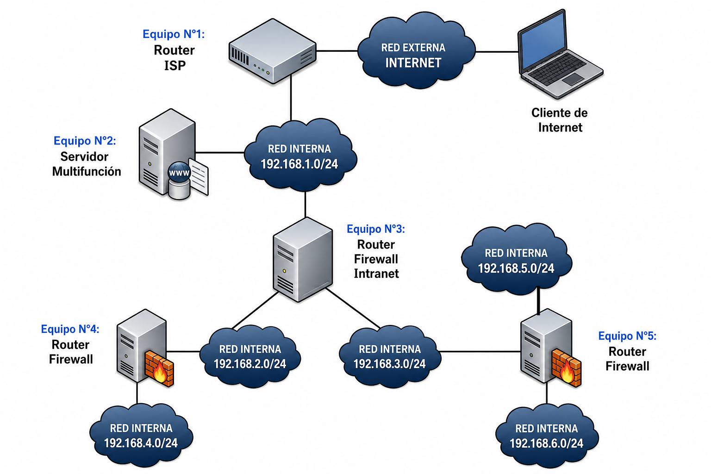
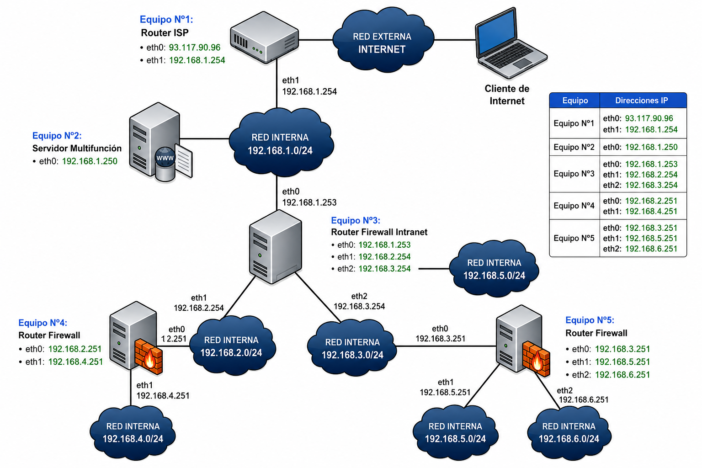

# Oposiciones 2018 Aragón

## Ejercicio de Enrutamiento

Dada el siguiente esquema de red y los teniendo en cuenta los datos aportados debajo:

| Equipo      | Direcciones IP                                                                 |
|--------------|---------------------------------------------------------------------------------|
| Equipo Nº1   | 93.117.90.96 (eth0), 192.168.1.254 (eth1)                                     |
| Equipo Nº2   | 192.168.1.250 (eth0)                                                           |
| Equipo Nº3   | 192.168.1.253 (eth0), 192.168.2.254 (eth1), 192.168.3.254 (eth2)              |
| Equipo Nº4   | 192.168.2.251 (eth0), 192.168.4.251 (eth1)                                    |
| Equipo Nº5   | 192.168.3.251 (eth0), 192.168.5.251 (eth1), 192.168.6.251 (eth2)              |

El diagrama de red con las direcciones de red es el siguiente:

1. Indica cómo sería la tabla de enrutamiento estática (Red de destino, máscara, gateway, interfaz) del equipo ‘**Equipo Nº3**’, teniendo en cuenta que debe poderse alcanzar cualquier equipo de cualquiera de las Intranets mostradas e Internet.”

| Red de Destino | Máscara        | Gateway (Salto) | Interfaz de Red |
|----------------|-----------------|----------------|-----------------|
| 0.0.0.0        | 0.0.0.0         | 192.168.1.254 | eth0            |
| 192.168.4.0    | 255.255.255.0   | 192.168.2.251 | eth1            |
| 192.168.5.0    | 255.255.255.0   | 192.168.3.251 | eth2            |
| 192.168.6.0    | 255.255.255.0   | 192.168.3.251 | eth2            |
| 192.168.1.0    | 255.255.255.0   | - | eth0            |
| 192.168.2.0    | 255.255.255.0   | - | eth1            |
| 192.168.3.0    | 255.255.255.0   | - | eth2            |

### Explicación:

#### Columnas Gateway y Nº Saltos
Si el Equipo nº 3 tiene interfaz en la misma red que el destino del paquete, entonces la entrega será a un host de la misma red a la que pertenece el Equipo nº 3 y, por tanto, sería un envío directo sin necesidad de salto de red. En estos casos, en la columna “Gateway” (Próximo salto) no será necesario indicar ningún Gateway o equipo pasarela, por lo que no existirá salto entre routers.

Cuando el destino no es una red directamente alcanzable por el Equipo nº 3 (caso de envío indirecto), entonces se indicará la dirección del Gateway o próximo salto del paquete, que será la dirección del router más cercano a la red destino, que sea alcanzable desde el Equipo nº 3.

Aunque en el ejercicio no se solicita explícitamente, anotamos el nº saltos necesarios para llegar a destino en la última columna “Nº Saltos”. El nº de saltos será 0 cuando el Equipo nº3 esté conectado directamente a la red de destino (para las Intranets 192.168.1.0/24, 192.168.2.0/24 y 192.168.3.0/24). 

Cuando la red de destino no sea directamente alcanzable, caso de envío indirecto, en este ejercicio el nº de saltos será 1, referido al número de routers que tendrán que atravesar los paquetes para que finalmente lleguen su destino.

Para alcanzar las redes de destino del ejercicio el Equipo nº 3 enviará paquetes a:

**Casos de envío directo (no necesario envío a otro router):**
- Si Red destino: 192.168.1.0/24, Equipo nº3 enviará la información a la red destino directamente.
- Si Red destino: 192.168.2.0/24, Equipo nº3 enviará la información a la red destino directamente.
- Si Red destino: 192.168.3.0/24, Equipo nº3 enviará la información a la red destino directamente.

**Casos de envío indirecto:**
- Si Red destino: 192.168.4.0/24, Equipo nº3 enviará la información al Equipo nº4 (Router Firewall) con IP 192.168.2.251
- Si Red destino: 192.168.5.0/24, Equipo nº3 enviará la información al Equipo nº5 (Router Firewall) con IP 192.168.3.254
- Si Red destino: 192.168.6.0/24, Equipo nº3 enviará la información al Equipo nº5 (Router Firewall) con IP 192.168.3.254
- Si Red destino es Internet, Equipo nº3 enviará la información al Equipo nº1 (Router ISP) con IP 192.168.1.254

### Columna Interfaz

En esta columna se indica la interfaz del router (Equipo nº 3), por donde se enviarán los paquetes teniendo en cuenta la interfaz más próxima a la red destino:
- Si Red destino: 192.168.1.0/24, Equipo nº3 enviará la información por su interfaz eth0 (192.168.1.253) y desde ahí al destino directamente
- Si Red destino: 192.168.2.0/24, Equipo nº3 enviará la información por su interfaz eth1 (192.168.2.254) y desde ahí al destino directamente
- Si Red destino: 192.168.3.0/24, Equipo nº3 enviará la información por su interfaz eth2 (192.168.3.254) y desde ahí al destino directamente
- Si Red destino: 192.168.4.0/24, Equipo nº3 enviará la información por su interfaz eth1 (192.168.2.254) al Equipo nº4 (Router Firewall) con IP 192.168.2.251
- Si Red destino: 192.168.5.0/24, Equipo nº3 enviará la información por su interfaz eth2 (192.168.3.254) al Equipo nº5 (Router Firewall) con IP 192.168.3.251
- Si Red destino: 192.168.6.0/24, Equipo nº3 enviará la información por su interfaz eth2 (192.168.3.254) al Equipo nº5 (Router Firewall) con IP 192.168.3.251
- Si Red destino es Internet, Equipo nº3 enviará la información por la interfaz eth0
(192.168.1.253) al Equipo nº1 (Router ISP) con IP 192.168.1.254