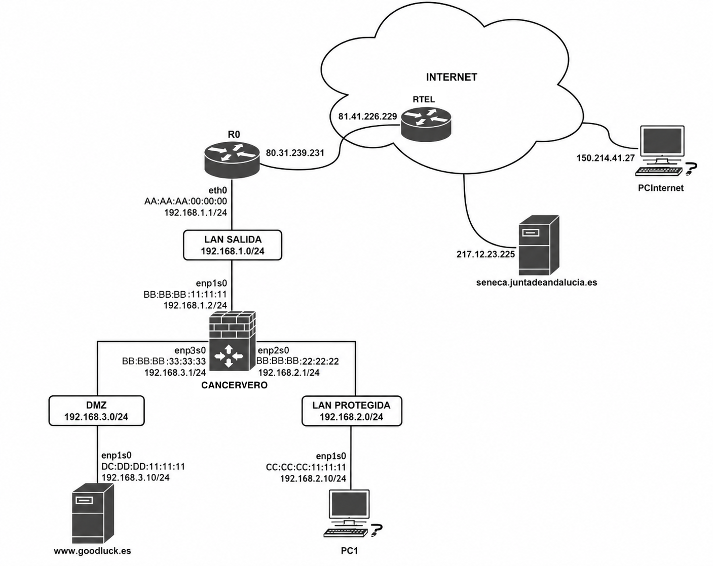

# Andalucía 2025 PES Informática

## EJERCICIO 3: REDES. (2.5 puntos).

La empresa Goodluck, S.L. cuenta en su sede principal con un sistema informático compuesto por varios servidores y 50 equipos de usuario. Su red se organiza en una DMZ, una LAN PROTEGIDA y una LAN SALIDA. El sistema está conectado a
Internet por un router de fibra óptica de una compañía de telecomunicaciones.
A continuación, se muestra un esquema lógico que incluye Internet y la red
indicada. En este esquema se muestran únicamente los dispositivos relevantes
para el desarrollo del ejercicio.

En el esquema, cada equipo de la empresa tiene identificadas sus tarjetas de red Gigabit Ethernet con su nombre, dirección MAC y dirección IP.

Tenga en cuenta las siguientes consideraciones:

- R0 es un router proporcionado por la compañía de telecomunicaciones, que ofrece conectividad a Internet mediante fibra óptica. Está configurado de la siguiente manera:
   - Realiza NAPT2 (masquerading) de LAN SALIDA hacia Internet.
   - Port Forwarding de 80.31.239.231:443 a 192.168.1.2:443.

- RTEL es un router de la compañía de telecomunicaciones, ubicado en Internet, que actúa como puerta de enlace de R0 para todo el tráfico con
destino a Internet.

- www.goodluck.es es un servidor web alojado en la DMZ de la empresa.
- PC1 es un equipo de usuario situado en la LAN PROTEGIDA de la empresa.
seneca.juntadeandalucia.es es un servidor web público ubicado en Internet.
- PCInternet es un PC conectado directamente a Internet, con IP pública.
- Se supone que el servidor DNS en Internet del dominio goodluck.es funciona
perfectamente, traduciendo www.goodluck.es por 80.31.239.231.
- Se supone que el servidor DNS interno de la organización funciona
perfectamente, traduciendo www.goodluck.es por 192.168.3.10.
- Cancervero es una máquina con Debian 12 (sin entorno gráfico) con el
pequete iptables correctamente instalado y operativo, que cumple todas las
funciones que se especifican a continuación:
  - El enrutamiento IP está activado.
  - La ruta por defecto es 192.168.1.1 a través de la interfaz enp1s0.
  - Realiza NAPT (masquerading) para la red DMZ hacia la red LAN SALIDA.
  - Realiza NAPT (masquerading) para la red LAN PROTEGIDA hacia la red LAN SALIDA.
  - Realiza Port Forwarding de 192.168.1.2:443 a 192.168.3.10:443.
  - Implementa una serie de reglas de filtrado que no vienen al caso para el presente ejercicio.

**Observaciones importantes:**

Para responder a este ejercicio, identifique en su respuesta el número de la
misma, por ejemplo:

3.1.a:
| Origen | Destino |
| --- | --- |
| MAC origen = XX:XX:XX:XX:XX:XX | MAC destino = XX:XX:XX:XX:XX:XX |
| IP origen = X.X.X.X | IP destino = X.X.X.X |
| Puerto origen = XXXXX | Puerto destino = XXXXX |

## Ejercicio 3.1

PC1 se desea conectar a la web `seneca.juntadeandalucia.es` por HTTPS. Para ello, PC1 envía un segmento TCP con el flag SYN=1 que viaja desde PC1 a `seneca.juntadeandalucia.es`. Responda a las siguientes cuestiones relativas a esa comunicación:

### 3.1.a

En el tramo de red entre **PC1 y Cancervero**, indique los siguientes campos de la trama Ethernet, del paquete IP y del segmento TCP que se transmiten en ese momento: MAC origen, MAC destino, IP origen, IP destino, puerto origen y puerto destino.

| | Origen | Destino |
|---|---|---|
| MAC | `CC:CC:CC:11:11:11` | `BB:BB:BB:22:22:22` |
| IP | `192.168.2.10` | `217.12.23.225` |
| Puerto | `40500` (aleatorio) | `443` |

### 3.1.b

En el tramo de red entre **Cancervero y R0**, indique los siguientes campos de la trama Ethernet, del paquete IP y del segmento TCP que se transmiten en ese momento: MAC origen, MAC destino, IP origen, IP destino, puerto origen y puerto destino.

| | Origen | Destino |
|---|---|---|
| MAC | `BB:BB:BB:11:11:11` | `AA:AA:AA:00:00:00` |
| IP | `192.168.1.2` | `217.12.23.225` |
| Puerto | `50000` (aleatorio) | `443` |

### 3.1.c

En el tramo de red entre **R0 y `seneca.juntadeandalucia.es`**, indique los siguientes campos del paquete IP y del segmento TCP que se transmiten en ese momento: IP origen, IP destino, puerto origen y puerto destino.

| | Origen | Destino |
|---|---|---|
| IP | `80.31.239.231` | `217.12.23.225` |
| Puerto | `50000` | `443` |

## Ejercicio 3.2

`seneca.juntadeandalucia.es` responde al mensaje anterior (ejercicio 3.1), enviándole a PC1 un segmento TCP con el flag SYN=1 y el flag ACK=1. Responda a las siguientes cuestiones relativas a esa comunicación:

### 3.2.a

En el tramo de red entre **`seneca.juntadeandalucia.es` y R0**, indique los siguientes campos del paquete IP y del segmento TCP que se transmiten en ese momento: IP origen, IP destino, puerto origen y puerto destino.

| | Origen | Destino |
|---|---|---|
| IP | `217.12.23.225` | `80.31.239.231` |
| Puerto | `443` | `50000` |

### 3.2.b

En el tramo de red entre **R0 y Cancervero**, indique los siguientes campos de la trama Ethernet, del paquete IP y del segmento TCP que se transmiten en ese momento: MAC origen, MAC destino, IP origen, IP destino, puerto origen y puerto destino.

| | Origen | Destino |
|---|---|---|
| MAC | `AA:AA:AA:00:00:00` | `BB:BB:BB:11:11:11` |
| IP | `217.12.23.225` | `192.168.1.2` |
| Puerto | `443` | `50000` |

### 3.2.c

En el tramo de red entre **Cancervero y PC1**, indique los siguientes campos de la trama Ethernet, del paquete IP y del segmento TCP que se transmiten en ese momento: MAC origen, MAC destino, IP origen, IP destino, puerto origen y puerto destino.

| | Origen | Destino |
|---|---|---|
| MAC | `BB:BB:BB:22:22:22` | `CC:CC:CC:11:11:11` |
| IP | `217.12.23.225` | `192.168.2.10` |
| Puerto | `443` | `40500` |

---

## Ejercicio 3.3

PCInternet se desea conectar a la web `www.goodluck.es` por HTTPS. Para ello, PCInternet envía un segmento TCP con el flag SYN=1 que viaja desde PCInternet a `www.goodluck.es`. Responda a las siguientes cuestiones relativas a esa comunicación:

### 3.3.a

En el tramo de red entre **PCInternet y R0**, indique los siguientes campos del paquete IP y del segmento TCP que se transmiten en ese momento: IP origen, IP destino, puerto origen y puerto destino.

| | Origen | Destino |
|---|---|---|
| IP | `150.214.41.27` | `80.31.239.231` |
| Puerto | `39000` | `443` |

### 3.3.b

En el tramo de red entre **R0 y Cancervero**, indique los siguientes campos de la trama Ethernet, del paquete IP y del segmento TCP que se transmiten en ese momento: MAC origen, MAC destino, IP origen, IP destino, puerto origen y puerto destino.

| | Origen | Destino |
|---|---|---|
| MAC | `AA:AA:AA:00:00:00` | `BB:BB:BB:11:11:11` |
| IP | `150.214.41.27` | `192.168.1.2` |
| Puerto | `39000` | `443` |

### 3.3.c

En el tramo de red entre **Cancervero y `www.goodluck.es`**, indique los siguientes campos de la trama Ethernet, del paquete IP y del segmento TCP que se transmiten en ese momento: MAC origen, MAC destino, IP origen, IP destino, puerto origen y puerto destino.

| | Origen | Destino |
|---|---|---|
| MAC | `BB:BB:BB:33:33:33` | `DD:DD:DD:11:11:11` |
| IP | `150.214.41.27` | `192.168.3.10` |
| Puerto | `39000` | `443` |

---

## Ejercicio 3.4

`www.goodluck.es` responde al mensaje anterior (ejercicio 3.3), enviándole a PCInternet un segmento TCP con el flag SYN=1 y el flag ACK=1. Responda a las siguientes cuestiones relativas a esa comunicación:

### 3.4.a

En el tramo de red entre **`www.goodluck.es` y Cancervero**, indique los siguientes campos de la trama Ethernet, del paquete IP y del segmento TCP que se transmiten en ese momento: MAC origen, MAC destino, IP origen, IP destino, puerto origen y puerto destino.

| | Origen | Destino |
|---|---|---|
| MAC | `DD:DD:DD:11:11:11` | `BB:BB:BB:33:33:33` |
| IP | `192.168.3.10` | `150.214.41.27` |
| Puerto | `443` | `39000` |

### 3.4.b

En el tramo de red entre **Cancervero y R0**, indique los siguientes campos de la trama Ethernet, del paquete IP y del segmento TCP que se transmiten en ese momento: MAC origen, MAC destino, IP origen, IP destino, puerto origen y puerto destino.

| | Origen | Destino |
|---|---|---|
| MAC | `BB:BB:BB:11:11:11` | `AA:AA:AA:00:00:00` |
| IP | `192.168.1.2` | `150.214.41.27` |
| Puerto | `443` | `39000` |

### 3.4.c

En el tramo de red entre **R0 y PCInternet**, indique los siguientes campos del paquete IP y del segmento TCP que se transmiten en ese momento: IP origen, IP destino, puerto origen y puerto destino.

| | Origen | Destino |
|---|---|---|
| IP | `80.31.239.231` | `150.214.41.27` |
| Puerto | `443` | `39000` |

